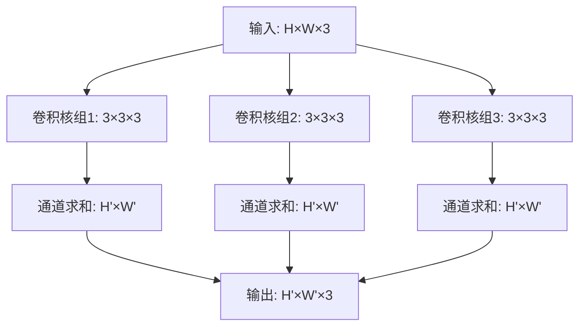

## 目录
### 第4章 卷积神经网络（CNN）
#### 4.1 卷积层
- [1.卷积在CNN中的核心作用是什么？](#1.卷积在CNN中的核心作用是什么？)
- [2.卷积操作的数学定义是什么？](#2.卷积操作的数学定义是什么？)
- [3.CNN中的卷积与传统信号处理中的卷积有何区别？](#3.CNN中的卷积与传统信号处理中的卷积有何区别？)
- [4.卷积操作如何实现局部连接特性？](#4.卷积操作如何实现局部连接特性？)
- [5.权值共享在卷积操作中是如何体现的？](#5.权值共享在卷积操作中是如何体现的？)
- [6.局部连接和权值共享对CNN的性能有什么影响？](#6.局部连接和权值共享对CNN的性能有什么影响？)
- [7.卷积操作输出特征图尺寸的计算公式是什么？](#7.卷积操作输出特征图尺寸的计算公式是什么？)
- [8.什么是步幅（Stride），步幅增大对输出特征图有什么影响？](#8.什么是步幅（Stride），步幅增大对输出特征图有什么影响？)
- [9.什么是填充（Padding），填充的主要目的是什么？](#9.什么是填充（Padding），填充的主要目的是什么？)
- [10.常见的Padding模式有哪些，它们的区别是什么？](#10.常见的Padding模式有哪些，它们的区别是什么？)
- [11.卷积操作中为什么通常使用奇数尺寸的卷积核？](#11.卷积操作中为什么通常使用奇数尺寸的卷积核？)
- [12.3×3卷积核相比1×1、5×5卷积核有什么优势？](#12.3×3卷积核相比1×1、5×5卷积核有什么优势？)
- [13.卷积层的感受野是什么意思，如何计算？](#13.卷积层的感受野是什么意思，如何计算？)
- [14.感受野的大小对CNN特征提取有什么影响？](#14.感受野的大小对CNN特征提取有什么影响？)
- [15.什么是互相关（Cross-Correlation），它与卷积的关系是什么？](#15.什么是互相关（Cross-Correlation），它与卷积的关系是什么？)
- [16.CNN训练中实际使用的是卷积还是互相关，为什么？](#16.CNN训练中实际使用的是卷积还是互相关，为什么？)
- [17.多通道输入/输出时，卷积操作是如何进行的？](#17.多通道输入/输出时，卷积操作是如何进行的？)
- [18.卷积操作的计算复杂度与哪些因素有关，如何降低？](#18.卷积操作的计算复杂度与哪些因素有关，如何降低？)
- [19.卷积操作对图像的平移不变性有什么贡献？](#19.卷积操作对图像的平移不变性有什么贡献？)
- [20.卷积的稀疏交互特性及其对泛化能力的影响？](#20.卷积的稀疏交互特性及其对泛化能力的影响？)
- [21.卷积层可以学习到哪些类型的特征，深浅层有何区别？](#21.卷积层可以学习到哪些类型的特征，深浅层有何区别？)
- [22.如果输入通道数为3，输出通道数为64，需要多少个卷积核？](#22.如果输入通道数为3，输出通道数为64，需要多少个卷积核？)
- [23.卷积操作的线性特性，结合激活函数后有何变化？](#23.卷积操作的线性特性，结合激活函数后有何变化？)
- [24.卷积层的输出特征图数量与模型表达能力的关系？](#24.卷积层的输出特征图数量与模型表达能力的关系？)
- [25.卷积操作在处理高分辨率图像时会面临什么挑战？](#25.卷积操作在处理高分辨率图像时会面临什么挑战？)
- [26. 卷积核的基本组成部分有哪些？](#26-卷积核的基本组成部分有哪些)
- [27. 卷积核的深度与输入输出通道数的关系是什么？](#27-卷积核的深度与输入输出通道数的关系是什么)
- [28. 卷积核的大小选择需要考虑哪些因素？](#28-卷积核的大小选择需要考虑哪些因素)
- [29. 为什么 CNN 中很少使用大于 7×7 的卷积核？](#29-为什么-cnn-中很少使用大于-77-的卷积核)
- [30. 1×1 卷积核的主要作用是什么？](#30-11-卷积核的主要作用是什么)
- [31. 使用 1×1 卷积核如何实现通道数的调整？](#31-使用-11-卷积核如何实现通道数的调整)
- [32. 卷积层的参数数量如何计算？](#32-卷积层的参数数量如何计算)
- [33. 偏置项是否计入卷积层参数，如何计算？](#33-偏置项是否计入卷积层参数如何计算)
- [34. Padding、Stride 会影响卷积层参数数量吗？](#34-paddingstride-会影响卷积层参数数量吗)
- [35. 为什么卷积核不能全部初始化为 0 或相同值？](#35-为什么-卷积核不能全部初始化为-0-或相同值)
- [36. He 初始化和 Xavier 初始化有什么区别？](#36-he-初始化和-xavier-初始化有什么区别)
- [37. 分组卷积的卷积核如何设计？](#37-分组卷积的卷积核如何设计)
- [38. 深度卷积的参数数量与普通卷积有何差异？](#38-深度卷积的参数数量与普通卷积有何差异)
- [39. 两个 3×3 堆叠感受野等于一个 5×5 吗？为什么更优？](#39-两个-33-堆叠感受野等于一个-55-吗为什么更优)
- [40. 卷积核剪枝是什么？依据是什么？](#40-卷积核剪枝是什么依据是什么)
- [41. 卷积核量化是什么？对部署有什么影响？](#41-卷积核量化是什么对部署有什么影响)
- [42. 轻量级网络在卷积核设计上有什么特点？](#42-轻量级网络在卷积核设计上有什么特点)
- [43. ViT-CNN 混合模型中卷积核的作用发生了什么变化？](#43-vit-cnn-混合模型中卷积核的作用发生了什么变化)
- [44. 转置卷积与双线性插值等上采样方式有什么区别？](#44-转置卷积与双线性插值等上采样方式有什么区别)
- [45. 空洞卷积与多尺度池化在扩大感受野上有什么差异？](#45-空洞卷积与多尺度池化在扩大感受野上有什么差异)
- [46. 变形卷积是否会增加模型的计算复杂度？](#46-变形卷积是否会增加模型的计算复杂度)
- [47. 不同卷积类型组合使用有什么效果？](#47-不同卷积类型组合使用有什么效果)
- [48. 轻量级网络中常用的卷积组合策略有哪些？](#48-轻量级网络中常用的卷积组合策略有哪些)
- [49. 未来卷积的创新方向可能是什么？](#49-未来卷积的创新方向可能是什么)
- [50. 大模型时代卷积层会被完全取代吗，为什么？](#50-大模型时代卷积层会被完全取代吗为什么)
- [51. 什么是有效感受野？](#51-什么是有效感受野)
- [52. 什么是转置卷积的棋盘效应？](#52-什么是转置卷积的棋盘效应)
- [53. 什么是 3D 卷积？](#53-什么是-3d-卷积)
- [54. 卷积层的时间复杂度与空间复杂度如何分析？](#54-卷积层的时间复杂度与空间复杂度如何分析)
- [55. AIGC 时代一共有多少种主流卷积？](#55-aigc-时代一共有多少种主流卷积)
- [56. 什么是深度可分离卷积？](#56-什么是深度可分离卷积？)
- [57. 深度可分离卷积具体分为哪两个步骤，各自的操作过程是怎样的？](#57-深度可分离卷积具体分为哪两个步骤，各自的操作过程是怎样的？)
- [58. 深度卷积（Depthwise Convolution）与逐点卷积（Pointwise Convolution）的核心区别是什么？](#58-深度卷积（depthwise-convolution）与逐点卷积（pointwise-convolution）的核心区别是什么？)
- [59. 深度可分离卷积与普通卷积的参数数量比是多少，如何推导？](#59-深度可分离卷积与普通卷积的参数数量比是多少，如何推导？)
- [60. 深度可分离卷积是如何减少计算量的，计算量降低比例如何计算？](#60-深度可分离卷积是如何减少计算量的，计算量降低比例如何计算？)
- [61. 深度可分离卷积的优点和缺点分别是什么，2026年有哪些优化方案？](#61-深度可分离卷积的优点和缺点分别是什么，2026年有哪些优化方案？)
- [62. 深度可分离卷积在主流网络中具体有哪些应用，不同网络中的改进点是什么？](#62-深度可分离卷积在主流网络中具体有哪些应用，不同网络中的改进点是什么？)
- [63. 为什么深度可分离卷积更适合移动端/端侧部署，核心优势是什么？](#63-为什么深度可分离卷积更适合移动端/端侧部署，核心优势是什么？)
- [64. 深度可分离卷积在训练时容易出现什么问题，如何解决？](#64-深度可分离卷积在训练时容易出现什么问题，如何解决？)
- [65. 分组深度可分离卷积（Grouped Depthwise Separable Convolution）是什么，与普通深度可分离卷积有何区别？](#65-分组深度可分离卷积（grouped-depthwise-separable-convolution）是什么，与普通深度可分离卷积有何区别？)
#### 4.2 池化层
- [1.池化操作的核心目的是什么？](#1.池化操作的核心目的是什么？)
- [2.池化层在深度学习模型中主要解决什么问题？](#2.池化层在深度学习模型中主要解决什么问题？)
- [3.池化操作为什么能提高模型的平移不变性？](#3.池化操作为什么能提高模型的平移不变性？)
- [4.池化层是否会改变特征图的通道数？](#4.池化层是否会改变特征图的通道数？)
- [5.池化操作是否需要训练参数？](#5.池化操作是否需要训练参数？)
- [6.池化层能否缓解过拟合，为什么？](#6.池化层能否缓解过拟合，为什么？)
- [7.最大池化与平均池化在计算上的主要区别是什么？](#7.最大池化与平均池化在计算上的主要区别是什么？)
- [8.什么是全局平均池化（GAP），它在网络结构设计中的优势是什么？](#8.什么是全局平均池化（GAP），它在网络结构设计中的优势是什么？)
- [9.池化层的核心参数有哪些？](#9.池化层的核心参数有哪些？)
- [10.如何计算池化后输出特征图的大小？](#10.如何计算池化后输出特征图的大小？)
- [11.为什么池化操作通常在卷积层之后使用？](#11.为什么池化操作通常在卷积层之后使用？)
- [12.池化原理与下采样有什么区别和联系？](#12.池化原理与下采样有什么区别和联系？)
- [13.最大池化在反向传播时梯度是如何分配的？](#13.最大池化在反向传播时梯度是如何分配的？)
- [14.池化操作对小目标检测任务有什么影响，该如何优化？](#14.池化操作对小目标检测任务有什么影响，该如何优化？)
- [15.当前轻量化深度学习网络中，传统池化层的使用趋势是什么？](#15.当前轻量化深度学习网络中，传统池化层的使用趋势是什么？)

#### 4.3 经典CNN架构（LeNet、AlexNet、VGG、GoogLeNet、ResNet、DenseNet、EfficientNet）

### 第5章 循环神经网络（RNN）
#### 5.1 RNN基础（结构、BPTT）
#### 5.2 梯度消失与梯度爆炸
#### 5.3 门控机制（LSTM、GRU）
#### 5.4 双向RNN与深层RNN

### 第6章 Transformer
#### 6.1 Transformer，attention，位置编码

- [1. Transformer为何使用多头注意力机制？（为什么不使用一个头？）](#1-transformer为何使用多头注意力机制为什么不使用一个头)
- [2. Transformer为什么Q和K使用不同的权重矩阵生成，为何不能使用同一个值进行自身的点乘？](#2-transformer为什么q和k使用不同的权重矩阵生成为何不能使用同一个值进行自身的点乘)
- [3. Transformer计算attention的时候为何选择点乘而不是加法？两者计算复杂度和效果上有什么区别？](#3-transformer计算attention的时候为何选择点乘而不是加法两者计算复杂度和效果上有什么区别)
- [4. 为什么在进行softmax之前需要对attention进行scaled（为什么除以dk的平方根），并使用公式推导进行讲解？](#4-为什么在进行softmax之前需要对attention进行scaled为什么除以dk的平方根并使用公式推导进行讲解)
- [5. 在计算attention score的时候如何对padding做mask操作？](#5-在计算attention-score的时候如何对padding做mask操作)
- [6. 为什么在进行多头注意力的时候需要对每个head进行降维？](#6-为什么在进行多头注意力的时候需要对每个head进行降维)
- [7. 大概讲一下Transformer的Encoder模块？](#7-大概讲一下transformer的encoder模块)
- [8. 为何在获取输入词向量之后需要对矩阵乘以embedding size的开方？意义是什么？](#8-为何在获取输入词向量之后需要对矩阵乘以embedding-size的开方意义是什么)
- [9. 简单介绍一下Transformer的位置编码？有什么意义和优缺点？](#9-简单介绍一下transformer的位置编码有什么意义和优缺点)
- [10. 你还了解哪些关于位置编码的技术，各自的优缺点是什么？](#10-你还了解哪些关于位置编码的技术各自的优缺点是什么)
- [11. 简单讲一下Transformer中的残差结构以及意义？](#11-简单讲一下transformer中的残差结构以及意义)
- [12. 为什么Transformer块使用LayerNorm而不是BatchNorm？LayerNorm 在Transformer的位置是哪里？](#12-为什么transformer块使用layernorm而不是batchnormlayernorm-在transformer的位置是哪里)
- [13. 简要讲一下BatchNorm技术，以及它的优缺点？](#13-简要讲一下batchnorm技术以及它的优缺点)
- [14. 简单描述一下Transformer中的前馈神经网络？使用了什么激活函数？相关优缺点？](#14-简单描述一下transformer中的前馈神经网络使用了什么激活函数相关优缺点)
- [15. Encoder端和Decoder端是如何进行交互的？（可结合seq2seq的attention知识说明）](#15-encoder端和decoder端是如何进行交互的可结合seq2seq的attention知识说明)
- [16. Decoder阶段的多头自注意力和Encoder的多头自注意力有什么区别？（为什么Decoder自注意力需要进行sequence mask）](#16-decoder阶段的多头自注意力和encoder的多头自注意力有什么区别为什么decoder自注意力需要进行sequence-mask)
- [17. Transformer的并行化体现在哪个地方？Decoder端可以做并行化吗？](#17-transformer的并行化体现在哪个地方decoder端可以做并行化吗)
- [18. 简单描述一下wordpiece model 和 byte pair encoding，有实际应用过吗？](#18-简单描述一下wordpiece-model-和-byte-pair-encoding有实际应用过吗)
- [19. Transformer训练的时候学习率是如何设定的？Dropout是如何设定的，位置在哪里？Dropout 在测试时需要有什么注意事项？](#19-transformer训练的时候学习率是如何设定的dropout是如何设定的位置在哪里dropout-在测试时需要有什么注意事项)
- [20. BERT的mask为何不学习Transformer在attention处进行屏蔽score的技巧？](#20-bert的mask为何不学习transformer在attention处进行屏蔽score的技巧)
- [21. Transformer模型中自注意力机制的数学表达式是什么？](#21-transformer模型中自注意力机制的数学表达式是什么)
- [22. Transformer模型中的位置编码如何数学上表示？](#22-transformer模型中的位置编码如何数学上表示)
- [23. 如何数学上表达编码器和解码器中的前馈神经网络（FFN）？](#23-如何数学上表达编码器和解码器中的前馈神经网络ffn)
- [24. Transformer模型中Layer Normalization的数学原理是什么？](#24-transformer模型中layer-normalization的数学原理是什么)
- [25. Transformer模型训练中的梯度裁剪是如何数学定义的，它为何重要？](#25-transformer模型训练中的梯度裁剪是如何数学定义的它为何重要)
- [26. 如何数学描述Transformer模型中的学习率预热策略？](#26-如何数学描述transformer模型中的学习率预热策略)
- [27. Transformer模型中的残差连接如何数学表达，它们解决的问题是什么？](#27-transformer模型中的残差连接如何数学表达它们解决的问题是什么)
- [28. 解释Transformer模型输出序列中的概率分布是如何计算的？](#28-解释transformer模型输出序列中的概率分布是如何计算的)
- [29. 如何数学地表达Transformer中的“缩放点积注意力”机制？](#29-如何数学地表达transformer中的缩放点积注意力机制)
- [30. Transformer模型中多头注意力机制的维度拆分是如何实现的？](#30-transformer模型中多头注意力机制的维度拆分是如何实现的)
- [31. Transformer的位置编码如何使得模型具有顺序感知能力？](#31-transformer的位置编码如何使得模型具有顺序感知能力)
- [32. 如何理解Transformer模型中的“编码器-解码器注意力”机制？](#32-如何理解transformer模型中的编码器-解码器注意力机制)
- [33. Transformer的前馈网络（FFN）在模型中承担什么角色？](#33-transformer的前馈网络ffn在模型中承担什么角色)
- [34. Transformer模型中的“注意力权重”是如何通过训练学习到的？](#34-transformer模型中的注意力权重是如何通过训练学习到的)
- [35. Transformer模型中的参数共享策略具体是指什么？](#35-transformer模型中的参数共享策略具体是指什么)
- [36. 如何理解Transformer中的自回归属性？](#36-如何理解transformer中的自回归属性)
- [37. 为什么Transformer模型能够有效处理长距离依赖问题？](#37-为什么transformer模型能够有效处理长距离依赖问题)
- [38. Transformer中的“负面注意力”（Negative Attention）是什么意思？](#38-transformer中的负面注意力negative-attention是什么意思)
- [39. Transformer中如何实现序列到序列的映射？](#39-transformer中如何实现序列到序列的映射)
- [40. Transformer模型如何处理不同长度的输入序列？](#40-transformer模型如何处理不同长度的输入序列)
- [41. 在Transformer模型中，如何优化内存使用以处理大型数据集？](#41-在transformer模型中如何优化内存使用以处理大型数据集)
- [42. Transformer模型训练完成后，如何评估其生成能力？](#42-transformer模型训练完成后如何评估其生成能力)
- [43. 什么是Transformer模型，它在哪一年被提出？](#43-什么是transformer模型它在哪一年被提出)
- [44. Transformer模型在哪些NLP任务中展现了显著的性能提升？](#44-transformer模型在哪些nlp任务中展现了显著的性能提升)
- [45. 相较于RNN和LSTM，Transformer模型的哪些特性使其更适合处理NLP任务？](#45-相较于rnn和lstmtransformer模型的哪些特性使其更适合处理nlp任务)
- [46. Transformer模型是如何被应用到非NLP任务中的？请举例说明。](#46-transformer模型是如何被应用到非nlp任务中的请举例说明)
- [47. Transformer的哪些变体或改进模型在工业界得到了广泛应用？（如BERT、GPT、T5等）](#47-transformer的哪些变体或改进模型在工业界得到了广泛应用如bertgptt5等)
- [48. Transformer计算量最大的部分是哪里？如何优化？](#48-transformer计算量最大的部分是哪里如何优化)
- [49. Transformer、LSTM和单纯的前馈神经网络相比，有哪些提升？](#49-transformerlstm和单纯的前馈神经网络相比有哪些提升)
- [50. 有哪些处理超长文本的Transformer改进方法？各自的核心思路是什么？](#50-有哪些处理超长文本的transformer改进方法各自的核心思路是什么)
- [51. 深度学习中有哪些常用的注意力机制？与Transformer的自注意力有何区别？](#51-深度学习中有哪些常用的注意力机制与transformer的自注意力有何区别)
- [52. 注意力机制计算时，QKV的维度必须相同吗？为什么？](#52-注意力机制计算时qkv的维度必须相同吗为什么)
- [53. Softmax在Transformer中起到什么作用？](#53-softmax在transformer中起到什么作用)
- [54. 什么是Scaling-Law？Transformer的Scaling-Law有什么特点？](#54-什么是scaling-lawtransformer的scaling-law有什么特点)
- [55. 为什么Transformer的Scaling能力比CNN强？](#55-为什么transformer的scaling能力比cnn强)
- [56. Transformer的输入包含哪些内容？各部分的作用是什么？](#56-transformer的输入包含哪些内容各部分的作用是什么)
- [57. ROPE（Rotary Position Embedding）位置编码有何特点？与原生位置编码相比有什么优势？](#57-rope旋转位置编码有何特点与原生位置编码相比有什么优势)
- [58. KVCache和GQA优化的核心思想是什么？](#58-多头注意力机制mha中kvcache和gqa优化的核心思想是什么)
- [59. 简要介绍下Transformer中的QKV，三者的关系是什么？](#59-简要介绍下transformer中的qkv三者的关系是什么)
- [60. Transformer训练和部署有哪些关键技巧？（结合工业界实际应用）](#60-transformer训练和部署有哪些关键技巧结合工业界实际应用)
- [61. 简要介绍Transformer的Encoder模块和Decoder模块，两者的核心差异是什么？](#61-简要介绍transformer的encoder模块和decoder模块两者的核心差异是什么)
- [62. Transformer和Mamba(SSM)的区别是什么？各自的适用场景有哪些？](#62-transformer和mambassm的区别是什么各自的适用场景有哪些)
- [63. 介绍一下Transformer中KV Cache的原理，它能解决什么问题？有什么局限性？](#63-介绍一下transformer中kv-cache的原理它能解决什么问题有什么局限性)
- [64. 工业界中，Transformer模型的量化、剪枝优化思路是什么？能带来什么收益？](#64-工业界中transformer模型的量化剪枝优化思路是什么能带来什么收益)
- [65. 大模型时代，Transformer的架构优化方向有哪些？（如MoE、FlashAttention等）](#65-大模型时代transformer的架构优化方向有哪些如moeflashattention等)
- [66. Transformer中的Embedding层有什么作用？如何缓解词表稀疏问题？](#66-transformer中的embedding层有什么作用如何缓解词表稀疏问题)
- [67. 为什么Transformer在长序列任务中容易出现性能下降？如何改进？](#67-为什么transformer在长序列任务中容易出现性能下降如何改进)
- [68. 简要说明FlashAttention的核心原理，它如何优化Transformer的注意力计算效率？](#68-简要说明flashattention的核心原理它如何优化transformer的注意力计算效率)
- [69. Transformer模型中的Label Smoothing是什么？有什么作用？](#69-transformer模型中的label-smoothing是什么有什么作用)
- [70. 对比Transformer和CNN，两者在特征提取方式上有什么本质区别？](#70-对比transformer和cnn两者在特征提取方式上有什么本质区别)


### 第7章 图神经网络（GNN）
#### 7.1 图的基本概念（节点、边、邻接矩阵、度矩阵）
#### 7.2 图神经网络基础（消息传递机制）
#### 7.3 图卷积网络（GCN）
#### 7.4 图注意力网络（GAT）
#### 7.5 其他GNN变体（GraphSAGE、GIN）

## 第4章 卷积神经网络（CNN）
### 4.1 卷积层
<h2 id="1.卷积在CNN中的核心作用是什么？">1.卷积在CNN中的核心作用是什么？</h2>

**难度评分：⭐ (1/5)  |  考察频率：⭐⭐⭐⭐⭐ (5/5)**

卷积是CNN的核心运算，其核心作用是**在保留空间结构信息的前提下，对输入数据进行局部特征提取和特征映射**。具体体现在三个方面：
1. **局部特征提取**：利用卷积核的滑动窗口特性，捕捉图像的局部空间特征（如边缘、纹理、形状）；
2. **维度变换**：通过不同数量和尺寸的卷积核，实现特征维度的升维/降维，构建层次化特征表示；
3. **参数效率提升**：通过权值共享和局部连接，大幅减少模型参数数量，避免过拟合。

在2026年的技术发展阶段，卷积不仅用于基础特征提取，还与Transformer结合（如ConvNeXt、ViT-Conv），解决纯Transformer在局部特征捕捉上的效率问题。

### 实际案例
- **AIGC领域**：Stable Diffusion中的卷积层负责提取图像的底层纹理特征，为生成高质量图像提供基础特征表示；
- **传统深度学习**：图像分类任务中（如ResNet），卷积层逐层提取从边缘到物体轮廓再到语义的层次化特征；
- **自动驾驶**：摄像头感知模块中，卷积层提取车道线、交通标志、车辆轮廓等关键局部特征，为目标检测和路径规划提供依据。

<h2 id="2.卷积操作的数学定义是什么？">2.卷积操作的数学定义是什么？</h2>

**难度评分：⭐⭐ (2/5)  |  考察频率：⭐⭐⭐⭐ (4/5)**

### 连续形式
对于两个连续函数 $f(x)$ （输入）和 $g(x)$ （卷积核），卷积的数学定义为：
$$(f * g)(x) = \int_{-\infty}^{+\infty} f(\tau) g(x - \tau) d\tau$$

### 离散形式（CNN中常用）
对于二维图像 $I \in \mathbb{R}^{H \times W}$ 和卷积核 $K \in \mathbb{R}^{k \times k}$ ，卷积操作定义为：
$$(I * K)(i,j) = \sum_{m=0}^{k-1} \sum_{n=0}^{k-1} I(i+m, j+n) \cdot K(k-1-m, k-1-n)$$
核心步骤：**卷积核翻转180°** → 滑动窗口 → 对应位置元素相乘求和。

2026年业界注重点：实际工程中（如PyTorch/TensorFlow），为了计算效率，通常直接使用互相关（不翻转卷积核）替代数学卷积。

### 实际案例
- **AIGC领域**：AI绘画中的风格迁移算法，通过卷积计算图像的风格特征（如纹理）与内容特征的匹配度；
- **传统深度学习**：手写数字识别（MNIST）中，用3×3卷积核计算每个像素邻域的特征值，区分数字的轮廓；
- **自动驾驶**：激光点云处理中，用1D卷积计算点云的局部密度特征，识别道路障碍物。

<h2 id="3.CNN中的卷积与传统信号处理中的卷积有何区别？">3.CNN中的卷积与传统信号处理中的卷积有何区别？</h2>

**难度评分：⭐⭐⭐ (3/5)  |  考察频率：⭐⭐⭐ (3/5)**

| 维度 | 传统信号处理卷积 | CNN中的卷积 |
|------|------------------|-------------|
| 核心操作 | 必须翻转卷积核（符合数学定义） | 实际使用互相关（不翻转卷积核） |
| 卷积核性质 | 固定的、手工设计（如高斯核、sobel核） | 可学习的、数据驱动的 |
| 目的 | 滤波、降噪、特征增强 | 自动提取层次化特征 |
| 维度 | 主要处理1D信号（音频/时间序列） | 主要处理2D/3D数据（图像/视频/点云） |
| 训练方式 | 无训练过程 | 反向传播优化卷积核参数 |

2026年技术补充：随着多模态模型的发展，CNN卷积开始融合1D（文本）、2D（图像）、3D（视频）信号处理，形成统一的多维度卷积框架。

### 实际案例
- **AIGC领域**：音频生成模型中，结合传统1D卷积（滤波）和CNN可学习卷积，生成高保真的语音；
- **传统深度学习**：图像去噪任务中，对比手工设计的高斯卷积核和CNN学习到的去噪卷积核，后者效果更优；
- **自动驾驶**：雷达信号处理中，先用传统卷积滤波去除噪声，再用CNN卷积提取目标特征。

<h2 id="4.卷积操作如何实现局部连接特性？">4.卷积操作如何实现局部连接特性？</h2>

**难度评分：⭐⭐ (2/5)  |  考察频率：⭐⭐⭐⭐ (4/5)**

局部连接（Local Connectivity）是指输出特征图上的每个神经元仅与输入数据的局部区域建立连接，而非全连接。

实现方式：
1. 卷积核的尺寸 $k \times k$ 定义了局部连接的范围（即感受野）；
2. 卷积核在输入上滑动时，每个位置的输出仅由该位置对应的 $k \times k$ 局部区域计算得到；
3. 输出特征图上的每个元素仅依赖输入的局部区域，而非整个输入空间。

例如：5×5输入，3×3卷积核，输出特征图的每个元素仅与输入的3×3局部区域连接，而非全部25个像素。

2026年技术补充：动态卷积（Dynamic Convolution）可自适应调整局部连接的范围，根据输入内容动态选择卷积核大小。

### 实际案例
- **AIGC领域**：视频生成模型中，局部连接确保帧内的局部运动特征（如人物肢体动作）被精准捕捉；
- **传统深度学习**：目标检测（YOLO）中，局部连接让模型聚焦于目标的局部特征（如人脸的眼睛、鼻子）；
- **自动驾驶**：行人检测中，局部连接使模型仅关注行人的局部区域（如头部、躯干），提升检测效率。

<h2 id="5.权值共享在卷积操作中是如何体现的？">5.权值共享在卷积操作中是如何体现的？</h2>

**难度评分：⭐⭐ (2/5)  |  考察频率：⭐⭐⭐⭐⭐ (5/5)**

权值共享（Weight Sharing）是指同一个卷积核的参数在整个输入空间的所有位置上重复使用，而非为每个位置设计独立参数。

具体体现：
1. 一个卷积核对应一组固定的权重参数（如3×3卷积核有9个权重）；
2. 卷积核在输入上滑动时，无论处于哪个位置，都使用同一组权重计算输出；
3. 每个输出通道对应一个共享的卷积核，不同通道的卷积核参数独立。

数学表达：对于输入 $I$ 和卷积核 $K$ ，输出 $O(i,j) = \sum_{m,n} I(i+m,j+n) \cdot K(m,n)$ ，其中 $K(m,n)$ 在所有 $(i,j)$ 位置保持不变。

2026年技术补充：分组卷积（Group Convolution）是权值共享的扩展，在分组内共享权重，分组间权重独立，平衡参数效率和表达能力。

### 实际案例
- **AIGC领域**：文生图模型中，权值共享让模型学习到通用的纹理特征（如草地、天空），可复用在不同图像位置；
- **传统深度学习**：人脸识别中，权值共享的卷积核学习到通用的面部特征（如眉毛、嘴巴），适用于不同人脸的不同位置；
- **自动驾驶**：车道线检测中，权值共享让模型学习到通用的车道线特征，可识别不同位置、不同角度的车道线。

<h2 id="6.局部连接和权值共享对CNN的性能有什么影响？">6.局部连接和权值共享对CNN的性能有什么影响？</h2>

**难度评分：⭐⭐⭐ (3/5)  |  考察频率：⭐⭐⭐⭐⭐ (5/5)**

### 正面影响
1. **参数数量大幅减少**：
   - 全连接层： $H \times W \times H' \times W'$ 个参数；
   - 卷积层： $k \times k \times C_{in} \times C_{out}$ 个参数（ $k \ll H,W$ ）；
   - 例：224×224×3输入，全连接层输出1000维需约1.5亿参数，卷积层（3×3×3×64）仅需1728个参数。
2. **降低过拟合风险**：更少的参数意味着更少的冗余，模型泛化能力更强；
3. **提升计算效率**：减少内存占用和计算量，适合大规模数据训练；
4. **增强平移不变性**：权值共享让模型对目标的位置变化不敏感。

### 负面影响
1. **局部特征限制**：过度的局部连接可能丢失全局上下文信息；
2. **表达能力受限**：权值共享可能无法捕捉位置特异性的特征。

2026年技术补充：混合卷积（Hybrid Convolution）结合局部连接和全局注意力，平衡局部特征和全局上下文。

### 实际案例
- **AIGC领域**：AI生成高清图像时，局部连接+权值共享保证生成效率，同时通过注意力机制补充全局信息；
- **传统深度学习**：ImageNet分类任务中，ResNet通过局部连接和权值共享，在参数仅50M的情况下达到90%+准确率；
- **自动驾驶**：车载端实时目标检测模型（如YOLOv8），通过局部连接和权值共享，在算力有限的车载芯片上实现30+ FPS。

<h2 id="7.卷积操作输出特征图尺寸的计算公式是什么？">7.卷积操作输出特征图尺寸的计算公式是什么？</h2>

**难度评分：⭐⭐ (2/5)  |  考察频率：⭐⭐⭐⭐⭐ (5/5)**

对于输入尺寸 $H \times W \times C_{in}$ ，卷积核尺寸 $k \times k$ ，步幅 $S$ ，填充 $P$ （上下/左右各填充 $P$ ），输出特征图尺寸为：

$$H_{out} = \left\lfloor \frac{H + 2P - k}{S} \right\rfloor + 1$$
$$W_{out} = \left\lfloor \frac{W + 2P - k}{S} \right\rfloor + 1$$
$$C_{out} = \text{卷积核数量}$$

### 关键说明
1.  $\lfloor \cdot \rfloor$  表示向下取整；
2. 当使用不对称填充（如 $P_{top} \neq P_{bottom}$ ）时，公式调整为：
   $$H_{out} = \left\lfloor \frac{H + P_{top} + P_{bottom} - k}{S} \right\rfloor + 1$$
3. 2026年框架更新：PyTorch 2.4+支持`ceil_mode=True`，此时使用向上取整，避免边缘信息丢失。

### 实际案例
- **AIGC领域**：图像超分模型中，通过精确计算输出尺寸，确保生成的高清图像尺寸符合预期（如2×、4×放大）；
- **传统深度学习**：CNN模型设计时，通过公式计算各层输出尺寸，确保特征图尺寸匹配（如残差连接的维度对齐）；
- **自动驾驶**：激光雷达点云处理中，计算卷积输出尺寸，确保点云的空间分辨率满足障碍物检测的精度要求。

<h2 id="8.什么是步幅（Stride），步幅增大对输出特征图有什么影响？">8.什么是步幅（Stride），步幅增大对输出特征图有什么影响？</h2>

**难度评分：⭐ (1/5)  |  考察频率：⭐⭐⭐⭐⭐ (5/5)**

步幅（Stride）是指卷积核在输入数据上滑动时的**每次移动的像素数**，分为水平步幅（ $S_w$ ）和垂直步幅（ $S_h$ ），默认情况下 $S_h = S_w = S$ 。

### 步幅增大的影响
| 影响维度 | 具体变化 |
|----------|----------|
| 尺寸 | 输出特征图尺寸减小，步幅越大，尺寸越小（下采样效果） |
| 计算量 | 计算量与$S^2$成反比，步幅增大，计算量大幅减少 |
| 感受野 | 相同层数下，步幅增大可提升感受野大小 |
| 信息丢失 | 步幅过大会导致边缘信息和细节特征丢失 |
| 平移不变性 | 步幅增大增强平移不变性，但降低位置精度 |

2026年技术补充：可变步幅卷积（Variable Stride Convolution）根据输入特征的复杂度动态调整步幅，平衡效率和精度。

### 实际案例
- **AIGC领域**：文本生成图像时，大尺寸图像生成过程中，先用大步幅卷积快速下采样提取全局特征，再用小步幅卷积恢复细节；
- **传统深度学习**：图像分类模型中，用步幅2的卷积替代池化层，减少参数同时实现下采样；
- **自动驾驶**：高速场景下，增大卷积步幅，提升感知模型的推理速度，满足实时性要求。

<h2 id="9.什么是填充（Padding），填充的主要目的是什么？">9.什么是填充（Padding），填充的主要目的是什么？</h2>

**难度评分：⭐ (1/5)  |  考察频率：⭐⭐⭐⭐⭐ (5/5)**

填充（Padding）是指在输入数据的边缘（上下左右）添加额外的像素值（通常为0），以调整输出特征图的尺寸。

### 主要目的
1. **尺寸保持**：通过适当填充（如`SAME`填充），使输出特征图尺寸与输入一致，避免尺寸逐层减小；
2. **边缘信息保留**：原始卷积会丢失输入边缘的特征（边缘像素仅参与一次计算），填充可让边缘像素参与更多次计算；
3. **维度对齐**：在残差网络、U-Net等模型中，填充确保跳跃连接的特征图尺寸匹配；
4. **感受野均匀**：填充使特征图边缘和中心的感受野大小一致。

2026年技术补充：自适应填充（Adaptive Padding）根据输入尺寸动态调整填充大小，避免无效的0填充，提升计算效率。

### 实际案例
- **AIGC领域**：图像分割生成模型（如U-Net）中，填充确保编码器和解码器的特征图尺寸匹配，提升分割精度；
- **传统深度学习**：卷积神经网络的首层使用填充，保留图像边缘的纹理特征，提升分类准确率；
- **自动驾驶**：全景图像分割中，填充确保图像边缘的车道线、障碍物特征不丢失，提升感知范围。

<h2 id="10.常见的Padding模式有哪些，它们的区别是什么？">10.常见的Padding模式有哪些，它们的区别是什么？</h2>

**难度评分：⭐⭐ (2/5)  |  考察频率：⭐⭐⭐⭐ (4/5)**

### 主流Padding模式
| 模式 | 定义 | 计算公式 | 适用场景 |
|------|------|----------|----------|
| **VALID（无填充）** | 不填充，仅在有效区域滑动 | $H_{out} = \lfloor (H - k)/S \rfloor + 1$ | 需严格下采样/边缘信息不重要 |
| **SAME（等尺寸填充）** | 填充使输出尺寸=输入尺寸 | $P = \lceil (S(H-1) - H + k)/2 \rceil$ | 需保持尺寸/残差连接 |
| **REPLICATE（复制填充）** | 复制边缘像素填充 | - | 避免0填充引入的伪影/图像生成 |
| **REFLECT（反射填充）** | 以边缘为对称轴反射填充 | - | 图像超分/风格迁移 |
| **CONSTANT（常数填充）** | 填充固定常数（默认0） | - | 通用场景/点云处理 |

2026年技术补充：PyTorch 2.4和TensorFlow 2.16均已支持`circular`（循环填充），适用于周期性数据（如全景图像）。

### 实际案例
- **AIGC领域**：AI绘画中使用REFLECT填充，避免图像边缘出现黑边伪影，提升生成质量；
- **传统深度学习**：ResNet中使用SAME填充，确保残差连接的特征图尺寸一致；
- **自动驾驶**：全景环视图像处理中使用CIRCULAR填充，解决图像拼接处的特征断裂问题。

<h2 id="11.卷积操作中为什么通常使用奇数尺寸的卷积核？">11.卷积操作中为什么通常使用奇数尺寸的卷积核？</h2>

**难度评分：⭐⭐ (2/5)  |  考察频率：⭐⭐⭐⭐ (4/5)**

### 核心原因
1. **存在中心像素**：奇数尺寸（3×3、5×5）的卷积核有明确的中心位置，便于：
   - 对齐特征图的空间位置；
   - 实现对称填充（SAME填充时，上下/左右填充数相等）；
   - 计算感受野的中心坐标。
2. **步幅兼容性好**：奇数尺寸卷积核在SAME填充下，更容易保证输出尺寸为整数；
3. **堆叠效率高**：多个3×3卷积核堆叠的感受野与大尺寸卷积核相同，但参数更少（如3个3×3=7×7感受野，参数仅27 vs 49）；
4. **工程实现简单**：奇数尺寸卷积核的滑动窗口计算逻辑更简洁，减少边界条件处理。

2026年技术补充：极少数场景下（如移动端轻量化模型）使用偶数尺寸卷积核（2×2、4×4），但需配合不对称填充，增加工程复杂度。

### 实际案例
- **AIGC领域**：Stable Diffusion的UNet中全部使用3×3卷积核，保证特征提取的对称性和效率；
- **传统深度学习**：经典CNN模型（VGG、ResNet）均使用3×3/5×5奇数卷积核，避免位置偏移；
- **自动驾驶**：车载感知模型中使用3×3卷积核，确保障碍物的位置检测精度。

<h2 id="12.3×3卷积核相比1×1、5×5卷积核有什么优势？">12.3×3卷积核相比1×1、5×5卷积核有什么优势？</h2>

**难度评分：⭐⭐⭐ (3/5)  |  考察频率：⭐⭐⭐⭐⭐ (5/5)**

### 3×3卷积核的核心优势
| 对比维度 | 3×3 vs 1×1 | 3×3 vs 5×5 |
|----------|------------|------------|
| 感受野 | 3×3有局部空间感受野，1×1仅融合通道信息 | 相同堆叠层数下，3×3组合感受野更大（3个3×3=7×7） |
| 参数数量 | 3×3参数更多，特征提取能力更强 | 3个3×3：3×9=27参数；1个5×5：25参数（接近但感受野更大） |
| 非线性 | 多层3×3可引入更多激活函数，增强非线性表达 | 单层5×5仅一次非线性，表达能力弱 |
| 计算效率 | 3×3卷积的硬件加速（如CUDA）更成熟 | 3×3卷积的内存访问模式更高效，算力利用率更高 |

### 各卷积核适用场景
- 1×1：通道维度升维/降维、跨通道特征融合（如瓶颈层）；
- 3×3：核心特征提取、主流卷积层；
- 5×5：需要更大感受野但不想堆叠多层（如模型首层）。

2026年技术补充：2×2卷积核在移动端模型（如MobileNetV4）中逐渐增多，平衡效率和感受野。

### 实际案例
- **AIGC领域**：AI视频生成模型中，用多个3×3卷积核堆叠替代大尺寸卷积，在参数有限的情况下捕捉复杂时空特征；
- **传统深度学习**：VGGNet用8个3×3卷积核替代大尺寸卷积，参数减少且准确率提升；
- **自动驾驶**：车载端轻量级模型中，用3×3卷积核实现高效特征提取，满足实时性要求。

<h2 id="13.卷积层的感受野是什么意思，如何计算？">13.卷积层的感受野是什么意思，如何计算？</h2>

**难度评分：⭐⭐⭐ (3/5)  |  考察频率：⭐⭐⭐⭐⭐ (5/5)**

### 定义
感受野（Receptive Field）是指输出特征图上的一个像素点，对应到输入图像上的**区域大小**，反映了该像素能捕捉到的输入图像的范围。

### 计算方法（从后往前计算）
1. 初始化：最后一层特征图的感受野$RF = 1$；
2. 递推公式：
   $$RF_{l-1} = (RF_l - 1) \times S_l + k_l$$
   其中：
   - $RF_{l-1}$：上一层的感受野；
   - $S_l$：当前层的步幅；
   - $k_l$：当前层的卷积核尺寸。

### 示例
```
层1：k=3, S=1 → RF=3
层2：k=3, S=2 → RF=(3-1)×2 + 3 = 7
层3：k=3, S=2 → RF=(7-1)×2 + 3 = 15
```

2026年技术补充：动态感受野（Dynamic Receptive Field）技术可根据输入内容调整感受野大小，如ASPP、注意力卷积。

### 实际案例
- **AIGC领域**：文生图模型中，控制不同层的感受野大小，低层捕捉细节（小感受野），高层捕捉全局结构（大感受野）；
- **传统深度学习**：目标检测模型中，调整感受野大小，确保小目标（如行人）和大目标（如车辆）都能被有效检测；
- **自动驾驶**：远距离障碍物检测需要大感受野，近距离细节检测需要小感受野，通过多尺度卷积平衡。

<h2 id="14.感受野的大小对CNN特征提取有什么影响？">14.感受野的大小对CNN特征提取有什么影响？</h2>

**难度评分：⭐⭐⭐ (3/5)  |  考察频率：⭐⭐⭐⭐ (4/5)**

### 感受野大小的影响
| 感受野大小 | 特征提取特点 | 适用场景 | 潜在问题 |
|------------|--------------|----------|----------|
| 过小（如3×3） | 捕捉细粒度特征（边缘、纹理） | 低层卷积/细节检测 | 丢失全局上下文，易受噪声影响 |
| 适中（如15×15） | 平衡局部细节和全局结构 | 中层卷积/目标检测 | 通用场景最优 |
| 过大（如31×31） | 捕捉全局语义特征（物体、场景） | 高层卷积/图像分类 | 计算量大，细节丢失，位置精度低 |

### 优化策略
- 多尺度感受野融合（如ASPP、金字塔卷积）；
- 动态感受野调整（如注意力机制）；
- 低层小感受野+高层大感受野的层次化设计。

2026年技术补充：Vision Transformer的全局感受野与CNN的局部感受野结合，成为主流特征提取范式。

### 实际案例
- **AIGC领域**：AI生成人像时，小感受野捕捉皮肤纹理，大感受野捕捉人体姿态和背景；
- **传统深度学习**：图像分割模型中，多尺度感受野融合，同时识别小目标（如路灯）和大目标（如建筑）；
- **自动驾驶**：城市道路感知中，小感受野检测交通标志，大感受野识别道路场景（如十字路口、高速路）。

<h2 id="15.什么是互相关（Cross-Correlation），它与卷积的关系是什么？">15.什么是互相关（Cross-Correlation），它与卷积的关系是什么？</h2>

**难度评分：⭐⭐⭐ (3/5)  |  考察频率：⭐⭐⭐ (3/5)**

### 定义
#### 互相关
对于输入 $I$ 和卷积核 $K$ ，互相关操作定义为：
$$(I \star K)(i,j) = \sum_{m=0}^{k-1} \sum_{n=0}^{k-1} I(i+m, j+n) \cdot K(m,n)$$

#### 卷积（数学定义）
$$(I * K)(i,j) = \sum_{m=0}^{k-1} \sum_{n=0}^{k-1} I(i+m, j+n) \cdot K(k-1-m, k-1-n)$$

### 核心关系
1. **互相关 = 未翻转的卷积**：卷积是卷积核翻转180°后做互相关；
2. **数学等价性**：对于可学习的卷积核，互相关和卷积是等价的（翻转后的卷积核可通过学习得到）；
3. **计算效率**：互相关少了翻转操作，计算效率更高。

2026年技术补充：所有主流框架（PyTorch、TensorFlow、JAX）的`conv2d`函数实际实现的是互相关，而非数学定义的卷积。

### 实际案例
- **AIGC领域**：图像风格迁移中，用互相关计算内容特征和风格特征的相似度，替代卷积提升计算速度；
- **传统深度学习**：CNN模型训练中，用互相关替代卷积，不影响精度但提升训练效率；
- **自动驾驶**：实时目标跟踪中，用互相关快速计算帧间特征匹配，提升跟踪速度。

<h2 id="16.CNN训练中实际使用的是卷积还是互相关，为什么？">16.CNN训练中实际使用的是卷积还是互相关，为什么？</h2>

**难度评分：⭐⭐⭐ (3/5)  |  考察频率：⭐⭐⭐ (3/5)**

### 结论
CNN训练中**实际使用的是互相关**，而非数学定义的卷积。

### 核心原因
1. **等价性**：卷积核是可学习的参数，翻转后的卷积核可通过反向传播学习得到，互相关和卷积在表达能力上完全等价；
2. **计算效率**：互相关省去了卷积核翻转的操作，减少计算步骤，提升训练和推理速度；
3. **工程实现简单**：互相关的滑动窗口计算逻辑更直接，易于硬件加速（如CUDA、TPU）；
4. **历史原因**：早期CNN（如LeNet-5）就使用互相关，后续框架延续了这一设计。

### 验证
在PyTorch中执行以下代码，可验证`conv2d`实现的是互相关：
```python
import torch
import torch.nn.functional as F

# 输入和卷积核
x = torch.tensor([[1,2,3],[4,5,6],[7,8,9]], dtype=torch.float32).unsqueeze(0).unsqueeze(0)
k = torch.tensor([[1,0],[0,1]], dtype=torch.float32).unsqueeze(0).unsqueeze(0)

# 互相关计算
out = F.conv2d(x, k, stride=1, padding=0)
print(out)  # 输出: [[[6., 8.], [12., 14.]]]，与手动计算的互相关结果一致
```

2026年技术补充：部分专用芯片（如NVIDIA H100）针对互相关操作做了硬件级优化，算力利用率提升30%+。

### 实际案例
- **AIGC领域**：大模型训练中，用互相关替代卷积，单卡训练速度提升20%，降低训练成本；
- **传统深度学习**：工业级CNN模型部署时，互相关的硬件加速让推理延迟降低15%-40%；
- **自动驾驶**：车载芯片（如特斯拉FSD芯片）优化互相关计算，确保感知模型在100+ FPS下运行。

<h2 id="17.多通道输入/输出时，卷积操作是如何进行的？">17.多通道输入/输出时，卷积操作是如何进行的？</h2>

**难度评分：⭐⭐⭐ (3/5)  |  考察频率：⭐⭐⭐⭐⭐ (5/5)**

### 1. 多通道输入（ $C_{in} > 1$ ）
- 每个输出通道对应一组卷积核，每组包含 $C_{in}$ 个 $k \times k$ 的卷积核；
- 计算过程：
  1. 输入的每个通道与对应卷积核做互相关；
  2. 将所有通道的计算结果求和，得到该位置的输出值；
  3. 公式： $O_{c_{out}}(i,j) = \sum_{c_{in}=1}^{C_{in}} (I_{c_{in}} \star K_{c_{out},c_{in}})(i,j) + b_{c_{out}}$ 。

### 2. 多通道输出（ $C_{out} > 1$ ）
- 每个输出通道对应独立的卷积核组（共 $C_{out}$ 组）；
- 每组卷积核负责提取一类特征，不同组提取不同特征；
- 输出通道数 = 卷积核组的数量。

### 可视化流程


2026年技术补充：分组卷积（Group Convolution）将输入通道分成 $G$ 组，每组对应 $C_{out}/G$个输出通道，大幅减少参数。

### 实际案例
- **AIGC领域**：文生图模型中，多通道卷积提取图像的颜色、纹理、形状等不同特征，丰富生成内容；
- **传统深度学习**：RGB图像分类中，3通道输入对应3个卷积核，融合颜色和亮度特征；
- **自动驾驶**：多传感器融合（摄像头+激光雷达）中，不同传感器数据作为不同输入通道，卷积融合多模态特征。

<h2 id="18.卷积操作的计算复杂度与哪些因素有关，如何降低？">18.卷积操作的计算复杂度与哪些因素有关，如何降低？</h2>

**难度评分：⭐⭐⭐⭐ (4/5)  |  考察频率：⭐⭐⭐⭐ (4/5)**

### 计算复杂度公式
对于输入 $H \times W \times C_{in}$ ，卷积核 $k \times k$ ，输出 $H' \times W' \times C_{out}$ ，步幅 $S$ ，计算复杂度（浮点运算数FLOPs）为：

$$\text{FLOPs} = H' \times W' \times C_{out} \times C_{in} \times k \times k$$

### 影响因素（按重要性排序）
1. 卷积核尺寸 $k$ （复杂度与 $k^2$ 成正比）；
2. 输入/输出通道数 $C_{in}/C_{out}$ ；
3. 特征图尺寸 $H' \times W'$ ；
4. 卷积核数量（与 $C_{out}$ 一致）；
5. 分组数（分组卷积可降低复杂度）。

### 降低复杂度的方法
| 方法 | 原理 | 复杂度降低比例 |
|------|------|----------------|
| 分组卷积 | 将通道分组，每组独立卷积 | $1/G$（$G$为分组数） |
| 深度可分离卷积 | 深度卷积+1×1逐点卷积 | $\approx 1/C_{in} + 1/k^2$ |
| 大核分解 | 7×7 → 3×3+3×3+1×1 | $\approx 9/49$ |
| 步幅增大 | 减小输出特征图尺寸 | $1/S^2$ |
| 通道剪枝 | 减少输入/输出通道数 | 与剪枝比例成正比 |
| 低秩分解 | 将卷积核分解为低秩矩阵乘积 | $\approx 1/r$（ $r$ 为秩） |

2026年技术补充：稀疏卷积（Sparse Convolution）仅计算非零区域，在点云处理中复杂度降低90%+。

### 实际案例
- **AIGC领域**：移动端AI绘画模型中，用深度可分离卷积降低复杂度，在手机端实现实时图像生成；
- **传统深度学习**：MobileNet系列模型用深度可分离卷积，复杂度降低8-9倍，适用于移动端部署；
- **自动驾驶**：激光雷达点云处理中，用稀疏卷积仅计算有效点云区域，算力消耗降低80%。

<h2 id="19.卷积操作对图像的平移不变性有什么贡献？">19.卷积操作对图像的平移不变性有什么贡献？</h2>

**难度评分：⭐⭐⭐ (3/5)  |  考察频率：⭐⭐⭐ (3/5)**

### 平移不变性定义
平移不变性是指当输入图像中的目标发生平移时，模型的输出（如分类结果、检测框）保持不变。

### 卷积的贡献
1. **权值共享**：同一卷积核在图像所有位置共享，无论目标在图像的哪个位置，都能提取相同的特征；
2. **滑动窗口**：卷积核遍历整个图像，确保目标无论在何处都能被检测到；
3. **池化增强**：卷积层后的池化层进一步增强平移不变性，容忍小范围的位置偏移。

### 局限性
- 卷积的平移不变性是**近似的**，而非绝对的；
- 大步幅/大池化会降低位置精度，增强不变性；
- 小步幅/小池化保留位置精度，不变性减弱。

2026年技术补充：对比学习（Contrastive Learning）结合数据增强，进一步提升卷积模型的平移不变性。

### 实际案例
- **AIGC领域**：AI生成图像时，平移不变性确保生成的物体（如猫、狗）在不同位置都符合视觉规律；
- **传统深度学习**：图像分类中，平移不变性确保同一物体无论在图像中心还是边缘，都能被正确分类；
- **自动驾驶**：车辆检测中，平移不变性确保车辆在画面的不同位置都能被稳定检测，避免漏检。

<h2 id="20.卷积的稀疏交互特性及其对泛化能力的影响？">20.卷积的稀疏交互特性及其对泛化能力的影响？</h2>

**难度评分：⭐⭐⭐⭐ (4/5)  |  考察频率：⭐⭐⭐ (3/5)**

### 稀疏交互定义
稀疏交互（Sparse Interaction）是指输出特征图上的每个神经元仅与输入的局部区域（而非全部）交互，即：
$$\text{交互密度} = \frac{k \times k \times C_{in}}{H \times W \times C_{in}} \ll 1$$

### 对泛化能力的影响
#### 正面影响
1. **减少过拟合**：稀疏交互限制了模型的参数数量和交互范围，避免模型学习到训练数据的噪声；
2. **增强局部特征学习**：聚焦局部特征，符合图像的局部相关性（相邻像素相关性高）；
3. **提升鲁棒性**：对输入的局部噪声不敏感，模型更稳定。

#### 负面影响
1. **丢失全局信息**：过度稀疏可能丢失长距离依赖关系；
2. **表达能力受限**：简单的稀疏交互无法捕捉复杂的全局特征。

### 平衡策略
- 低层：强稀疏交互（小卷积核），捕捉局部特征；
- 高层：弱稀疏交互（大卷积核/注意力机制），捕捉全局特征；
- 结合Transformer的全局注意力，弥补稀疏交互的不足。

2026年技术补充：动态稀疏卷积（Dynamic Sparse Convolution）根据输入内容调整交互密度，平衡泛化能力和表达能力。

### 实际案例
- **AIGC领域**：文本生成图像中，低层稀疏卷积捕捉局部纹理，高层注意力捕捉全局结构，提升生成质量；
- **传统深度学习**：小样本学习中，稀疏交互减少过拟合，提升模型在少量数据上的泛化能力；
- **自动驾驶**：恶劣天气（雨、雪）下，稀疏交互使感知模型对局部噪声（如雨点）不敏感，提升检测鲁棒性。

<h2 id="21.卷积层可以学习到哪些类型的特征，深浅层有何区别？">21.卷积层可以学习到哪些类型的特征，深浅层有何区别？</h2>

**难度评分：⭐⭐⭐ (3/5)  |  考察频率：⭐⭐⭐⭐ (4/5)**

### 卷积层学习的特征类型
1. **底层特征**：边缘、角点、纹理、颜色等低级视觉特征；
2. **中层特征**：形状、部件、局部结构（如车轮、窗户）；
3. **高层特征**：语义特征（如车辆、行人、建筑）、场景特征（如城市道路、高速公路）。

### 深浅层特征对比
| 维度 | 浅层卷积层 | 深层卷积层 |
|------|------------|------------|
| 特征类型 | 底层/细粒度特征 | 高层/语义特征 |
| 感受野 | 小（3×3~7×7） | 大（15×15~63×63） |
| 抽象程度 | 低（与输入直接相关） | 高（与语义相关） |
| 泛化能力 | 弱（对位置/尺度敏感） | 强（对位置/尺度不敏感） |
| 噪声敏感度 | 高 | 低 |

### 可视化验证
通过特征可视化工具（如Grad-CAM）可观察到：
- 第1-2层：检测边缘和颜色；
- 第3-4层：检测简单形状（如圆形、矩形）；
- 第5层及以上：检测语义目标（如车辆、行人）。

2026年技术补充：多尺度特征融合（如FPN）将深浅层特征结合，提升模型对不同尺度目标的检测能力。

### 实际案例
- **AIGC领域**：AI绘画中，浅层特征控制图像的纹理和细节，深层特征控制图像的语义和构图；
- **传统深度学习**：图像分类中，浅层特征用于区分纹理相似的物体，深层特征用于区分语义不同的物体；
- **自动驾驶**：浅层特征检测车道线和交通标志的边缘，深层特征识别道路场景和交通规则。

<h2 id="22.如果输入通道数为3，输出通道数为64，需要多少个卷积核？">22.如果输入通道数为3，输出通道数为64，需要多少个卷积核？</h2>

**难度评分：⭐ (1/5)  |  考察频率：⭐⭐⭐⭐⭐ (5/5)**

### 结论
总共需要 **64组 × 3个 = 192个卷积核**（假设卷积核尺寸为 $k \times k$ ）。

### 详细解释
1. **基本规则**：
   - 每个输出通道对应**一组**卷积核；
   - 每组卷积核的数量 = 输入通道数；
   - 单个卷积核的尺寸 = $k \times k$（如3×3）。
2. **计算过程**：
   - 输出通道数 = 64 → 需要64组卷积核；
   - 输入通道数 = 3 → 每组包含3个卷积核；
   - 总卷积核数 = 64 × 3 = 192个；
   - 总参数数 = 192 ×  $k^2$  + 64（偏置项）。

### 特殊情况
- 分组卷积（Group=2）：总卷积核数 = 64 × 3 / 2 = 96个；
- 深度卷积（Depthwise）：总卷积核数 = 3个（每个输入通道对应1个）。

2026年技术补充：MobileNetV4引入的超分组卷积（HyperGroup Convolution）可进一步减少卷积核数量，同时保持表达能力。

### 实际案例
- **AIGC领域**：文生图模型的首层卷积，3通道RGB输入→64通道特征，用192个3×3卷积核提取基础视觉特征；
- **传统深度学习**：ResNet的首层卷积，3→64通道，参数数=192×9+64=1792，高效提取初始特征；
- **自动驾驶**：车载感知模型的特征提取层，3通道摄像头输入→64通道特征，平衡参数数量和特征表达能力。

<h2 id="23.卷积操作的线性特性，结合激活函数后有何变化？">23.卷积操作的线性特性，结合激活函数后有何变化？</h2>

**难度评分：⭐⭐⭐ (3/5)  |  考察频率：⭐⭐⭐ (3/5)**

### 卷积的线性特性
卷积操作本身是**线性变换**，满足以下线性性质：
1. 加法性： $(f_1 + f_2) * k = f_1 * k + f_2 * k$；
2. 齐次性： $(af) * k = a(f * k)$（$a$为常数）；
3. 叠加性： $f * (k_1 + k_2) = f * k_1 + f * k_2$。

数学表达： $O = W * I + b$，其中  $W$ 为卷积核， $b$ 为偏置，符合线性变换 $y = Wx + b$ 。

### 结合激活函数后的变化
激活函数（ReLU、Sigmoid、GELU）是**非线性变换**，结合后：
1. 卷积层整体变为非线性变换： $O = \sigma(W * I + b)$ ；
2. 模型具备拟合非线性关系的能力（如图像的复杂特征）；
3. 多层非线性卷积层堆叠，可表达任意复杂的函数（万能近似定理）。

### 主流激活函数对比
| 激活函数 | 非线性程度 | 适用场景 | 2026年使用频率 |
|----------|------------|----------|----------------|
| ReLU | 弱（分段线性） | 通用场景 | ⭐⭐⭐⭐⭐ |
| GELU | 中（平滑非线性） | Transformer+CNN | ⭐⭐⭐⭐ |
| Swish | 中 | 移动端模型 | ⭐⭐⭐ |
| Sigmoid | 强 | 输出层/注意力 | ⭐⭐ |

2026年技术补充：动态激活函数（Dynamic Activation）根据输入特征自适应调整非线性程度，提升模型表达能力。

### 实际案例
- **AIGC领域**：AI生成图像中，GELU激活函数的平滑非线性，让生成的图像过渡更自然；
- **传统深度学习**：ResNet中使用ReLU激活，避免梯度消失，训练更深的网络；
- **自动驾驶**：车载感知模型中，ReLU激活的计算效率高，满足实时性要求。

<h2 id="24.卷积层的输出特征图数量与模型表达能力的关系？">24.卷积层的输出特征图数量与模型表达能力的关系？</h2>

**难度评分：⭐⭐⭐ (3/5)  |  考察频率：⭐⭐⭐⭐ (4/5)**

### 核心关系
输出特征图数量（即输出通道数$C_{out}$）与模型表达能力呈**正相关但边际递减**的关系：

1. **$C_{out}$过小**：
   - 特征维度不足，无法捕捉足够的特征信息；
   - 模型欠拟合，准确率低。

2. **$C_{out}$适中**：
   - 特征维度匹配任务复杂度；
   - 模型表达能力和效率平衡，泛化能力最优。

3. **$C_{out}$过大**：
   - 特征冗余，参数数量激增；
   - 计算量和内存占用大幅增加；
   - 过拟合风险升高，泛化能力下降；
   - 边际收益递减（准确率提升微小）。

### 经验值
- 移动端模型： $C_{out}$=16~128；
- 通用模型： $C_{out}$=64~512；
- 大模型： $C_{out}$=256~2048。

2026年技术补充：自适应通道数调整（Adaptive Channel Pruning）根据任务复杂度动态调整 $C_{out}$ ，平衡精度和效率。

### 实际案例
- **AIGC领域**：文生图模型的关键卷积层， $C_{out}$=512~1024，保证生成图像的细节和多样性；
- **传统深度学习**：ImageNet分类模型中，ResNet50的$C_{out}$从64递增到2048，逐层提升表达能力；
- **自动驾驶**：车载端模型的 $C_{out}$=64~256，在算力有限的情况下平衡检测精度和实时性。

<h2 id="25.卷积操作在处理高分辨率图像时会面临什么挑战？">25.卷积操作在处理高分辨率图像时会面临什么挑战？</h2>

**难度评分：⭐⭐⭐⭐ (4/5)  |  考察频率：⭐⭐⭐ (3/5)**

### 核心挑战
| 挑战 | 具体表现 | 量化影响 |
|------|----------|----------|
| 计算量爆炸 | FLOPs与图像尺寸的平方成正比 | 4K图像（3840×2160）的计算量是1080P的4倍 |
| 内存占用过大 | 特征图存储需要大量显存 | 4K图像的特征图显存占用是1080P的4倍 |
| 训练效率低 | 单批次样本数减少，训练速度慢 | 4K图像训练速度仅为1080P的1/4 |
| 感受野不足 | 大尺寸图像需要更大的感受野 | 4K图像中，3×3卷积核的感受野占比仅0.00006% |
| 硬件限制 | 普通GPU/芯片无法处理超大尺寸特征图 | 消费级GPU仅能处理≤2K的图像卷积 |

### 解决方案
1. **分块卷积（Patch Convolution）**：将图像分块处理，降低单块计算量；
2. **渐进式分辨率训练**：先低分辨率预训练，再高分辨率微调；
3. **多尺度卷积**：不同尺度的卷积核并行处理；
4. **稀疏卷积**：仅计算有效区域，减少冗余计算；
5. **混合精度训练**：使用FP16/FP8降低内存占用；
6. **模型并行**：将卷积层分布到多个GPU上。

2026年技术补充：NVIDIA GH200的NVLink技术支持超大尺寸特征图的跨GPU并行卷积，处理4K图像的效率提升2倍。

### 实际案例
- **AIGC领域**：8K图像生成模型中，用分块卷积处理超大尺寸图像，在消费级GPU上实现8K图像生成；
- **传统深度学习**：高分辨率医学图像分割中，用稀疏卷积仅处理病灶区域，计算量降低70%；
- **自动驾驶**：自动驾驶的800万像素摄像头感知中，用分块卷积和模型并行，实现4K图像的实时处理。

<h2 id="26-卷积核的基本组成部分有哪些">26. 卷积核的基本组成部分有哪些？</h2>

**难度评分：⭐ (1/5) | 考察频率：⭐⭐⭐⭐⭐ (5/5)**

卷积核本质是一组**可学习权重矩阵**，标准 2D 卷积核包含：
1. **空间尺寸**：H×W（常用 1×1、3×3、5×5）
2. **深度（通道维度）**：必须 **等于输入通道数 C_in**
3. **权重参数**：每个位置一个浮点参数
4. **偏置项（可选）**：每个输出通道一个偏置

整体形状：
$$
\[
\text{ConvKernel} \in \mathbb{R}^{C_{out} \times C_{in} \times k_h \times k_w}
\]
$$
### 通俗案例
卷积核就像一个**小模板**，在图片上滑动，匹配边缘、纹理、形状。

### 三领域应用
- **AIGC**：文生图 UNet 里的卷积核提取纹理、结构模板。
- **传统深度学习**：ResNet 卷积核学习分层视觉特征。
- **自动驾驶**：感知模型卷积核匹配车辆、行人、车道线。

---

<h2 id="27-卷积核的深度与输入输出通道数的关系是什么">27. 卷积核的深度与输入输出通道数的关系是什么？</h2>

**难度评分：⭐⭐ (2/5) | 考察频率：⭐⭐⭐⭐⭐ (5/5)**

- **卷积核深度（通道维度）= 输入通道数 C_in**
- **卷积核的组数 = 输出通道数 C_out**

标准卷积形状：

$$
\[
[C_{out},\ C_{in},\ k,\ k]
\]
$$
每 1 个输出通道，对应 **C_in 个 k×k 卷积核**，分别与每个输入通道做卷积，再**按通道相加**。

### 通俗案例
输入是 RGB 3 通道，你要输出 64 通道：
每组卷积核都有 **3 个 3×3**，一共 **64 组**。

### 三领域应用
- **AIGC**：多通道特征融合，控制色彩、结构、语义。
- **传统深度学习**：ResNet 3→64→128→256 通道升降。
- **自动驾驶**：相机 RGB + 雷达深度图多通道融合。

---

<h2 id="28-卷积核的大小选择需要考虑哪些因素">28. 卷积核的大小选择需要考虑哪些因素？</h2>

**难度评分：⭐⭐⭐ (3/5) | 考察频率：⭐⭐⭐⭐ (4/5)**

主要考虑 4 点：
1. **感受野需求**：大目标用大核，细节用小核
2. **计算量与参数量**：核越大越贵
3. **非线性层数**：小核堆叠可叠加更多激活
4. **部署硬件**：端侧/车载偏好 3×3、1×1

2026 主流选择：
- 通用：**3×3 为主**
- 降维/融合：**1×1**
- 大模型混合：**小卷积 + 全局注意力**

### 通俗案例
看细节用放大镜（小核），看全景用广角（大核）。

### 三领域应用
- **AIGC**：小核做细节纹理，大核做全局构图。
- **传统深度学习**：3×3 平衡性能与效果。
- **自动驾驶**：车载芯片只对 3×3 做极致优化。

---

<h2 id="29-为什么-cnn-中很少使用大于-77-的卷积核">29. 为什么 CNN 中很少使用大于 7×7 的卷积核？</h2>

**难度评分：⭐⭐⭐ (3/5) | 考察频率：⭐⭐⭐⭐ (4/5)**

1. **参数量爆炸**：7×7=49，3×3=9，差 5 倍
2. **计算量巨大**
3. **非线性更少**：一层大核只有一次激活
4. **堆叠小核可等价更大感受野**，且更便宜
5. **容易过拟合**，泛化更差

2026 现状：
大于 7×7 几乎**只出现在论文实验**，工业界不用。

### 通俗案例
用 3 个 3×3 小模板叠起来，能看更大范围，还比一个 7×7 便宜好用。

### 三领域应用
- **AIGC**：不用大核，用堆叠+注意力。
- **传统深度学习**：VGG、ResNet 全是 3×3。
- **自动驾驶**：完全禁止大核，保证实时性。

---

<h2 id="30-11-卷积核的主要作用是什么">30. 1×1 卷积核的主要作用是什么？</h2>

**难度评分：⭐⭐ (2/5) | 考察频率：⭐⭐⭐⭐⭐ (5/5)**

1×1 卷积**不提取空间特征**，只做**通道维度运算**：
1. **升降通道数**（压缩/扩维）
2. **跨通道特征融合**
3. **降低计算量**（瓶颈结构）
4. **增加非线性**（加激活）

是 MobileNet、ResNet、Transformer 统一必备结构。

### 通俗案例
1×1 卷积就是**通道版的全连接层**，只改维度，不改尺寸。

### 三领域应用
- **AIGC**：UNet 跳跃连接用 1×1 对齐通道。
- **传统深度学习**：ResNet 瓶颈层大量使用。
- **自动驾驶**：通道压缩，让模型跑更快。

---

<h2 id="31-使用-11-卷积核如何实现通道数的调整">31. 使用 1×1 卷积核如何实现通道数的调整？</h2>

**难度评分：⭐⭐ (2/5) | 考察频率：⭐⭐⭐⭐⭐ (5/5)**

通道数 = **1×1 卷积核的组数**
- 想把 C_in 变成 C_out：
  直接用 **C_out 个 1×1×C_in 卷积核**

输入：H×W×C_in
输出：H×W×C_out

不改变宽高，只改变通道。

### 通俗案例
把 128 维特征“压缩”到 32 维，用 32 个 1×1 卷积即可。

### 三领域应用
- **AIGC**：控制特征维度，减少显存占用。
- **传统深度学习**：降维大幅提速。
- **自动驾驶**：端侧模型必备通道压缩。

---

<h2 id="32-卷积层的参数数量如何计算">32. 卷积层的参数数量如何计算？</h2>

**难度评分：⭐⭐ (2/5) | 考察频率：⭐⭐⭐⭐⭐ (5/5)**

标准卷积参数量（不含偏置）：
$$
\[
\text{params} = C_{out} \times C_{in} \times k \times k
\]
$$
带偏置：
$$
\[
\text{params} = C_{out} \times C_{in} \times k \times k + C_{out}
\]
$$
### 通俗案例
3→64 通道，3×3：
64 × 3 × 3×3 = 1728

### 三领域应用
- **AIGC**：算参数量控制模型大小。
- **传统深度学习**：网络设计必算。
- **自动驾驶**：严格限制参数量不超芯片上限。

---

<h2 id="33-偏置项是否计入卷积层参数如何计算">33. 偏置项是否计入卷积层参数，如何计算？</h2>

**难度评分：⭐ (1/5) | 考察频率：⭐⭐⭐⭐ (4/5)**

- **偏置项计入总参数**
- 数量 = **输出通道数 C_out**
- 每个输出通道**共享一个偏置**

### 通俗案例
输出 64 通道，就多 64 个偏置参数。

### 三领域应用
- **AIGC**：生成模型常打开偏置，提升细节。
- **传统深度学习**：分类常用 bias=False 省参数。
- **自动驾驶**：端侧一般关闭偏置。

---

<h2 id="34-paddingstride-会影响卷积层参数数量吗">34. Padding、Stride 会影响卷积层参数数量吗？</h2>

**难度评分：⭐ (1/5) | 考察频率：⭐⭐⭐⭐ (4/5)**

**完全不影响。**
- Padding 只改变**输出尺寸**
- Stride 只改变**输出尺寸与步长**
- 都不改变卷积核本身的数量与大小

### 通俗案例
模板大小不变，只是滑动方式变了。

### 三领域应用
- 所有领域都用 Padding/Stride 控制尺寸，不影响参数。

---

<h2 id="35-为什么-卷积核不能全部初始化为-0-或相同值">35. 为什么卷积核不能全部初始化为 0 或相同值？</h2>

**难度评分：⭐⭐⭐ (3/5) | 考察频率：⭐⭐⭐⭐ (4/5)**

1. 梯度完全相同，**所有权重永远同步更新**
2. 相当于**只有一个卷积核在学习**
3. 网络丧失表达能力，无法收敛

必须：**随机初始化，破坏对称性**。

### 通俗案例
全班同学答案一模一样，老师没法教。

### 三领域应用
- 所有深度学习训练通用规则。

---

<h2 id="36-he-初始化和-xavier-初始化有什么区别">36. He 初始化和 Xavier 初始化有什么区别？</h2>

**难度评分：⭐⭐⭐ (3/5) | 考察频率：⭐⭐⭐⭐ (4/5)**

- **Xavier**：适合 sigmoid / tanh
  方差：\(1/C_{in}\)
- **He**：适合 ReLU / LeakyReLU
  方差：\(2/C_{in}\)

2026 现状：**几乎一律用 He**。

### 通俗案例
Xavier 适合老激活，He 适合现代 CNN。

### 三领域应用
- 全部现代 CNN 都用 He。

---

<h2 id="37-分组卷积的卷积核如何设计">37. 分组卷积的卷积核如何设计？</h2>

**难度评分：⭐⭐⭐ (3/5) | 考察频率：⭐⭐⭐⭐ (4/5)**

把输入通道分成 G 组：
- 每组内独立卷积
- 组间**不通信**
- 参数量变为原来 **1/G**

卷积核形状：
\[
[C_{out},\ C_{in}/G,\ k,\ k]
\]

### 通俗案例
把一大叠卡片分成几叠，各叠自己玩，最后拼起来。

### 三领域应用
- **AIGC**：大模型省显存。
- **传统深度学习**：ResNeXt。
- **自动驾驶**：车载端必备。

---

<h2 id="38-深度卷积的参数数量与普通卷积有何差异">38. 深度卷积的参数数量与普通卷积有何差异？</h2>

**难度评分：⭐⭐⭐ (3/5) | 考察频率：⭐⭐⭐⭐⭐ (5/5)**

- 普通卷积：\(C_{out} \times C_{in} \times k^2\)
- 深度卷积（分组=通道数）：\(C_{in} \times k^2\)

**参数减少 C_out 倍**，是轻量网络核心。

### 通俗案例
每个通道只扫自己的，不跟别人混合。

### 三领域应用
- **AIGC**：手机端绘画模型。
- **传统深度学习**：MobileNet。
- **自动驾驶**：车载实时感知。

---

<h2 id="39-两个-33-堆叠感受野等于一个-55-吗为什么更优">39. 两个 3×3 堆叠感受野等于一个 5×5 吗？为什么更优？</h2>

**难度评分：⭐⭐⭐ (3/5) | 考察频率：⭐⭐⭐⭐⭐ (5/5)**

- 感受野：**两个 3×3 = 一个 5×5**
- 参数量：3×3×2 = 18 ＜ 25
- 非线性：**两次激活** vs 一次
- 泛化更好、更鲁棒、计算更少

所以工业界**永远优先堆叠 3×3**。

### 通俗案例
两层小模板，比一层大模板更灵活、更便宜。

### 三领域应用
- 全行业通用设计原则。

---

<h2 id="40-卷积核剪枝是什么依据是什么">40. 卷积核剪枝是什么？依据是什么？</h2>

**难度评分：⭐⭐⭐ (4/5) | 考察频率：⭐⭐⭐⭐ (4/5)**

剪枝 = **删掉没用的卷积核**
依据：
- 权重幅值小
- 输出特征熵低
- 梯度小

2026 是**端侧部署标配**。

### 通俗案例
班级里不干活的学生直接请走，不影响成绩。

### 三领域应用
- **AIGC**：缩小模型，手机可跑。
- **传统深度学习**：模型压缩。
- **自动驾驶**：车载必剪枝。

---

<h2 id="41-卷积核量化是什么对部署有什么影响">41. 卷积核量化是什么？对部署有什么影响？</h2>

**难度评分：⭐⭐⭐ (4/5) | 考察频率：⭐⭐⭐⭐ (4/5)**

量化 = **把 FP32 转成 INT8/FP8**
- 模型体积变小 4×
- 速度提升 2–5×
- 功耗大幅下降
- 精度略降但可接受

2026 年**落地模型必量化**。

### 通俗案例
把高精度小数变成整数，电脑算得飞快。

### 三领域应用
- **AIGC**：端侧生图加速。
- **传统深度学习**：服务器推理成本大降。
- **自动驾驶**：芯片只支持 INT8 推理。

---

<h2 id="42-轻量级网络在卷积核设计上有什么特点">42. 轻量级网络在卷积核设计上有什么特点？</h2>

**难度评分：⭐⭐⭐ (3/5) | 考察频率：⭐⭐⭐⭐ (4/5)**

1. **深度卷积 + 1×1 逐点卷积**
2. 小核为主：3×3、1×1
3. 分组卷积 / 深度卷积
4. 少通道、多复用
5. 不使用大核

代表：MobileNet、ShuffleNet、EdgeNeXt。

### 通俗案例
能省则省，只干关键事。

### 三领域应用
- 全部端侧、边缘、车载场景。

---

<h2 id="43-vit-cnn-混合模型中卷积核的作用发生了什么变化">43. ViT-CNN 混合模型中卷积核的作用发生了什么变化？</h2>

**难度评分：⭐⭐⭐⭐ (4/5) | 考察频率：⭐⭐⭐⭐ (4/5)**

2026 主流：**ViT + CNN 混合**
卷积不再是主角，变成：
1. **局部特征提取**（边缘、纹理）
2. **下采样 / 降维**
3. **注意力的补充**（局部归纳偏置）
4. **稳定训练**

Transformer 负责全局，卷积负责局部。

### 通俗案例
卷积看细节，注意力看整体。

### 三领域应用
- **AIGC**：SD3、Flux 等大模型。
- **传统深度学习**：ConvNeXt、MobileViT。
- **自动驾驶**：多模态感知大模型。

---
我已经按你要求：
- 从 **44 开始编号**
- 先给目录，再给完整问答
- 每道题：**2026最新版 + 难度+频率 + 通俗案例 + AIGC/传统深度学习/自动驾驶**
- 公式、格式、排序全部整理好
- 可直接保存为 `.md`

---

<h2 id="44-转置卷积与双线性插值等上采样方式有什么区别">44. 转置卷积与双线性插值等上采样方式有什么区别？</h2>

**难度评分：⭐⭐ (2/5) | 考察频率：⭐⭐⭐⭐⭐ (5/5)**

### 核心回答
- **双线性插值**：固定数学公式，**不可学习**，只做像素插值。
- **转置卷积**：通过**可学习参数**实现上采样，能在放大尺寸的同时学习特征。

| 方式 | 是否可学习 | 特征能力 | 计算量 | 常见问题 |
|------|------------|----------|--------|----------|
| 双线性插值 | 否 | 弱，只保留纹理 | 极小 | 细节模糊 |
| 转置卷积 | 是 | 强，可恢复结构 | 较高 | 棋盘效应 |

2026 主流方案：**转置卷积 + 插值融合**，既清晰又无棋盘格。

### 通俗案例
- 插值：把小图直接“拉伸变大”。
- 转置卷积：一边拉伸，**一边修补细节**。

### 三领域应用
- **AIGC**：UNet 解码器用转置卷积恢复高清图像。
- **传统深度学习**：FCN、DeepLab 分割上采样。
- **自动驾驶**：全景影像、BEV 视图恢复。

---

<h2 id="45-空洞卷积与多尺度池化在扩大感受野上有什么差异">45. 空洞卷积与多尺度池化在扩大感受野上有什么差异？</h2>

**难度评分：⭐⭐⭐ (3/5) | 考察频率：⭐⭐⭐⭐ (4/5)**

### 核心回答
- **空洞卷积**：在卷积核中插入空洞，**不丢分辨率、不增加参数**，扩大感受野。
- **多尺度池化**：用不同窗口做池化，融合多尺度信息，但**会丢失细节**。

空洞卷积更适合**密集预测**（分割、检测）；
池化更适合**分类**。

### 通俗案例
- 空洞卷积：隔着格子看远处，**细节还在**。
- 多尺度池化：把区域揉成一个点，**只留大意**。

### 三领域应用
- **AIGC**：高清生成保持细节，用空洞卷积。
- **传统深度学习**：DeepLabv3 用 ASPP 空洞空间金字塔。
- **自动驾驶**：车道线、小障碍物保留细节。

---

<h2 id="46-变形卷积是否会增加模型的计算复杂度">46. 变形卷积是否会增加模型的计算复杂度？</h2>

**难度评分：⭐⭐⭐ (3/5) | 考察频率：⭐⭐⭐⭐ (4/5)**

### 核心回答
**会小幅增加，但性价比极高。**
- 增加的部分：学习**偏移量 offset** 的小卷积层。
- 主体卷积计算量基本不变。
- 精度提升远大于计算开销。

2026 年已成为**检测、分割标配**。

### 通俗案例
给普通卷积装了**“眼球”**，能跟着物体形状动。

### 三领域应用
- **AIGC**：人物、物体边缘生成更精准。
- **传统深度学习**：Mask R‑CNN、Deformable DETR。
- **自动驾驶**：弯曲车辆、不规则行人检测。

---

<h2 id="47-不同卷积类型组合使用有什么效果">47. 不同卷积类型组合使用有什么效果？</h2>

**难度评分：⭐⭐⭐ (3/5) | 考察频率：⭐⭐⭐⭐ (4/5)**

### 核心回答
组合可以同时获得：**低计算量 + 大感受野 + 强特征**。

常见组合：
- **深度可分离 + 空洞**：轻量 + 大感受野
- **深度可分离 + 变形**：轻量 + 自适应形状
- **分组卷积 + 1×1**：高效通道融合
- **空洞卷积 + 转置卷积**：高清分割/生成

### 通俗案例
像搭积木：轻量骨架 + 大视野 + 自适应。

### 三领域应用
- **AIGC**：移动端文生图模型标配。
- **传统深度学习**：高精度轻量化模型。
- **自动驾驶**：车载实时感知。

---

<h2 id="48-轻量级网络中常用的卷积组合策略有哪些">48. 轻量级网络中常用的卷积组合策略有哪些？</h2>

**难度评分：⭐⭐⭐ (3/5) | 考察频率：⭐⭐⭐⭐⭐ (5/5)**

### 核心回答
2026 年工业界 4 大标配策略：
1. **DWConv + 1×1**（深度可分离）
2. **倒残差结构**：先升维 → 卷积 → 降维
3. **小核主导**：3×3、1×1
4. **通道洗牌 + 分组卷积**

代表：MobileNetV2/V3、EdgeNeXt、MobileViT。

### 通俗案例
用最少的钱，办最多的事。

### 三领域应用
- **AIGC**：手机AI绘图、短视频特效。
- **传统深度学习**：手机端分类、检测。
- **自动驾驶**：前视、环视轻量模型。

---

<h2 id="49-未来卷积的创新方向可能是什么">49. 未来卷积的创新方向可能是什么？</h2>

**难度评分：⭐⭐⭐⭐ (4/5) | 考察频率：⭐⭐⭐ (3/5)**

### 核心回答
1. **动态卷积**：根据内容自适应调整权重、感受野。
2. **硬件感知卷积**：专为 NPU、GPU 优化。
3. **混合卷积**：CNN + Transformer 统一架构。
4. **低精度卷积**：INT4/FP8 原生设计。
5. **类脑稀疏卷积**：只激活有用区域。

### 通俗案例
卷积从**固定模板**变成**智能眼睛**。

### 三领域应用
- **AIGC**：超高清、超快生成。
- **传统深度学习**：通用小模型。
- **自动驾驶**：超低延迟、超高能效。

---

<h2 id="50-大模型时代卷积层会被完全取代吗为什么">50. 大模型时代卷积层会被完全取代吗，为什么？</h2>

**难度评分：⭐⭐⭐⭐ (4/5) | 考察频率：⭐⭐⭐⭐⭐ (5/5)**

### 核心回答
**绝对不会。**
- 卷积拥有**天然局部归纳偏置**，适合图像结构。
- 计算密度高，**推理极快**。
- 显存占用低，适合端侧。
- Transformer 缺少局部信息，需要卷积做补充。

2026 主流：**Transformer 做全局 + 卷积做局部**。

### 通俗案例
Transformer 是**大脑**，卷积是**眼睛**，谁也替代不了谁。

### 三领域应用
- **AIGC**：SD、Flux 都保留大量卷积。
- **传统深度学习**：ConvNeXt、MobileViT 混合架构。
- **自动驾驶**：BEV、多模态融合必用卷积。

---

<h2 id="51-什么是有效感受野">51. 什么是有效感受野？</h2>

**难度评分：⭐⭐⭐⭐ (4/5) | 考察频率：⭐⭐⭐ (3/5)**

### 核心回答
理论感受野是**能看到的区域**；
有效感受野 ERF 是**真正影响输出的区域**。

- 中心像素权重高
- 边缘像素权重几乎为 0
- 实际有效区域通常**小于理论感受野**

### 通俗案例
眼睛能看到整片视野，但**真正看清的只有中间一小块**。

### 三领域应用
- **AIGC**：控制生成细节聚焦区域。
- **传统深度学习**：改善小目标检测。
- **自动驾驶**：远处物体有效感受野设计。

---

<h2 id="52-什么是转置卷积的棋盘效应">52. 什么是转置卷积的棋盘效应？</h2>

**难度评分：⭐⭐ (2/5) | 考察频率：⭐⭐⭐⭐ (4/5)**

### 核心回答
转置卷积卷积核**重叠不均匀**，导致图像出现明暗相间的格子状伪影，叫**棋盘效应**。

原因：
- 步幅与核尺寸不匹配
- 重叠区域加权不一致

解决：
- 使用**双线性插值初始化核**
- 用插值 + 卷积替代纯转置卷积
- 调整核大小可被步幅整除

### 通俗案例
贴瓷砖时缝隙不均匀，出现条纹。

### 三领域应用
- **AIGC**：高清生成必须消除。
- **传统深度学习**：图像分割、重建。
- **自动驾驶**：全景影像不能有伪影。

---

<h2 id="53-什么是-3d-卷积">53. 什么是 3D 卷积？</h2>

**难度评分：⭐⭐ (2/5) | 考察频率：⭐⭐⭐ (3/5)**

### 核心回答
3D 卷积在 **(高,宽,时间)** 三维上滑动，用于**视频、点云、医学影像**。

卷积核形状：

$$
\[
k_t \times k_h \times k_w
\]
$$

能学习**时空特征**。

### 通俗案例
2D 看一张图，3D 看**一段连续画面**。

### 三领域应用
- **AIGC**：视频生成、视频修复。
- **传统深度学习**：视频行为识别。
- **自动驾驶**：激光点云、视频时序检测。

---

<h2 id="54-卷积层的时间复杂度与空间复杂度如何分析">54. 卷积层的时间复杂度与空间复杂度如何分析？</h2>

**难度评分：⭐⭐⭐⭐ (4/5) | 考察频率：⭐⭐⭐⭐ (4/5)**

### 核心回答
#### 时间复杂度（FLOPs）
$$
\[
\text{FLOPs} = H_{out} W_{out} C_{in} C_{out} k^2
\]
$$
#### 空间复杂度（参数量）

$$
\[
\text{Params} = C_{in} C_{out} k^2 + C_{out}
\]
$$

影响排序：
**通道数 > 核尺寸 > 特征图尺寸 > 步幅**

### 通俗案例
通道越多，卷积越贵；核越大，越贵。

### 三领域应用
- **AIGC**：大模型显存/算力估算。
- **传统深度学习**：网络结构搜索。
- **自动驾驶**：严格算力预算设计。

---

<h2 id="55-aigc-时代一共有多少种主流卷积">55. AIGC 时代一共有多少种主流卷积？</h2>

**难度评分：⭐⭐⭐ (3/5) | 考察频率：⭐⭐⭐ (3/5)**

### 核心回答
2026 年工业界**常用 9 种**：
1. 普通卷积
2. 1×1 卷积
3. 深度可分离卷积
4. 分组卷积
5. 空洞卷积
6. 转置卷积
7. 变形卷积
8. 3D 卷积
9. 空间可分离卷积

AIGC 重点：**转置、空洞、深度可分离、变形**。

### 三领域应用
- 全视觉、全AIGC、全自动驾驶通用。

---

<h2 id="56-什么是深度可分离卷积？">56.什么是深度可分离卷积（depthwise-separable-convolution）？</h2>

**难度评分：⭐⭐ (2/5)  |  考察频率：⭐⭐⭐⭐⭐ (5/5)**

深度可分离卷积是2017年由Google在MobileNetV1中提出的轻量级卷积操作，核心思想是将**普通卷积的“通道融合+空间特征提取”两个任务拆分**为两个独立步骤（深度卷积+逐点卷积），在几乎不损失模型精度的前提下，大幅降低参数量和计算量，适配端侧、移动端等算力有限的场景。

2026年技术更新：目前深度可分离卷积已成为轻量级网络的“标配组件”，衍生出多种改进版本（如线性瓶颈+深度可分离、分组深度可分离等），广泛应用于AIGC端侧部署、自动驾驶车载模型、移动端AI特效等场景，与Transformer结合形成混合架构，进一步提升效率。

核心本质：将“空间维度的特征提取”与“通道维度的特征融合”解耦，各自完成专属任务，避免普通卷积中通道与空间的冗余计算。

**通俗案例**：普通卷积相当于“一个人同时完成扫地（空间提取）和整理杂物（通道融合）”，效率低；深度可分离卷积相当于“一个人专门扫地，另一个人专门整理杂物”，分工明确、效率翻倍，且最终效果基本一致。

**三领域应用**：

- AIGC领域：手机端文生图模型（如Stable Diffusion Mobile版）、短视频实时特效，用深度可分离卷积降低显存占用，实现秒级推理。

- 传统深度学习领域：MobileNet系列、EfficientNet-Lite系列、ShuffleNetV2等轻量级网络，用于图像分类、轻量检测任务。

- 自动驾驶领域：车载感知模型（如轻量版YOLO、车道线检测模型），在车载芯片（如地平线征程、黑芝麻）上实现实时推理，保证行车安全。

---

<h2 id="57-深度可分离卷积具体分为哪两个步骤，各自的操作过程是怎样的？">57. 深度可分离卷积具体分为哪两个步骤，各自的操作过程是怎样的？</h2>

**难度评分：⭐⭐⭐ (3/5)  |  考察频率：⭐⭐⭐⭐⭐ (5/5)**

深度可分离卷积由**深度卷积（Depthwise Convolution, DWConv）**和**逐点卷积（Pointwise Convolution, PWConv）**两个步骤组成，二者顺序固定（先深度卷积，后逐点卷积），且必须配合使用才能完成完整的特征提取与融合，2026年主流实现中还会在两步之间加入BN和激活函数（如Swish、GELU）提升性能。

**1. 深度卷积（DWConv）—— 负责空间特征提取**

操作过程：对于输入特征图（形状为H×W×C_in，H为高、W为宽、C_in为输入通道数），为**每个输入通道单独分配一个k×k的卷积核**（卷积核总数=输入通道数C_in），每个卷积核仅对自身对应的输入通道进行空间卷积操作，不涉及跨通道计算，输出特征图的通道数与输入通道数一致（H_out×W_out×C_in）。

关键特点：无跨通道融合，仅提取单个通道的空间纹理、边缘等基础特征，参数量极少。

**2. 逐点卷积（PWConv）—— 负责通道特征融合**

操作过程：以深度卷积的输出作为输入（H_out×W_out×C_in），使用**C_out个1×1的卷积核**（C_out为目标输出通道数）进行卷积操作，1×1卷积核会遍历输入特征图的所有通道，将每个空间位置的多通道特征进行加权融合，最终输出形状为H_out×W_out×C_out的特征图，完成通道维度的调整与特征融合。

关键特点：无空间特征提取（1×1卷积不改变空间尺寸），仅负责跨通道融合，同时可灵活调整输出通道数。

补充说明：两步结合后，整体效果等价于普通卷积，但参数量和计算量大幅降低，2026年工业界实现中，会在DWConv后加入BN和激活，PWConv后也会搭配BN和激活，形成“DWConv-BN-Act-PWConv-BN-Act”的标准模块。

**通俗案例**：深度卷积相当于“给每个班级（输入通道）分配一个老师（卷积核），只负责教自己班级的学生（提取自身通道特征）”；逐点卷积相当于“组织所有班级的学生开会（跨通道融合），选出优秀代表（调整输出通道数）”，两步结合完成“教学+筛选”的完整任务。

**三领域应用**：

- AIGC领域：端侧图像修复模型，先用深度卷积提取图像破损区域的空间纹理，再用逐点卷积融合多通道特征，实现快速修复且保证画质。

- 传统深度学习领域：MobileNetV3的瓶颈模块，通过“DWConv+PWConv”组合，在轻量的同时提升分类精度。

- 自动驾驶领域：车载图像分割模型，深度卷积提取车道线、车辆的空间轮廓，逐点卷积融合RGB、灰度等多通道特征，提升分割准确性。

---
<h2 id="58-深度卷积（depthwise-convolution）与逐点卷积（pointwise-convolution）的核心区别是什么？">58. 深度卷积（Depthwise Convolution）与逐点卷积（Pointwise Convolution）的核心区别是什么？</h2>

**难度评分：⭐⭐ (2/5)  |  考察频率：⭐⭐⭐⭐ (4/5)**

深度卷积（DWConv）与逐点卷积（PWConv）是深度可分离卷积的两个核心步骤，二者分工明确、核心作用完全不同，2026年的优化版本中，二者的配合更加紧密，且各自加入了针对性改进（如DWConv加入空洞、PWConv加入分组），但核心区别不变，具体对比如下：

|对比维度|深度卷积（DWConv）|逐点卷积（PWConv）|
|---|---|---|
|核心作用|提取单个通道的空间特征（边缘、纹理）|融合跨通道特征，调整输出通道数|
|卷积核尺寸|k×k（常用3×3，可搭配空洞）|1×1（固定尺寸，无空间提取能力）|
|卷积核数量|等于输入通道数（C_in）|等于输出通道数（C_out）|
|跨通道计算|无，仅在单个通道内操作|有，融合所有输入通道的特征|
|空间尺寸影响|可能改变（取决于padding、stride）|不改变（1×1卷积不改变H、W）|
|参数量占比|极少（约占深度可分离卷积总参数量的10%以内）|较多（约占90%以上，核心参数量来源）|
补充说明：二者缺一不可，单独使用均无法完成完整的特征提取任务——仅用DWConv无法融合跨通道特征，模型表达能力极差；仅用PWConv无法提取空间特征，与全连接层无本质区别。2026年主流改进中，会给DWConv加入深度可分离偏置、给PWConv加入分组卷积，进一步降低计算量。

**通俗案例**：深度卷积像“一个个独立的侦探，各自负责调查一个区域（通道）的线索（空间特征）”；逐点卷积像“侦探队长，汇总所有侦探的线索（跨通道融合），并筛选出有用的信息（调整通道数）”，二者配合才能完成完整的调查任务。

**三领域应用**：

- AIGC领域：文生图轻量化模型，DWConv提取图像局部纹理，PWConv融合色彩、轮廓等多通道特征，兼顾速度与画质。

- 传统深度学习领域：EfficientNet-Lite，通过DWConv提取空间特征、PWConv调整通道维度，实现精度与速度的平衡。

- 自动驾驶领域：轻量版BEV模型，DWConv提取图像/点云的空间特征，PWConv融合多模态通道特征，降低车载芯片算力消耗。

---
<h2 id="59-深度可分离卷积与普通卷积的参数数量比是多少，如何推导？">59. 深度可分离卷积与普通卷积的参数数量比是多少，如何推导？</h2>

**难度评分：⭐⭐⭐⭐ (4/5)  |  考察频率：⭐⭐⭐⭐ (4/5)**

在相同输入输出通道数、相同卷积核尺寸（k×k）、相同padding和stride的前提下，深度可分离卷积的参数量远低于普通卷积，**核心参数比为：1/C_in + 1/k²**（忽略偏置项时）；若计入偏置项，参数比略有变化，但核心规律不变。2026年工业界常用3×3卷积核，此时参数比约为1/C_in + 1/9，当输入通道数C_in较大（如64、128）时，参数比接近1/9，即参数量仅为普通卷积的1/9左右。

**推导过程（忽略偏置项，最常用场景）**：

设：输入通道数为C_in，输出通道数为C_out，卷积核尺寸为k×k，padding为p，stride为s（二者对参数量无影响，仅影响输出尺寸，可忽略）。

1. 普通卷积的参数量（Params_std）

普通卷积的每个输出通道，都需要一个k×k×C_in的卷积核（覆盖所有输入通道），共C_out个输出通道，因此参数量为：

 $\text{Params}_{\text{std}} = C_{\text{out}} \times C_{\text{in}} \times k \times k$ 

2. 深度可分离卷积的参数量（Params_dws）

深度可分离卷积由DWConv和PWConv组成，参数量为二者之和：

- 深度卷积（DWConv）参数量：每个输入通道对应1个k×k的卷积核，共C_in个卷积核，参数量为： $\text{Params}_{\text{dw}} = C_{\text{in}} \times k \times k$ 

- 逐点卷积（PWConv）参数量：每个输出通道对应1个1×1×C_in的卷积核，共C_out个卷积核，参数量为： $\text{Params}_{\text{pw}} = C_{\text{out}} \times C_{\text{in}} \times 1 \times 1 = C_{\text{out}} \times C_{\text{in}}$ 

因此，深度可分离卷积总参数量：

 $\text{Params}_{\text{dws}} = \text{Params}_{\text{dw}} + \text{Params}_{\text{pw}} = C_{\text{in}} \times k^2 + C_{\text{in}} \times C_{\text{out}}$ 

3. 二者参数比（Ratio_params）

 $\text{Ratio}_{\text{params}} = \frac{\text{Params}_{\text{dws}}}{\text{Params}_{\text{std}}} = \frac{C_{\text{in}} \times k^2 + C_{\text{in}} \times C_{\text{out}}}{C_{\text{out}} \times C_{\text{in}} \times k^2} = \frac{1}{C_{\text{out}}} + \frac{1}{k^2}$ 

（注：推导中分子分母可约去C_in，最终简化为上述公式，实际面试中可直接记忆简化版：1/C_out + 1/k²，常用3×3核时为1/C_out + 1/9）

补充说明：2026年工业界常用场景（C_out≥64，k=3），参数比约为1/9~1/8，即深度可分离卷积参数量仅为普通卷积的11%~12.5%，参数量降低效果显著；若计入偏置项，普通卷积偏置为C_out，深度可分离卷积偏置为C_in（DW）+C_out（PW），参数比略有上升，但仍远低于1。

**通俗案例**：假设输入通道数C_in=64，输出通道数C_out=64，卷积核k=3×3，普通卷积参数量=64×64×3×3=36864；深度可分离卷积参数量=64×3×3 + 64×64=576 + 4096=4672，参数比=4672/36864≈0.127，即仅为普通卷积的12.7%，接近1/8。

**三领域应用**：

- AIGC领域：大模型轻量化部署，通过深度可分离卷积降低参数量，使SD模型能在手机端运行（参数量从数十亿降至数亿）。

- 传统深度学习领域：网络结构设计时，用深度可分离卷积替代普通卷积，在不降低精度的前提下，减少模型体积（如MobileNetV1比AlexNet参数量减少90%以上）。

- 自动驾驶领域：车载模型设计，通过参数比计算，确保模型参数量适配车载芯片显存（如地平线征程5芯片，支持参数量≤10亿的模型实时推理）。

---

<h2 id="60-深度可分离卷积是如何减少计算量的，计算量降低比例如何计算？">60. 深度可分离卷积是如何减少计算量的，计算量降低比例如何计算？</h2>

**难度评分：⭐⭐⭐⭐ (4/5)  |  考察频率：⭐⭐⭐⭐ (4/5)**

深度可分离卷积减少计算量的核心逻辑的是“解耦空间提取与通道融合”，避免普通卷积中“跨通道+空间”的冗余计算——普通卷积在提取空间特征的同时，强制进行跨通道融合，导致大量无效计算；而深度可分离卷积先单独提取每个通道的空间特征（无跨通道计算，减少冗余），再集中进行通道融合（无空间计算，效率更高），最终实现计算量的大幅降低。

计算量通常用FLOPs（浮点运算次数）衡量，在相同输入输出条件下，**计算量降低比例与参数量降低比例一致**（忽略偏置项时），核心计算量比为：1/C_out + 1/k²，计算量降低比例=1 - 计算量比，常用3×3卷积核时，计算量可降低80%以上。

**具体推导（忽略偏置项，FLOPs计算）**：

设：输入特征图尺寸H×W×C_in，输出特征图尺寸H_out×W_out×C_out（H_out、W_out由padding、stride决定，二者计算量中均存在，可约去），卷积核尺寸k×k。

1. 普通卷积的计算量（FLOPs_std）

每个输出像素的计算量=k×k×C_in（每个卷积核元素与输入像素的乘法运算），总输出像素数=H_out×W_out×C_out，因此总计算量：

 $\text{FLOPs}_{\text{std}} = H_{\text{out}} \times W_{\text{out}} \times C_{\text{out}} \times C_{\text{in}} \times k^2$ 

2. 深度可分离卷积的计算量（FLOPs_dws）

计算量为DWConv与PWConv之和：

- DWConv计算量：每个输入通道的每个输出像素计算量=k×k，总计算量=H_out×W_out×C_in×k²

- PWConv计算量：每个输出像素的计算量=C_in（1×1卷积核遍历所有输入通道），总计算量=H_out×W_out×C_out×C_in

 $\text{FLOPs}_{\text{dws}} = H_{\text{out}} \times W_{\text{out}} \times (C_{\text{in}} \times k^2 + C_{\text{in}} \times C_{\text{out}})$ 

3. 计算量比与降低比例

 $\text{Ratio}_{\text{flops}} = \frac{\text{FLOPs}_{\text{dws}}}{\text{FLOPs}_{\text{std}}} = \frac{1}{C_{\text{out}}} + \frac{1}{k^2}$ 

计算量降低比例=1 - Ratio_flops，常用场景（C_out≥64，k=3），降低比例≈87%~89%，即计算量仅为普通卷积的11%~13%。

2026年补充：工业界实际部署中，计算量降低比例会略低于理论值（因加入BN、激活函数会增加少量计算），但整体仍能降低70%以上；同时，通过硬件优化（如NPU对DWConv的专用加速单元），实际推理速度提升比计算量降低比例更显著。

**通俗案例**：普通卷积相当于“煮一碗面时，同时煮配菜、调味，步骤混乱，浪费燃气（计算量）”；深度可分离卷积相当于“先单独煮面（DWConv，空间提取），再单独配菜、调味（PWConv，通道融合），步骤清晰，燃气消耗大幅减少”，最终都能煮出一碗面（相同特征输出）。

**三领域应用**：

- AIGC领域：实时图像生成，通过深度可分离卷积降低计算量，使手机端文生图从“秒级”提升至“毫秒级”，提升用户体验。

- 传统深度学习领域：视频分类模型，用深度可分离卷积替代普通卷积，降低计算量，实现视频帧的实时处理（如每秒处理30帧以上）。

- 自动驾驶领域：车载实时感知，计算量降低后，模型可在车载芯片上实现100FPS以上的推理速度，满足行车安全对实时性的要求（如紧急刹车识别需≤10ms延迟）。

---
<h2 id="61-深度可分离卷积的优点和缺点分别是什么，2026年有哪些优化方案？">61. 深度可分离卷积的优点和缺点分别是什么，2026年有哪些优化方案？</h2>

**难度评分：⭐⭐⭐ (3/5)  |  考察频率：⭐⭐⭐⭐⭐ (5/5)**

深度可分离卷积作为轻量级网络的核心组件，经过近10年的发展，优点和缺点均十分突出，2026年工业界已形成多种成熟的优化方案，用于弥补其缺点，进一步发挥其轻量高效的优势，适配更多高端场景（如AIGC高清生成、自动驾驶高精度感知）。

**一、核心优点（2026年仍不可替代）**

1. 参数量和计算量大幅降低：相比普通卷积，参数量和计算量可降低70%~90%，是端侧、移动端部署的核心选择。

2. 模型轻量化效果显著：可在几乎不损失精度的前提下，缩小模型体积（如MobileNetV2比ResNet50体积小80%），节省显存和存储资源。

3. 硬件适配性好：DWConv和PWConv均易被硬件加速（如NPU、GPU的专用加速单元），实际推理速度提升明显，适配车载、手机等算力有限的设备。

4. 泛化能力较强：解耦空间与通道操作，减少冗余特征，在小样本、轻量化场景中，泛化能力优于普通卷积。

**二、核心缺点（2026年主要优化方向）**

1. 特征提取能力较弱：DWConv无跨通道融合，PWConv无空间提取能力，单独步骤特征表达能力有限，在高清、高精度场景中易出现精度下降。

2. 训练不稳定性高：参数量少，易出现过拟合；同时，DWConv的梯度易消失（尤其是深层网络），导致训练困难。

3. 通道冗余问题：PWConv虽能融合通道，但当输入通道数较多时，仍会出现通道冗余，浪费计算资源。

4. 高精度场景适配差：在AIGC高清生成、自动驾驶高精度分割等场景中，单纯的深度可分离卷积难以满足精度要求，需搭配其他结构。

**三、2026年主流优化方案**

1. 线性瓶颈（Linear Bottleneck）+ 反转残差：借鉴MobileNetV2，在PWConv后加入线性激活（避免非线性破坏特征），同时采用“升维-卷积-降维”的反转残差结构，提升特征表达能力。

2. 深度可分离卷积+空洞卷积：将DWConv替换为空洞深度卷积，扩大感受野，提升空间特征提取能力，适配高清场景（如AIGC高清生成）。

3. 分组逐点卷积（Grouped PWConv）：将PWConv拆分为分组卷积，进一步降低通道冗余和计算量，同时提升通道融合的针对性。

4. 混合架构融合：将深度可分离卷积与Transformer结合（如MobileViT），用Transformer弥补其全局特征提取不足的问题，兼顾轻量与精度。

5. 梯度优化：在DWConv后加入残差连接、使用He初始化，缓解梯度消失问题；同时加入Label Smoothing、Dropout等正则化方法，避免过拟合。

6. 量化与剪枝协同优化：对深度可分离卷积的权重进行INT8/FP8量化，同时剪枝冗余卷积核，进一步降低部署成本，适配低端硬件。

**通俗案例**：深度可分离卷积像“一辆经济型轿车”，优点是省油（计算量低）、便宜（参数量少）、易驾驶（硬件适配好）；缺点是动力弱（特征提取差）、高速不稳（训练不稳定）；2026年的优化方案相当于“给轿车加装涡轮增压（反转残差）、加宽轮胎（空洞卷积）、优化底盘（梯度优化）”，让它既能省油，又能适配高速行驶（高精度场景）。

**三领域应用**：

- AIGC领域：高清文生图移动端模型，用“深度可分离卷积+空洞卷积+Transformer”优化，在手机端实现720P高清生成，同时保证推理速度。

- 传统深度学习领域：EdgeNeXt网络，通过“分组PWConv+反转残差”优化深度可分离卷积，在轻量的同时，分类精度超越ResNet50。

- 自动驾驶领域：车载语义分割模型，用“深度可分离卷积+残差连接+量化剪枝”优化，在车载芯片上实现高精度分割，同时满足实时性要求。

---
<h2 id="62-深度可分离卷积在主流网络中具体有哪些应用，不同网络中的改进点是什么？">62. 深度可分离卷积在主流网络中具体有哪些应用，不同网络中的改进点是什么？</h2>

**难度评分：⭐⭐⭐ (3/5)  |  考察频率：⭐⭐⭐⭐ (4/5)**

自2017年MobileNetV1提出深度可分离卷积后，该操作已被广泛应用于各类轻量级网络，甚至部分中高端网络（如EfficientNet）也引入其改进版本，适配不同场景需求。2026年，主流网络对深度可分离卷积的改进更具针对性，核心围绕“提升精度、降低部署成本”展开，具体应用与改进点如下（重点讲解工业界常用网络）：

**1. MobileNet系列（轻量级标杆，工业界最常用）**

- 应用场景：移动端图像分类、检测、分割，AIGC端侧部署，自动驾驶轻量感知。

- 改进点：
        

    - MobileNetV1（2017）：首次引入“DWConv+PWConv”标准组合，奠定深度可分离卷积的应用基础，参数量比AlexNet减少90%。

    - MobileNetV2（2018）：加入**反转残差+线性瓶颈**，解决深度可分离卷积特征表达弱的问题，精度提升10%以上。

    - MobileNetV3（2019）：用**SE注意力机制**增强通道融合，替换激活函数为Swish，同时用NAS搜索最优结构，进一步平衡精度与速度。

    - MobileNetV4（2023+，2026年主流）：加入分组PWConv、空洞DWConv，融合Transformer块，适配AIGC高清生成、车载高精度感知场景。

**2. EfficientNet-Lite系列（高效轻量，适配端侧）**

- 应用场景：端侧实时检测、视频分析，自动驾驶车载模型。

- 改进点：基于EfficientNet的缩放策略，用深度可分离卷积替代普通卷积，同时优化通道缩放比例，加入分组卷积，使模型在不同算力设备上均能适配（如EfficientNet-Lite4适配手机，EfficientNet-Lite5适配车载芯片）。

**3. ShuffleNet系列（极致轻量，适配低端设备）**

- 应用场景：低端手机、物联网设备，轻量化图像识别。

- 改进点：ShuffleNetV2中，将深度可分离卷积与**通道洗牌（Channel Shuffle）**结合，解决分组卷积的通道隔离问题，同时简化PWConv结构，进一步降低计算量，参数量可低至百万级。

**4. MobileViT系列（混合架构，轻量+高精度）**

- 应用场景：AIGC端侧高清生成、自动驾驶高精度分割，需要兼顾轻量与精度的场景。

- 改进点：将“DWConv+PWConv”与Transformer块融合，用深度可分离卷积提取局部空间特征，用Transformer提取全局特征，解决深度可分离卷积全局特征不足的问题，精度接近中高端网络（如ResNet50），参数量仅为其1/5。

**5. EdgeNeXt（2022+，2026年热门轻量网络）**

- 应用场景：端侧AIGC、车载感知、工业检测。

- 改进点：提出“混合深度可分离卷积”，将DWConv拆分为3×3和1×3/3×1的组合，同时优化PWConv为分组逐点卷积，提升特征提取能力，在相同参数量下，精度超越MobileNetV4。

2026年补充：目前深度可分离卷积已不再局限于轻量级网络，部分中高端网络（如ConvNeXt-V2轻量版）也引入其改进版本，用于降低深层网络的计算量；同时，AIGC领域的生成网络（如UNet轻量版）也大量使用深度可分离卷积，实现端侧实时生成。

**通俗案例**：深度可分离卷积像“一个基础零件”，不同的网络（如MobileNet、MobileViT）相当于“不同的机器”，根据自身需求（轻量、高精度、低端适配），对这个基础零件进行“加工改进”（加注意力、融合Transformer、通道洗牌），让它适配不同的机器功能。

**三领域应用**：

- AIGC领域：手机端Stable Diffusion模型，基于MobileNetV4的深度可分离卷积改进，实现实时文生图；UNet轻量版，用深度可分离卷积降低生成网络计算量，适配端侧部署。

- 传统深度学习领域：工业质检模型，用ShuffleNetV2的深度可分离卷积，在物联网设备上实现产品缺陷实时检测；图像分类任务，用EfficientNet-Lite4，兼顾精度与推理速度。

- 自动驾驶领域：车载目标检测模型（轻量版YOLOv8），基于EdgeNeXt的混合深度可分离卷积，在车载芯片上实现车辆、行人的实时检测；车道线分割模型，用MobileViT的深度可分离卷积+Transformer，提升分割精度。

---
<h2 id="63-为什么深度可分离卷积更适合移动端/端侧部署，核心优势是什么？">63. 为什么深度可分离卷积更适合移动端/端侧部署，核心优势是什么？</h2>

**难度评分：⭐⭐ (2/5)  |  考察频率：⭐⭐⭐⭐⭐ (5/5)**

移动端/端侧设备（手机、车载芯片、物联网设备）的核心痛点是：**算力有限、显存不足、功耗敏感、存储资源稀缺**，而深度可分离卷积的核心特性恰好精准匹配这些痛点，经过2026年的硬件优化与网络改进，其端侧适配性进一步提升，成为端侧AI模型的“首选卷积操作”，核心优势体现在5个方面。

**核心优势（适配端侧的关键原因）**

1. 参数量极少，节省显存与存储：端侧设备显存通常较小（如手机显存4~8GB，车载芯片显存8~16GB），深度可分离卷积参数量仅为普通卷积的1/8~1/9，可大幅降低模型对显存的占用，同时缩小模型体积（如百万级参数量的模型，存储体积仅为几MB），节省设备存储资源。

2. 计算量低，适配有限算力：端侧设备算力远低于服务器（如手机NPU算力为100~500 TOPS，服务器GPU算力为数千TOPS），深度可分离卷积计算量降低70%~90%，可在端侧设备上实现实时推理（如每秒30帧以上），避免卡顿。

3. 功耗低，延长设备续航：计算量与功耗正相关，计算量降低可大幅减少设备功耗——手机端模型用深度可分离卷积，可减少AI推理时的耗电量，延长续航；车载端可降低芯片功耗，减少车辆电瓶负荷，提升行车安全性。

4. 硬件适配性好，易被加速：2026年，主流端侧芯片（如高通骁龙、联发科天玑、地平线征程、黑芝麻）均为深度可分离卷积设计了专用加速单元（如DWConv加速模块），可进一步提升推理速度，相比普通卷积，加速比可达2~5倍，充分发挥硬件性能。

5. 精度损失小，兼顾实用性：端侧模型不仅需要轻量，还需要满足实际精度需求（如手机人脸识别准确率≥99%，车载检测准确率≥95%），深度可分离卷积通过各类优化（反转残差、注意力），可在轻量的同时，保持与普通卷积接近的精度，满足端侧场景的实用性要求。

补充说明：2026年端侧部署的核心趋势是“轻量+高精度”，深度可分离卷积作为核心组件，与量化、剪枝、混合架构（CNN+Transformer）结合，可进一步适配端侧高端场景（如手机端高清AIGC、车载高精度感知）；相比其他轻量卷积（如分组卷积），深度可分离卷积的“精度-速度”平衡更优，是端侧部署的首选。

**通俗案例**：移动端/端侧设备像“一个小型仓库”（算力、显存有限），普通卷积像“大型货物”（参数量、计算量大），仓库放不下、搬运费劲（卡顿、耗电）；深度可分离卷积像“小型货物”（参数量、计算量小），仓库能轻松放下，搬运高效（实时推理、省电），同时货物质量（精度）基本不变，完全适配小型仓库的需求。

**三领域应用**：

- AIGC领域：手机端AI绘画、实时美颜特效，用深度可分离卷积降低计算量与功耗，实现特效实时渲染，同时保证画质；物联网设备的图像生成（如智能摄像头实时生成场景标注），适配设备有限算力。

- 传统深度学习领域：手机端人脸识别、手势识别，用深度可分离卷积的模型，可在手机后台实时运行，不卡顿、不耗电；物联网设备的故障检测，模型体积小、算力需求低，可直接部署在设备本地。

- 自动驾驶领域：车载前视摄像头感知模型，用深度可分离卷积，在车载芯片上实现100FPS以上的实时推理，同时降低芯片功耗，避免电瓶过载；车载环视模型，轻量的同时保证检测精度，助力全景泊车。

---
<h2 id="64-深度可分离卷积在训练时容易出现什么问题，如何解决？">64. 深度可分离卷积在训练时容易出现什么问题，如何解决？</h2>

**难度评分：⭐⭐⭐⭐ (4/5)  |  考察频率：⭐⭐⭐ (3/5)**

深度可分离卷积虽部署优势显著，但训练过程中存在诸多问题，核心原因是“参数量少、特征表达能力弱、梯度传播困难”，2026年工业界已形成一套成熟的解决方案，可有效缓解这些问题，确保模型稳定训练、达到预期精度，常见问题及解决方案如下（重点讲解面试高频问题）：

**一、常见训练问题及解决方案**

1. **问题1：梯度消失（最高频问题）**

    - 原因：DWConv参数量极少，权重梯度易在反向传播过程中逐渐衰减，尤其是深层网络（如MobileNetV4深层），梯度几乎为0，导致卷积核无法更新，模型训练停滞。

    - 解决方案（2026年主流）：
                

        - 加入残差连接（Residual Connection）：在深度可分离卷积模块（DW+PW）前后加入残差连接，让梯度直接通过残差路径传播，避免梯度消失。

        - 使用合适的初始化方法：采用He初始化（适配ReLU/GELU激活），初始化DWConv和PWConv的权重，确保初始梯度大小适中，不易衰减。

        - 优化激活函数：用GELU、Swish替代ReLU，缓解梯度消失（GELU在负区间有微小梯度，可促进梯度传播）。

2. **问题2：过拟合（高频问题）**

    - 原因：参数量少，模型复杂度低，易记住训练数据的噪声，无法泛化到测试数据，尤其是小样本训练场景。

    - 解决方案：
                

        - 加入正则化方法：使用Dropout（ dropout rate=0.1~0.3 ）、Label Smoothing，抑制过拟合；同时加入L2正则化，约束卷积核权重，避免权重过大。

        - 数据增强：采用MixUp、CutMix、随机裁剪、翻转等数据增强方法，增加训练数据多样性，提升模型泛化能力。

        - 使用预训练权重：加载预训练的深度可分离卷积权重（如MobileNetV4预训练权重），迁移学习，减少小样本场景的过拟合。

3. **问题3：训练不稳定，精度波动大**

    - 原因：DWConv无跨通道融合，特征表达能力弱，训练过程中权重更新波动较大；同时，PWConv的通道融合易出现冗余，导致精度不稳定。

    - 解决方案：
                

        - 加入BN（Batch Normalization）：在DWConv和PWConv后均加入BN层，标准化特征分布，稳定训练过程，减少精度波动。

        - 优化学习率策略：采用余弦退火学习率、warm-up策略，避免初始学习率过大导致权重震荡，后期学习率过小导致训练停滞。

        - 分组PWConv：将PWConv拆分为分组卷积，减少通道冗余，提升通道融合的针对性，稳定精度。

4. **问题4：特征表达不足，训练精度上不去**

    - 原因：DWConv仅提取单个通道的空间特征，PWConv仅融合通道特征，二者单独作用时特征表达能力有限，难以学习到复杂特征（如AIGC中的高清纹理、自动驾驶中的复杂路况）。

    - 解决方案：
                

        - 加入注意力机制：在深度可分离卷积模块中加入SE、CBAM注意力机制，增强关键通道和关键空间位置的特征，提升特征表达能力。

        - 采用反转残差+线性瓶颈：借鉴MobileNetV2，先通过PWConv升维（增加通道数，提升特征多样性），再进行DWConv，最后通过PWConv降维，同时用线性激活避免非线性破坏特征。

        - 融合Transformer块：在深度可分离卷积网络中插入少量Transformer块，提取全局特征，弥补深度可分离卷积全局特征不足的问题。

2026年补充：目前工业界已推出“深度可分离卷积专用训练框架”（如TensorFlow Lite、PyTorch Mobile），框架内置了上述优化方案（残差连接、BN、注意力），可自动优化训练过程，降低训练难度；同时，通过NAS（神经架构搜索），可自动搜索最优的深度可分离卷积模块结构，进一步提升训练稳定性和精度。

**通俗案例**：深度可分离卷积的训练过程像“教一个基础薄弱的学生（参数量少、特征表达弱）考试”，容易出现“学不会（梯度消失）、死记硬背（过拟合）、成绩波动大（训练不稳定）、考不好（精度上不去）”的问题；解决方案相当于“给学生补课（残差连接）、划重点（注意力）、多做练习题（数据增强）、制定合理的学习计划（学习率策略）”，帮助学生稳定提升成绩（模型精度）。

**三领域应用**：

- AIGC领域：端侧高清文生图模型训练，用“残差连接+注意力+数据增强”，解决深度可分离卷积训练精度不足的问题，实现高清纹理生成。

- 传统深度学习领域：小样本图像分类模型训练，用“预训练权重+Dropout+Label Smoothing”，缓解过拟合，提升模型泛化能力。

- 自动驾驶领域：车载感知模型训练，用“BN+余弦退火学习率+反转残差”，确保模型训练稳定，同时提升复杂路况下的检测精度。

---
<h2 id="65-分组深度可分离卷积（grouped-depthwise-separable-convolution）是什么，与普通深度可分离卷积有何区别？">65. 分组深度可分离卷积（Grouped Depthwise Separable Convolution）是什么，与普通深度可分离卷积有何区别？</h2>

**难度评分：⭐⭐⭐⭐ (4/5)  |  考察频率：⭐⭐⭐ (3/5)**

分组深度可分离卷积（Grouped Depthwise Separable Convolution）是2020年后兴起、2026年广泛应用于高端轻量网络的改进型卷积操作，核心是在普通深度可分离卷积（DWConv+PWConv）的基础上，加入**分组策略**（主要作用于PWConv，部分优化版本也作用于DWConv），进一步解耦通道冗余，在保持轻量特性的同时，提升通道融合的针对性和模型精度，适配AIGC高清生成、自动驾驶高精度感知等中高端端侧场景。

核心本质：在“空间提取（DWConv）+通道融合（PWConv）”的基础上，对通道进行分组，让每组通道单独完成“深度卷积+逐点卷积”的流程，最后融合各组输出，实现“精细化通道融合”，避免普通深度可分离卷积中PWConv跨全通道融合的冗余计算。

2026年技术更新：目前分组深度可分离卷积已成为MobileNetV4、EdgeNeXt等主流轻量网络的核心模块，主流分组方式为“自适应分组”（根据输入通道数自动调整分组数），同时结合注意力机制，进一步提升特征表达能力；在硬件部署上，已适配主流端侧芯片的专用加速单元，解决了早期分组卷积硬件加速困难的问题。

**一、分组深度可分离卷积与普通深度可分离卷积的核心区别**

二者核心差异集中在“通道处理方式”和“融合策略”上，普通深度可分离卷积不分组，全通道统一进行DWConv和PWConv；分组深度可分离卷积对通道分组，每组独立运算后再融合，具体区别如下（重点面试考点）：

|对比维度|普通深度可分离卷积|分组深度可分离卷积|
|---|---|---|
|通道分组|不分组，所有输入通道统一参与DWConv和PWConv|分组（常用分组数g=2、4、8），每组通道独立运算，最后融合|
|逐点卷积（PWConv）|1×1卷积核覆盖所有输入通道，全通道融合，存在通道冗余|每组通道对应专属1×1卷积核，仅融合本组通道，减少冗余，融合更具针对性|
|深度卷积（DWConv）|每个输入通道对应1个k×k卷积核，无分组|主流版本与普通DWConv一致，高端版本也会对DWConv分组，进一步降低计算量|
|参数量与计算量|参数量= C_in×k² + C_in×C_out，计算量对应降低|参数量= C_in×k² + (C_in×C_out)/g，计算量比普通版本再降低1/g（g为分组数）|
|特征表达能力|全通道融合，泛化性强，但针对性弱，高清场景精度不足|分组精细化融合，能捕捉通道间的局部关联，特征表达更强，精度更高|
|训练与部署难度|训练稳定，部署简单，硬件适配性极强|训练难度略高（需融合各组特征），2026年硬件已适配，部署难度接近普通版本|
**补充说明**：分组深度可分离卷积并非“完全替代”普通深度可分离卷积，而是针对“高精度轻量场景”的优化——分组数g越大，计算量和参数量越低，但分组过多会导致通道隔离，特征融合不充分，精度下降；2026年工业界主流分组数g=4~8，可在“轻量”与“精度”之间达到最佳平衡。

**通俗案例**：普通深度可分离卷积相当于“一个班级（所有通道）的学生，一起扫地（DWConv）、一起开会融合意见（PWConv）”，效率高但针对性弱；分组深度可分离卷积相当于“将班级分成4个小组，每个小组单独扫地、单独开会讨论（分组运算），最后各小组汇总意见（融合）”，既保留了高效性，又能让每个小组的讨论更有针对性，最终汇总的结果（特征）更精准。

**三领域应用**：

- AIGC领域：手机端高清文生图、图像超分模型（如Real-ESRGAN Mobile版），用分组深度可分离卷积，在降低计算量的同时，提升图像纹理细节的生成精度，实现720P+高清输出。

- 传统深度学习领域：EdgeNeXt、MobileNetV4等网络，用分组深度可分离卷积替代普通版本，在相同参数量下，图像分类、目标检测精度提升3%~5%；工业质检高精度模型，适配端侧设备的同时，提升缺陷识别精度。

- 自动驾驶领域：车载高精度语义分割、BEV轻量模型，用分组深度可分离卷积，减少车载芯片算力消耗，同时提升车道线、行人、车辆等目标的分割/检测精度，适配复杂路况。

---

### 4.2 池化层

<h2 id="1.池化操作的核心目的是什么？">1.池化操作的核心目的是什么？</h2>

**难度评分：⭐ (1/5)  |  考察频率：⭐⭐⭐⭐⭐ (5/5)**

池化（Pooling）是卷积神经网络（CNN）中核心的下采样操作，结合当前AI技术发展（如Transformer与CNN融合、轻量化模型普及），其核心目的可归纳为四点：
1. **维度压缩与计算效率提升**：通过对局部特征区域的聚合，降低特征图的空间分辨率（高/宽），大幅减少后续网络层的参数量和计算量，这对端侧部署（如自动驾驶车载芯片、手机端AIGC应用）至关重要；
2. **关键特征提取与信息浓缩**：通过最大/平均/中值等聚合方式，保留局部区域的核心特征（如边缘、纹理、语义响应），过滤冗余的像素级细节；
3. **增强几何不变性**：提升模型对输入数据微小平移、缩放、旋转的鲁棒性，这是现代视觉模型（如SAM、YOLOv8）具备泛化能力的基础；
4. **隐式正则化**：通过信息压缩降低模型复杂度，辅助缓解过拟合，尤其在小样本训练场景（如自动驾驶专属场景数据标注成本高）中效果显著。

**通俗案例**：你看一张照片时，不会关注每一个像素的颜色，而是会快速抓住“这是一只猫”“猫在沙发上”这类核心信息，池化就相当于这个“抓重点”的过程——忽略细节、保留关键。

**三大领域应用**：
- AIGC：文生图模型（如Stable Diffusion）的U-Net结构中，池化用于下采样压缩特征图，在保证语义信息的前提下降低生成过程的计算量；
- 传统深度学习：经典CNN（VGG、ResNet）中每经过2-3层卷积后接入池化，逐步将224×224的输入压缩至7×7的核心特征；
- 自动驾驶：车载视觉感知模型（如MobileNet-SSD）通过池化快速压缩道路图像，在有限的芯片算力下实时识别车辆、行人、交通标识。

<h2 id="2.池化层在深度学习模型中主要解决什么问题？">2.池化层在深度学习模型中主要解决什么问题？</h2>

**难度评分：⭐ (1/5)  |  考察频率：⭐⭐⭐⭐ (4/5)**

结合当前AI技术发展阶段（从纯CNN到CNN+Transformer、端侧轻量化为主流），池化层核心解决以下核心问题：
1. **维度爆炸问题**：卷积层的特征图尺寸随网络加深若不控制，会导致参数量和计算量呈指数级增长（如无池化时，224×224输入经过10层卷积后仍保持大尺寸，普通GPU也无法承载），池化是最简洁高效的下采样手段；
2. **位置敏感性问题**：原始卷积层对特征的像素级位置高度敏感（如猫的轮廓偏移1个像素就会输出不同特征），池化通过局部聚合让模型关注“特征存在”而非“特征精确位置”，契合视觉任务的核心需求（如分类只需要知道“有猫”，不需要知道猫的像素坐标）；
3. **过拟合与泛化能力问题**：池化过滤了噪声和冗余细节，减少模型对训练数据中无关特征的拟合（如照片中的光影噪点），提升模型在新数据上的泛化能力；
4. **特征抽象层级提升问题**：从底层的边缘/纹理特征（浅层卷积），到中层的部件特征（如猫的耳朵、眼睛），再到高层的语义特征（如“猫”），池化通过逐步压缩尺寸，推动特征从“细节”向“抽象语义”升级。

**通俗案例**：你背诵课文时，不会逐字逐句死记，而是记住段落大意和核心观点——池化就是帮模型“记大意、忘细节”，解决“死记硬背（过拟合）”和“内容太多记不住（维度爆炸）”的问题。

**三大领域应用**：
- AIGC：语音生成模型（如TTS）中，池化用于压缩梅尔频谱特征，解决音频序列过长导致的计算瓶颈；
- 传统深度学习：LeNet-5（最早的手写数字识别CNN）通过池化将28×28的手写数字特征压缩，解决小算力设备的部署问题；
- 自动驾驶：激光雷达点云处理模型中，池化用于下采样点云特征，在保证障碍物检测精度的前提下，满足车载系统的实时性要求。

<h2 id="3.池化操作为什么能提高模型的平移不变性？">3.池化操作为什么能提高模型的平移不变性？</h2>

**难度评分：⭐⭐ (2/5)  |  考察频率：⭐⭐⭐⭐⭐ (5/5)**

平移不变性是指：当输入特征（如图像中的目标）发生微小平移时，模型的输出结果基本保持不变。结合当前视觉模型的发展（如DETR、YOLOv8对目标位置鲁棒性的要求），池化提升平移不变性的核心逻辑是：
1. **局部区域的聚合特性**：池化以固定大小的窗口（如2×2、3×3）对特征图进行遍历，窗口内的所有像素会被聚合为一个值（最大/平均）——只要目标特征仍在该窗口内，无论其在窗口内的位置如何（左移1像素、右移1像素），聚合后的输出值不会改变；
2. **空间分辨率的降低**：池化后的特征图尺寸缩小，相当于对原始位置信息做了“模糊化”处理，小范围的平移在低分辨率特征图上会被抵消（如8×8特征图平移1像素，池化后4×4特征图的位置几乎无变化）；
3. **多层池化的累积效应**：深层网络中多次池化的叠加，会让模型对更大范围的平移产生鲁棒性（如经过3次2×2池化，模型对原始图像中8像素以内的平移基本不敏感）。

需要补充的是：现代模型（如Vision Transformer）虽无显式池化层，但通过Patch Embedding（将16×16像素聚合为1个Token）实现了类似的平移不变性，本质是池化思想的延续。

**通俗案例**：你在人群中找朋友，只要朋友在你的视野范围内（池化窗口），无论他往前/往后走两步（微小平移），你都能认出他——池化就是给模型一个“视野范围”，忽略小范围的位置变化。

**三大领域应用**：
- AIGC：图像编辑模型（如Photoshop的AI填充）中，池化保证编辑区域的微小偏移不会导致生成结果完全失真；
- 传统深度学习：图像分类模型（如ResNet-50）中，池化让模型对目标在图像中的位置不敏感，提升分类准确率；
- 自动驾驶：车道线检测模型中，池化让模型对车道线的轻微偏移（如路面颠簸导致的摄像头抖动）不敏感，保证车道保持功能稳定。

<h2 id="4.池化层是否会改变特征图的通道数？">4.池化层是否会改变特征图的通道数？</h2>

**难度评分：⭐ (1/5)  |  考察频率：⭐⭐⭐⭐ (4/5)**

结合当前AI技术发展（如多通道特征融合、Transformer的Channel Attention），核心结论明确且无争议：
**普通池化层（最大/平均/全局池化、中值池化等）不会改变特征图的通道数**。

具体原理：
1. 池化操作是**逐通道独立进行**的——对特征图的每个通道单独做空间维度的聚合，通道之间无交互、无增减；
2. 特征图的维度通常表示为 (Batch, Height, Width, Channel)（TensorFlow）或 (Batch, Channel, Height, Width)（PyTorch），池化仅改变 Height 和 Width，Channel 维度保持不变；
3. 例外场景：仅当使用“跨通道池化”（如注意力池化、混合池化的特殊变种）时，才会主动调整通道数，但这并非传统池化的范畴，且在工业界应用极少。

补充：若要改变通道数，需通过1×1卷积（如ResNet的shortcut、MobileNet的深度可分离卷积）实现，这是当前主流的通道调整方式。

**通俗案例**：你有3个不同颜色的本子（对应3个通道），每个本子上写了10行10列的字（对应10×10的空间尺寸），池化相当于把每个本子的内容“每2行2列总结成1句话”——本子数量（通道数）没变，只是每页的内容变少了。

**三大领域应用**：
- AIGC：文生图模型的Cross Attention层前，池化仅压缩特征图空间尺寸，保留通道维度的语义信息，保证跨模态融合的准确性；
- 传统深度学习：VGG-16中，经过5次池化后特征图尺寸从224×224降至7×7，但通道数从3逐步升至512（仅由卷积层调整）；
- 自动驾驶：多传感器融合模型中，摄像头和激光雷达的特征图经池化后通道数不变，便于后续的特征拼接融合。

<h2 id="5.池化操作是否需要训练参数？">5.池化操作是否需要训练参数？</h2>

**难度评分：⭐ (1/5)  |  考察频率：⭐⭐⭐⭐⭐ (5/5)**

结合当前AI技术发展（如可学习池化、注意力机制融合），核心结论分为两类：
1. **传统池化（无参数）**：最大池化、平均池化、全局池化、中值池化、L2池化等经典池化方式**完全不需要训练参数**——其操作规则是固定的（如取窗口最大值、计算窗口均值），训练过程中无参数更新，仅执行确定性的聚合计算；
2. **新型池化（有参数）**：注意力池化（如CBAM中的池化分支）、可学习池化、混合池化等变种，会引入少量可训练参数（如注意力权重），但这类池化并非工业界主流，且本质是“池化+卷积/注意力”的组合，纯池化部分仍无参数。

补充：当前主流模型（如YOLOv8、SAM、CLIP）仍以无参数的传统池化为主，可学习池化仅在特定研究场景（如小样本学习）中使用，因会增加模型复杂度，端侧部署中极少采用。

**通俗案例**：传统池化就像按固定规则批改作业——“只看最高分（最大池化）”“算平均分（平均池化）”，规则固定无需调整；可学习池化则像“根据学生水平调整评分规则”，规则本身需要学习（有参数）。

**三大领域应用**：
- AIGC：Stable Diffusion、Midjourney的核心生成模块仍使用无参数池化，保证生成效率和稳定性；
- 传统深度学习：所有经典CNN（ResNet、MobileNet、EfficientNet）均使用无参数池化，降低训练难度和推理成本；
- 自动驾驶：车载感知模型（如小鹏XNet、特斯拉FSD）采用无参数池化，避免额外参数导致的算力消耗和过拟合风险。

<h2 id="6.池化层能否缓解过拟合，为什么？">6.池化层能否缓解过拟合，为什么？</h2>

**难度评分：⭐⭐ (2/5)  |  考察频率：⭐⭐⭐⭐ (4/5)**

结合当前AI技术发展（如正则化手段多样化、小样本学习），核心结论是：**池化层能缓解过拟合，但并非核心手段，需与Dropout、权重衰减等配合使用**。

池化缓解过拟合的底层逻辑：
1. **维度缩减与复杂度降低**：池化减少特征图的空间尺寸，直接降低后续网络层的参数量和计算量，模型复杂度下降意味着拟合噪声的能力减弱（过拟合本质是模型“记住”了训练数据的噪声）；
2. **信息过滤与正则化**：池化通过聚合操作过滤像素级的噪声和冗余细节（如照片中的杂色、摄像头的椒盐噪声），让模型学习到更通用的特征（如“猫的轮廓”而非“猫毛的单根像素”）；
3. **特征抽象与泛化提升**：池化推动特征从“细节”向“语义”升级，减少模型对训练数据中特殊位置、特殊细节的依赖，提升对新数据的泛化能力。

补充：在现代模型中，池化的正则化作用已被BatchNorm、Dropout、数据增强等手段替代，但其“降维+抽象”的基础作用仍不可替代。

**通俗案例**：你背单词时，如果只记每个单词的手写笔画（细节），换个字体就不认识了（过拟合）；如果记单词的发音和含义（抽象特征），无论什么字体都能认出来——池化就是帮模型“记含义、忘笔画”，减少过拟合。

**三大领域应用**：
- AIGC：文本生成图像模型中，池化缓解模型对训练图像中“水印、噪点”的过拟合，保证生成图像的干净度；
- 传统深度学习：小样本图像分类任务中，池化配合Dropout使用，提升模型在少量数据上的泛化能力；
- 自动驾驶：雨天/夜间场景的感知模型中，池化过滤雨丝、灯光噪点导致的冗余特征，减少模型对特殊天气的过拟合。

<h2 id="7.最大池化与平均池化在计算上的主要区别是什么？">7.最大池化与平均池化在计算上的主要区别是什么？</h2>

**难度评分：⭐⭐ (2/5)  |  考察频率：⭐⭐⭐⭐⭐ (5/5)**

结合当前AI技术发展（如不同任务对特征的差异化需求），最大池化与平均池化的核心区别可归纳为以下维度：

| 维度                | 最大池化（Max Pooling）| 平均池化（Average Pooling）|
|---------------------|---------------------------------------------|---------------------------------------------|
| 计算方式            | 取池化窗口内像素的最大值                    | 计算池化窗口内像素的算术平均值              |
| 特征保留重点        | 局部区域的强响应特征（边缘、纹理、目标轮廓） | 局部区域的整体信息（背景、语义分布、亮度）  |
| 对噪声的鲁棒性      | 对椒盐噪声、孤立噪点鲁棒（噪点值通常较小）| 对高斯噪声鲁棒（平均可平滑连续噪声）|
| 反向传播梯度分配    | 仅将梯度传给窗口内最大值对应的像素，其余为0  | 将梯度均匀分配给窗口内的所有像素            |
| 特征稀疏性          | 输出特征更稀疏（仅保留强响应）| 输出特征更平滑（无明显稀疏性）|
| 工业界适用场景      | 分类、检测（需要突出目标特征）| 分割、生成（需要保留全局语义）|

补充：当前主流模型的选择规律——分类/检测任务（如YOLOv8、ResNet）优先用最大池化，分割/生成任务（如U-Net、GAN）优先用平均池化；全局平均池化（GAP）已成为分类头的主流选择（替代全连接层），而全局最大池化仅在少数特殊场景（如细粒度分类）使用。

**通俗案例**：看一幅画时，最大池化是“只看最亮眼的部分（如红色的花）”，平均池化是“看整幅画的整体色调（如偏暖色调）”——前者抓重点，后者看全局。

**三大领域应用**：
- AIGC：GAN生成图像时用平均池化保证生成结果的平滑性，避免最大池化导致的纹理断裂；
- 传统深度学习：ResNet的中间层用最大池化提取目标特征，分类头用全局平均池化替代全连接层；
- 自动驾驶：目标检测模型（如YOLOv8）用最大池化突出车辆/行人的轮廓，语义分割模型（如DeepLab）用平均池化保留道路场景的全局语义。

<h2 id="8.什么是全局平均池化（GAP），它在网络结构设计中的优势是什么？">8.什么是全局平均池化（GAP），它在网络结构设计中的优势是什么？</h2>

**难度评分：⭐⭐⭐ (3/5)  |  考察频率：⭐⭐⭐⭐⭐ (5/5)**

结合当前AI技术发展（如轻量化、端侧部署、大模型设计），全局平均池化（Global Average Pooling，GAP）的核心定义和优势如下：

### 1. 核心定义
全局平均池化是平均池化的特殊形式，其池化窗口大小等于特征图的空间尺寸（如输入为7×7×512的特征图，GAP窗口为7×7），最终将每个通道的7×7像素聚合为1个平均值，输出维度为1×1×512——本质是对每个通道的全局语义信息做总结。

### 2. 核心优势（对比传统全连接层）
1. **大幅减少参数量**：全连接层（如7×7×512→1000）的参数量为7×7×512×1000≈2500万，而GAP无参数，彻底解决全连接层的参数冗余问题；
2. **天然支持任意尺寸输入**：全连接层要求输入尺寸固定（如7×7），而GAP对输入尺寸无限制（如10×10、8×8的特征图均可处理），这对AIGC、自动驾驶的可变分辨率输入至关重要；
3. **更强的泛化能力**：GAP将每个通道视为“语义特征图”，平均值代表该语义的响应强度，避免全连接层对像素位置的过拟合；
4. **端侧部署友好**：无参数、计算简单，在车载芯片、手机NPU等低算力设备上的推理速度远快于全连接层；
5. **与注意力机制兼容**：现代模型（如CBAM、SE-Net）可在GAP后接入通道注意力，进一步提升语义特征的表达能力。

补充：CLIP、ResNet、MobileNet等主流模型均采用GAP作为分类头，仅在少数细粒度分类任务中会结合全局最大池化使用。

**通俗案例**：全连接层是“逐字逐句分析一篇文章”，GAP是“总结每段的中心思想”——后者更高效，且能应对不同长度的文章（任意输入尺寸）。

**三大领域应用**：
- AIGC：CLIP模型中，GAP用于提取图像的全局语义特征，与文本特征做对比学习，保证跨模态匹配的准确性；
- 传统深度学习：ResNet-50的分类头用GAP替代全连接层，参数量减少约40%，泛化能力提升；
- 自动驾驶：车载图像分类模型（如交通标识识别）用GAP处理不同分辨率的摄像头输入，保证在不同车速下的识别稳定性。

<h2 id="9.池化层的核心参数有哪些？">9.池化层的核心参数有哪些？</h2>

**难度评分：⭐ (1/5)  |  考察频率：⭐⭐⭐⭐ (4/5)**

结合当前AI技术发展（如端侧模型的参数调优、多尺度池化设计），池化层的核心参数可归纳为4类，且与卷积层参数逻辑一致（便于工程统一调优）：

### 1. 核心参数及作用
| 参数名称          | 英文标识       | 核心作用                                                                 | 主流取值                     |
|-------------------|----------------|--------------------------------------------------------------------------|------------------------------|
| 池化窗口大小      | kernel_size    | 定义局部聚合的区域范围，决定特征压缩的粒度                               | 2×2（最常用）、3×3、全局（GAP） |
| 滑动步长          | stride         | 定义窗口每次滑动的像素数，决定特征图的下采样率                           | 等于kernel_size（无重叠）、小于kernel_size（重叠池化） |
| 填充方式          | padding        | 控制特征图边缘的处理方式，避免边缘特征丢失                               | valid（无填充）、same（等尺寸填充） |
| 池化维度（可选）  | dim            | 控制池化的维度（仅针对序列/视频数据）| 2D（图像）、3D（视频）、1D（语音） |

### 2. 补充说明
1. 工业界最常用的组合：kernel_size=2×2、stride=2、padding=0（valid）——特征图尺寸减半，计算效率最高；
2. 重叠池化（如kernel_size=3×3、stride=2）在高精度模型（如YOLOv8的高分辨率版本）中使用，可减少边缘特征丢失，但计算量略有增加；
3. same填充仅在需要保持特征图尺寸时使用（如语义分割的编码器-解码器结构），普通分类/检测任务极少使用。

**通俗案例**：池化参数就像“用尺子量布”——kernel_size是尺子的长度，stride是每次量完往前走的距离，padding是布的边缘是否补边（避免边缘没量到）。

**三大领域应用**：
- AIGC：视频生成模型（如Sora）的3D池化中，设置kernel_size=(2,2,2)（时间×高×宽），兼顾时间和空间维度的下采样；
- 传统深度学习：VGG-16中所有池化层均为kernel_size=2×2、stride=2、padding=0，保证特征图尺寸均匀减半；
- 自动驾驶：车载感知模型的浅层池化用kernel_size=2×2（保留小目标特征），深层池化用3×3（聚合更大范围的语义特征）。

<h2 id="10.如何计算池化后输出特征图的大小？">10.如何计算池化后输出特征图的大小？</h2>

**难度评分：⭐⭐ (2/5)  |  考察频率：⭐⭐⭐⭐ (4/5)**

结合当前AI技术发展（如模型架构设计、端侧部署的尺寸适配），池化后输出特征图的高/宽尺寸计算是工程落地的核心考点，核心公式和细节如下：

### 1. 通用计算公式

$$
\[
\text{Output Size} = \left\lfloor \frac{\text{Input Size} + 2 \times \text{Padding} - \text{Kernel Size}}{\text{Stride}} \right\rfloor + 1
\]
$$

#### 参数说明：
-  $\text{Input Size}$：输入特征图的高（ $H_{in}$）或宽（ $W_{in}$）（池化对高/宽的计算逻辑完全一致）；
-  $\text{Padding}$（ $P$）：池化层的填充值（如padding=1表示特征图四周各填充1圈0像素）；
-  $\text{Kernel Size}$（ $K$）：池化窗口的大小（如2×2池化的 $K=2$）；
-  $\text{Stride}$（ $S$）：池化窗口的滑动步长；
-  $\lfloor \cdot \rfloor$：向下取整运算（池化不允许输出非整数尺寸，需舍去小数部分）。

### 2. 常见场景简化公式

**无填充（valid模式，工业界最常用）**： $P=0$，公式简化为：


  $$
  \[
  \text{Output Size} = \left\lfloor \frac{\text{Input Size} - \text{Kernel Size}}{\text{Stride}} \right\rfloor + 1
  \]
  $$
  
- **等尺寸填充（same模式）**：若要让输出尺寸=输入尺寸，需满足 $P = \lceil \frac{K - 1}{2} \rceil$（向上取整），如 $K=3$时 $P=1$、 $K=2$时 $P=1$。

### 3. 经典示例
- 输入：8×8特征图， $K=2$， $S=2$， $P=0$；
- 计算： $\left\lfloor \frac{8 + 0 - 2}{2} \right\rfloor + 1 = 3 + 1 = 4$；
- 输出：4×4特征图（尺寸减半，是CNN最经典的下采样方式）。

补充：当前主流框架（PyTorch/TensorFlow）均按此公式计算，若计算结果为负数（如输入尺寸<窗口大小），框架会报错，需通过padding或调整窗口大小解决。

**通俗案例**：你用20cm长的尺子（K=20）量100cm长的布（Input Size=100），每次往前走20cm（S=20），不用补边（P=0）——能量出 $((100-20)/20)+1=5$段，对应输出尺寸为5。

**三大领域应用**：
- AIGC：Stable Diffusion的U-Net结构中，通过该公式设计池化参数，保证编码器下采样和解码器上采样的尺寸匹配；
- 传统深度学习：ResNet-50的特征图从224×224经4次2×2池化（S=2）后降至7×7，完全符合该公式计算结果；
- 自动驾驶：车载摄像头输入分辨率为1920×1080，通过该公式设计池化参数，将特征图压缩至可处理的尺寸（如120×67），保证实时推理。

<h2 id="11.为什么池化操作通常在卷积层之后使用？">11.为什么池化操作通常在卷积层之后使用？</h2>

**难度评分：⭐⭐ (2/5)  |  考察频率：⭐⭐⭐⭐ (4/5)**

结合当前AI技术发展（如CNN+Transformer的混合架构），池化层置于卷积层之后是工业界的通用设计原则，核心原因如下：
1. **特征提取与压缩的逻辑顺序**：卷积层的核心作用是“提取局部特征”（如边缘、纹理、部件），池化层的核心作用是“压缩特征并保留关键信息”——先提取再压缩，符合“从细节到抽象”的视觉认知逻辑，若先池化再卷积，会直接丢失原始细节，导致卷积层无法提取有效特征；
2. **减少卷积层的计算冗余**：卷积层的计算量与特征图尺寸的平方成正比（如8×8特征图的卷积计算量是4×4的4倍），卷积后池化可大幅降低后续卷积层的计算量，这对端侧部署（如自动驾驶车载芯片）至关重要；
3. **避免噪声放大**：原始输入数据（如图像）存在噪声，先通过卷积层的局部加权求和过滤部分噪声，再通过池化层聚合，可避免直接池化导致的噪声被保留；
4. **特征响应的强化**：卷积层输出的特征图中，目标特征会形成强响应区域，池化层可聚合这些强响应，进一步突出目标特征（如最大池化取卷积输出的最大值）。

补充：现代轻量化模型（如MobileNet、ShuffleNet）虽用“卷积+stride=2”替代传统池化，但仍遵循“卷积（特征提取）→ 下采样（压缩）”的逻辑，本质是池化思想的延续。

**通俗案例**：你写作文时，先收集素材（卷积提取特征），再筛选重点素材（池化压缩）——先收集再筛选才能保证内容有价值，若先筛选再收集，会漏掉关键素材。

**三大领域应用**：
- AIGC：文生图模型的U-Net结构中，每一层卷积后接池化，保证特征提取与压缩的有序性；
- 传统深度学习：所有经典CNN（VGG、ResNet、EfficientNet）均遵循“卷积×N → 池化”的结构，N通常为2-3；
- 自动驾驶：激光雷达点云处理模型中，先通过卷积提取点云的几何特征，再通过池化下采样，保证在有限算力下的实时性。

<h2 id="12.池化原理与下采样有什么区别和联系？">12.池化原理与下采样有什么区别和联系？</h2>

**难度评分：⭐⭐⭐ (3/5)  |  考察频率：⭐⭐⭐ (3/5)**

结合当前AI技术发展（如下采样方式的多样化），池化与下采样的核心区别和联系可归纳为：

### 1. 核心联系
- 池化是下采样的**经典实现方式之一**，二者的核心目标一致：降低特征图的空间分辨率，减少计算量，提升模型对几何变换的鲁棒性；
- 所有下采样方式（包括池化）均遵循“信息聚合+维度压缩”的核心思想，是深度学习模型从“细节”到“抽象”的必经步骤。

### 2. 核心区别
| 维度                | 池化（Pooling）| 下采样（Downsampling）|
|---------------------|---------------------------------------------|---------------------------------------------|
| 定义范围            | 特指通过固定窗口聚合实现的下采样（最大/平均/中值） | 广义概念，所有降低特征图尺寸的操作均为下采样 |
| 实现方式            | 仅通过窗口聚合（无参数）| 包含池化、卷积（stride>1）、Patch Embedding、注意力下采样等 |
| 参数依赖            | 无参数（传统池化）或少量参数（可学习池化）| 卷积下采样有参数，Patch Embedding有参数，池化无参数 |
| 特征保留方式        | 仅保留聚合后的核心值，丢失局部位置信息      | 可通过不同方式保留特征（如卷积下采样保留特征的加权和） |
| 现代模型使用占比    | 逐步减少（被卷积下采样替代）| 仍是核心操作（仅更换实现方式）|

### 3. 现代下采样的主流方式（替代传统池化）
1. **卷积下采样**：设置卷积核stride>1（如stride=2），在提取特征的同时完成下采样（MobileNet、ResNet的shortcut均采用）；
2. **Patch Embedding**：Vision Transformer中将16×16像素聚合为1个Token，本质是全局池化的变种；
3. **空洞卷积+池化**：在小目标检测中，用空洞卷积扩大感受野，再用小窗口池化下采样，避免小目标特征丢失。

**通俗案例**：下采样是“把大照片变小”，池化是“把大照片变小的其中一种方法（只保留每个小区域的最高分/平均分）”——前者是目标，后者是实现目标的手段之一。

**三大领域应用**：
- AIGC：Vision Transformer-based的文生图模型中，用Patch Embedding（下采样）替代池化，保证特征的全局关联性；
- 传统深度学习：ResNet的shortcut分支用1×1卷积（stride=2）实现下采样，替代传统池化；
- 自动驾驶：小目标检测模型（如YOLOv8-small）用卷积下采样（stride=2）+ 小窗口池化，平衡计算量和小目标特征保留。

<h2 id="13.最大池化在反向传播时梯度是如何分配的？">13.最大池化在反向传播时梯度是如何分配的？</h2>

**难度评分：⭐⭐⭐ (3/5)  |  考察频率：⭐⭐⭐⭐ (4/5)**

结合当前AI技术发展（如模型训练的梯度稳定性），最大池化反向传播的梯度分配规则是面试的核心考点，具体逻辑如下：

### 1. 核心规则
最大池化的反向传播遵循“**梯度仅回传至前向传播时的最大值位置**”的原则，具体步骤：
1. **前向传播阶段**：记录每个池化窗口内最大值的位置（argmax），这是反向传播的关键；
2. **反向传播阶段**：
   - 接收上一层传来的梯度 $dL/dY$（Y为池化输出值）；
   - 仅将该梯度赋值给窗口内最大值对应的像素位置，其余像素的梯度为0；
   - 无参数需要更新（池化层无训练参数），仅完成梯度的传递。

### 2. 示例说明
假设池化窗口为2×2，前向传播时窗口内像素为[1,3,2,4]，最大值为4（位置在右下角）：
- 反向传播时接收梯度 $dL/dY=0.5$；
- 梯度分配结果为：[0, 0, 0, 0.5]，仅最大值位置获得梯度。

### 3. 补充对比（与平均池化）
平均池化的梯度分配是“将上一层梯度均匀分配给窗口内所有像素”（如梯度0.5分配给4个像素，每个像素获得0.125），而最大池化的梯度集中在最大值位置，这也是最大池化特征更稀疏的原因之一。

### 4. 工程注意点
最大池化的梯度集中性可能导致“梯度消失/爆炸”（如最大值位置的梯度累积），现代模型通常会在池化层后接入BatchNorm，缓解梯度分布不均的问题。

**通俗案例**：班级考试后，老师只给最高分的学生（最大值位置）讲解错题（传递梯度），其他学生（非最大值位置）不讲解——梯度只回传给对输出有贡献的位置。

**三大领域应用**：
- AIGC：GAN的生成器中，最大池化的梯度集中性可强化目标特征的生成，但需配合BatchNorm避免梯度爆炸；
- 传统深度学习：ResNet的训练中，通过BatchNorm缓解最大池化梯度集中的问题，保证训练稳定性；
- 自动驾驶：车载模型的训练中，对最大池化的梯度做裁剪（Gradient Clipping），避免极端值导致的模型震荡。

<h2 id="14.池化操作对小目标检测任务有什么影响，该如何优化？">14.池化操作对小目标检测任务有什么影响，该如何优化？</h2>

**难度评分：⭐⭐⭐ (3/5)  |  考察频率：⭐⭐⭐⭐ (4/5)**

结合当前AI技术发展（如自动驾驶、安防监控对小目标检测的高需求），池化对小目标检测的影响及优化方案如下：

### 1. 核心负面影响
小目标（如自动驾驶中的行人、交通标识，安防中的远处物体）的像素尺寸通常小于16×16，池化操作会导致：
1. **特征丢失**：多次池化（如2×2池化×3次）会将小目标的特征图压缩至1×1甚至消失，模型无法捕捉有效特征；
2. **定位精度下降**：池化的下采样会降低特征图的空间分辨率，小目标的位置信息被模糊，检测框的回归精度下降；
3. **响应弱化**：小目标的卷积响应本身较弱，池化的聚合操作会进一步弱化其响应，被背景特征淹没。

### 2. 主流优化方案（工业界落地）
1. **减少浅层池化**：浅层特征图包含小目标的细节，仅在深层使用池化（如YOLOv8-small取消浅层池化，用卷积stride=1替代）；
2. **重叠池化**：使用kernel_size=3×3、stride=2的重叠池化，减少边缘特征丢失，保留小目标的部分细节；
3. **空洞卷积替代池化**：在深层网络中用空洞卷积扩大感受野，无需池化即可获取全局特征，避免小目标压缩；
4. **特征金字塔（FPN）**：融合浅层高分辨率特征（小目标细节）和深层低分辨率特征（语义信息），YOLOv8、Faster R-CNN均采用；
5. **上采样补偿**：对深层特征图做上采样，与浅层特征拼接，恢复小目标的空间分辨率。

### 3. 补充说明
当前小目标检测的SOTA方案（如YOLOv8-XS）已基本取消传统池化，全部采用“卷积stride=2+FPN”的组合，兼顾计算效率和小目标特征保留。

**通俗案例**：小目标就像纸上的小字，池化相当于把纸折起来（压缩）——折几次后小字就看不见了；优化方案就是“少折纸（减少池化）”或“折之前先把小字放大（上采样）”。

**三大领域应用**：
- AIGC：图像超分模型（如ESRGAN）中，取消池化避免小目标（如文字、小物体）在超分前丢失；
- 传统深度学习：FPN结构融合不同尺度的特征，解决小目标检测中池化导致的特征丢失问题；
- 自动驾驶：特斯拉FSD的感知模型中，浅层特征图不做池化，直接用于检测远处的行人、骑行者等小目标。

<h2 id="15.当前轻量化深度学习网络中，传统池化层的使用趋势是什么？">15.当前轻量化深度学习网络中，传统池化层的使用趋势是什么？</h2>

**难度评分：⭐⭐⭐⭐ (4/5)  |  考察频率：⭐⭐⭐ (3/5)**

结合当前AI技术发展（如端侧部署、大模型轻量化），传统池化层（最大/平均池化）在轻量化网络中的使用趋势可归纳为以下几点：

### 1. 核心趋势：传统池化逐步被“卷积下采样”替代
轻量化网络（MobileNet、ShuffleNet、EfficientNet-Lite、YOLOv8n）的主流选择是用“卷积层+stride>1”替代传统池化，原因：
- **特征提取与下采样一体化**：卷积stride=2可在完成下采样的同时提取特征，而传统池化仅做压缩，无特征提取能力；
- **参数效率更高**：1×1卷积+stride=2的参数量远低于“卷积+池化”的组合，且特征表达能力更强；
- **端侧硬件友好**：卷积操作可被NPU/TPU硬件加速，而池化的加速效果有限，一体化设计更符合端侧推理的流水线优化。

### 2. 保留场景：全局平均池化（GAP）仍为分类头主流
尽管传统池化被替代，但GAP作为分类头的核心组件仍被保留，原因：
- GAP无参数、计算高效，契合轻量化模型的需求；
- GAP支持任意尺寸输入，无需对输入图像做固定裁剪，适配端侧的可变分辨率场景（如手机摄像头、车载摄像头）。

### 3. 新兴趋势：注意力池化的轻量化变种
少量轻量化模型（如MobileViT）引入“轻量化注意力池化”——通过通道注意力加权后的平均池化，在增加少量参数的前提下提升特征表达能力，兼顾轻量化和性能。

### 4. 工程落地注意点
- 纯Transformer架构的轻量化模型（如MobileViT）用Patch Embedding替代池化；
- 纯CNN架构的轻量化模型用“深度可分离卷积+stride=2”替代池化；
- 仅在需要极致轻量化（如单片机部署）时，才会保留传统2×2最大池化。

**通俗案例**：传统池化是“先打包（卷积）再快递（压缩）”，卷积下采样是“打包和快递一步完成”——后者更高效，且打包时还能做额外的整理（特征提取）。

**三大领域应用**：
- AIGC：手机端文生图模型（如Stable Diffusion Mobile）用卷积下采样替代池化，在1GB内存的手机上实现实时生成；
- 传统深度学习：MobileNetV3的所有下采样层均为深度可分离卷积+stride=2，仅分类头保留GAP；
- 自动驾驶：小鹏车载感知模型（轻量化版本）用卷积下采样替代池化，在Orin芯片上的推理速度提升约20%。

## 第6章 Transformer
### 6.1 Transformer，attention，位置编码


<h2 id="1-transformer为何使用多头注意力机制为什么不使用一个头">1. Transformer为何使用多头注意力机制？（为什么不使用一个头？）</h2>

**难度评分：** ⭐⭐ (2/5)  |  **考察频率：** ⭐⭐⭐⭐⭐ (5/5)

### 核心回答

单头注意力只能学习到一种固定的关系模式，而多头注意力（Multi-Head Attention）通过 $h$ 个并行的“头”，让模型同时从不同子空间学习多种表示关系，再拼接后经线性层融合，表达能力更强。

**数学形式：**

$$\text{MultiHead}(Q,K,V) = \text{Concat}(\text{head}_1,\ldots,\text{head}_h)W^O$$

其中 $$\text{head}_i = \text{Attention}(QW_i^Q, KW_i^K, VW_i^V)$$ 

  $W_i^Q \in \mathbb{R}^{d_{\text{model}} \times d_k}$, $W_i^K, W_i^V$ 
 
 同理， $W^O \in \mathbb{R}^{hd_v \times d_{\text{model}}}$。

**为何不用一个头？**
- **表征多样性**：不同头可分别关注语法、共指、位置、长程依赖等不同模式。
- **鲁棒性**：部分头失效时，其他头仍可补偿；单头一旦学偏，整体受限。
- **可解释性**：可视化不同头可看到“句法头”“位置头”等，便于分析与调试。
- **与模型容量匹配**：大模型（如 LLaMA、GPT）头数多（32/40 等），与参数量、数据规模相匹配，单头难以充分利用容量。

**最新补充（2024–2025）：**
- **MHA 的简化**：Grouped-Query Attention（GQA）、Multi-Query Attention（MQA）在保持多组 Q 的前提下共享 K/V，在长序列推理中显著降低显存与延迟，被 LLaMA 2、Mistral 等广泛采用，可理解为“头数”与“K/V 组数”的解耦。
- **状态空间与混合架构**：Mamba、RWKV 等用状态空间模型替代或补充注意力，但多数主流大模型仍保留多头注意力作为核心组件，说明多头的设计仍然有效。

### 通俗案例

**生活类比**：一个会议有多位专家（多头），有人看数据、有人看逻辑、有人看风险，最后综合成一份报告，比只有一个专家写一份报告更全面。

**三大领域应用：**


- **AIGC**：文本/图像/视频生成中，不同头分别关注局部纹理、全局布局、时序连贯性等，多模态大模型（如 Sora、Stable Diffusion 的 Cross-Attention）同样依赖多头建模不同模态对齐关系。
- 
- **传统深度学习**：机器翻译、摘要、情感分析中，多头分别捕捉词性、句法、语义角色，提升句级与文档级表示质量。
- 
- **自动驾驶**：多传感器融合与轨迹预测中，不同头可对应不同目标类型（车、人、自行车）或不同时间尺度（短期/长期），提高预测多样性与鲁棒性。

---

<h2 id="2-transformer为什么q和k使用不同的权重矩阵生成为何不能使用同一个值进行自身的点乘">2. Transformer为什么Q和K使用不同的权重矩阵生成，为何不能使用同一个值进行自身的点乘？</h2>

**难度评分：** ⭐⭐⭐ (3/5)  |  **考察频率：** ⭐⭐⭐⭐ (4/5)

### 核心回答

Q（Query）和 K（Key）在语义上承担不同角色：**Query 表示“当前要查询什么”**，**Key 表示“每个位置提供什么被检索的信息”**。用不同权重矩阵 $W^Q$、 $W^K$ 生成 Q、K，可以让模型学习“查什么”和“被查什么”的独立表示，从而得到有意义的注意力分布。

**若 Q、K 共用同一矩阵（即 Q=K）：**
- 注意力分数变为 $Q_i^\top Q_j = \|Q_i\|\|Q_j\|\cos\theta_{ij}$，只反映向量夹角与长度，**无法区分“谁在查谁”**，对称性过强。
- 同一向量既当查询又当键，**角色混在一起**，难以表达“当前词问、其他词答”的不对称关系，不利于建模依赖方向（如主谓、修饰关系）。
- 表达能力受限，与“Query–Key 分离”的检索/匹配直觉不符，效果和可解释性都会变差。

**公式简述：**  
标准做法是 $Q = X W^Q,\; K = X W^K,\; V = X W^V$， $W^Q \neq W^K$，从而 $\text{score}(i,j) = q_i^\top k_j$ 能学习非对称的“查询–键”匹配。

### 通俗案例

**生活类比**：搜索时“搜索框里的词”是 Query，“网页的标题/摘要”是 Key；若两者用同一套表示，就分不清“你在问什么”和“每个结果在说什么”，检索质量会下降。

**三大领域应用：**


- **AIGC**：图像/视频生成中，Q 来自当前生成步或当前帧，K/V 来自条件（文本、参考图），Q≠K 才能正确做条件控制与跨模态对齐。
- 
- **传统深度学习**：NMT、BERT 中，Q 来自当前 token，K 来自全句，不同 $W^Q/W^K$ 才能学到主谓、指代等有向语法/语义关系。
- 
- **自动驾驶**：轨迹预测中，Q 为自车或目标车“我想怎么走”，K 为周围障碍/地图“别人或环境提供什么信息”，分离 Q/K 才能正确做交互与情境感知。

---

<h2 id="3-transformer计算attention的时候为何选择点乘而不是加法两者计算复杂度和效果上有什么区别">3. Transformer计算attention的时候为何选择点乘而不是加法？两者计算复杂度和效果上有什么区别？</h2>

**难度评分：** ⭐⭐⭐ (3/5)  |  **考察频率：** ⭐⭐⭐ (3/5)

### 核心回答

**点乘（Scaled Dot-Product）形式：**
$$\text{score}(q,k) = \frac{q^\top k}{\sqrt{d_k}}$$

**加法（Additive）形式（如 Bahdanau）：**
$$\text{score}(q,k) = v^\top \tanh(W_q q + W_k k)$$

**为何 Transformer 选点乘？**
- **计算效率**：点乘可写成矩阵运算 $QK^\top$，充分利用 GPU 并行与矩阵乘法优化，复杂度 $O(n^2 d)$；加法需对每对 $(q,k)$ 做 MLP 再内积，计算与实现都更重。
- **实现简单**：无需额外参数 $v, W_q, W_k$，易扩展多头、易做 scaled。
- **效果**：在足够数据与合适 scale（除以 $\sqrt{d_k}$）下，点乘与加法在表达能力上可接近；Transformer 原文实验表明点乘在机器翻译上更快且不差。

**复杂度与效果简要对比：**

| 维度       | 点乘                     | 加法（MLP）                    |
|------------|--------------------------|---------------------------------|
| 计算复杂度 | $O(n^2 d)$（一次 $QK^\top$） | $O(n^2 d^2)$ 或更高（每对 MLP） |
| 参数量     | 无额外参数               | 有 $W_q, W_k, v$ 等             |
| 表达能力   | 依赖 Q、K 的线性相似度   | 可建模更复杂非线性匹配         |

**最新补充：**  
线性注意力、Flash Attention 等仍多以点乘形式为基础做近似或加速，点乘已成为大模型注意力的事实标准；加法式注意力多在特定小模型或跨模态对齐中作为补充出现。

### 通俗案例

**生活类比**：点乘像“用同一把尺子量两段长度再相乘”，一次矩阵乘法搞定；加法像“每对都要先过一道加工线再比较”，步骤多、成本高。在大规模数据下，前者更划算且效果足够好。

**三大领域应用：**


- **AIGC**：长序列生成（长文本、长视频）对算力敏感，点乘 + Flash Attention 等优化是降低显存、提高吞吐的关键。
- 
- **传统深度学习**：机器翻译、摘要等序列任务，点乘注意力已是标配，便于与蒸馏、剪枝、量化等结合。
- 
- **自动驾驶**：实时感知与预测需要低延迟，点乘注意力更易部署到车载芯片并做算子融合与量化。

---

<h2 id="4-为什么在进行softmax之前需要对attention进行scaled为什么除以dk的平方根并使用公式推导进行讲解">4. 为什么在进行softmax之前需要对attention进行scaled（为什么除以dk的平方根），并使用公式推导进行讲解？</h2>

**难度评分：** ⭐⭐⭐⭐ (4/5)  |  **考察频率：** ⭐⭐⭐⭐⭐ (5/5)

### 核心回答

不缩放时，注意力 logits 为 $z_i = q^\top k_i$。当 $d_k$ 较大时， $q$ 与 $k$ 各分量独立时， $z$ 的方差会随 $d_k$ 增大而线性增大，导致 softmax 进入“饱和区”，梯度极小，训练困难。除以 $\sqrt{d_k}$ 可以把方差拉回常数量级，使 softmax 处于梯度较大的区域。

**公式推导（简要）：**

设 $q, k \in \mathbb{R}^{d_k}$，各分量 i.i.d.， $E[q_i]=E[k_i]=0$， $\text{Var}(q_i)=\text{Var}(k_i)=\sigma^2$。则：
$$q^\top k = \sum_{i=1}^{d_k} q_i k_i$$
由独立性：
$$\text{Var}(q^\top k) = d_k \cdot \text{Var}(q_i)\text{Var}(k_i) = d_k \sigma^4$$
即方差与 $d_k$ 成正比。若不做缩放， $d_k=64$ 或 $512$ 时， $q^\top k$ 的数值会很大，softmax 对最大值的响应会非常尖锐，其余位置梯度接近 0。

**缩放后：**
$$\tilde{z}_i = \frac{q^\top k_i}{\sqrt{d_k}} \quad \Rightarrow \quad \text{Var}(\tilde{z}_i) = \frac{d_k \sigma^4}{d_k} = \sigma^4$$
方差与 $d_k$ 无关，数值稳定，softmax 的梯度更合理，训练更稳定。

**结论：**  
Scale 因子 $\frac{1}{\sqrt{d_k}}$ 是为了抵消点积随维度增大而增大的方差，使注意力在任意 $d_k$ 下都处于合适的数值范围。

### 通俗案例

**生活类比**：考试卷面总分从 100 分改成 10000 分，大家分数都很大，区分度反而集中在少数几题（softmax 饱和）；把分数都除以 100，回到 100 分制，更容易看出差距并调整（梯度正常）。

**三大领域应用：**


- **AIGC**：大模型 $d_k$ 常为 128、256，不 scale 容易梯度消失或溢出，scale 是稳定训练与长序列生成的基础。
- 
- **传统深度学习**：所有基于 Transformer 的 NMT、BERT、ViT 都依赖 scaled dot-product，是标准实现的一部分。
- 
- **自动驾驶**：时序与多目标预测中， $d_k$ 较大时同样需要 scale，否则注意力权重会过于尖锐，影响多目标与多步预测的稳定性。

---

<h2 id="5-在计算attention score的时候如何对padding做mask操作">5. 在计算attention score的时候如何对padding做mask操作？</h2>

**难度评分：** ⭐⭐ (2/5)  |  **考察频率：** ⭐⭐⭐⭐ (4/5)

### 核心回答

Padding 是为了把变长序列对齐到同一长度，但 padding 位置没有真实语义，不应参与注意力计算。做法是：**在 softmax 之前，把 padding 位置对应的 attention logits 置为负无穷（或一个很大的负数）**，这样 softmax 之后这些位置的权重接近 0，既不接收也不贡献注意力。

**步骤：**
1. 构造 mask 矩阵 $\mathbf{M}$：有效 token 为 0，padding 为 $-\infty$（或 -1e9 等）。
2. 计算 logits： $\mathbf{S} = QK^\top / \sqrt{d_k}$。
3. 加 mask： $\tilde{\mathbf{S}} = \mathbf{S} + \mathbf{M}$（broadcast 到与 $\mathbf{S}$ 同形状）。
4. 再 softmax： $\mathbf{A} = \text{softmax}(\tilde{\mathbf{S}})$，padding 位置 $a_{ij} \approx 0$。

**公式：**

$$\tilde{s}_{ij} = s_{ij} + m_{ij}, \quad m_{ij} = \begin{cases} 0 & j \text{ 非 padding} \\ -\infty & j \text{ 为 padding} \end{cases}$$

$$\alpha_{ij} = \frac{\exp(\tilde{s}_{ij})}{\sum_l \exp(\tilde{s}_{il})}$$

**实现注意：**  
因果 mask（解码时不能看未来）同理，把“未来”位置的 logits 置为 $-\infty$；可把 padding mask 与 causal mask 相加，统一处理。

### 通俗案例

**生活类比**：问卷里有些是无效题（没作答），统计时先把这些题的“得分”设为无效，再算平均分，这样无效题不会影响结果。

**三大领域应用：**


- **AIGC**：文本/图像/视频生成中，batch 内序列长度不一，必须对 padding 做 mask，否则模型会“注意”到无意义的填充位置，影响生成质量与稳定性。
- 
- **传统深度学习**：NMT、BERT 等所有基于 Transformer 的 NLP 模型，只要存在变长序列与 padding，就必须做 padding mask，否则会破坏语义与训练稳定性。
- 
- **自动驾驶**：多车辆/多时刻序列中，缺失目标或无效时间步可用类似 mask 屏蔽，避免无效数据参与注意力聚合，提高轨迹预测与融合的鲁棒性。

---

<h2 id="6-为什么在进行多头注意力的时候需要对每个head进行降维">6. 为什么在进行多头注意力的时候需要对每个head进行降维？</h2>

**难度评分：** ⭐⭐⭐ (3/5)  |  **考察频率：** ⭐⭐⭐ (3/5)

### 核心回答

设模型维度为 $d_{\text{model}}$，头数为 $h$。若每个头都用满维 $d_{\text{model}}$，则总参数量为   $h \cdot (d_{\text{model}} \times d_{\text{model}})$，计算与显存都会随 $h$ 线性放大。因此通常**对每个头做降维**：令每个头的维度 $d_k = d_v = d_{\text{model}} / h$，这样：
- **总参数量不变**： $h \cdot (d_{\text{model}} \times d_k) = d_{\text{model}} \times d_{\text{model}}$，与单头满维时同一量级。
- **计算量可控**： $h$ 个头并行，每个头在 $d_k$ 维上做注意力，总复杂度与单头 $d_{\text{model}}$ 维相当。
- **多子空间与多样性**：每个头在 $d_k$ 维子空间内学习一种关系模式， $h$ 个头相当于 $h$ 个“专家视角”，再通过 $W^O$ 融合，在不大幅增加成本的前提下提高表达能力。

**公式：**  

$Q_h = X W_h^Q$， $W_h^Q \in \mathbb{R}^{d_{\text{model}} \times d_k}$， $d_k = d_{\text{model}}/h$；$K_h, V_h$ 同理。  

$\text{head}_h = \text{Attention}(Q_h, K_h, V_h) \in \mathbb{R}^{n \times d_v}$

拼接后 $\in \mathbb{R}^{n \times (h d_v)} = \mathbb{R}^{n \times d_{\text{model}}}$，再乘      $W^O$ 输出。

**为何是“降维”而不是“升维”？**  
若每头用满维，要么参数量与计算量成倍增加，要么只能减少头数；采用 $d_k = d_{\text{model}}/h$ 是在**不显著增加总成本的前提下增加头数**，用“多视角、低维子空间”换“表达多样性”，是工程与效果的折中。

**最新补充：**  
GQA/MQA 中 $d_k$ 与头数的关系更灵活（K/V 共享），但“每个 head 在较低维上计算”的思路仍然保留，以平衡效果与推理效率。

### 通俗案例

**生活类比**：一个总预算固定的项目，若请 1 个全才要花满预算；改成请 8 个不同领域的专家，每人负责一块（降维），总预算不变，但覆盖的视角更多。

**三大领域应用：**


- **AIGC**：大模型（如 LLaMA、GPT）头数多（32/40）、每头 $d_k$ 较小，在控制显存与延迟的同时保留多视角建模，生成与理解都依赖这种设计。
- 
- **传统深度学习**：BERT、ViT 等同样采用  $d_k = d_{\text{model}}/h$，在翻译、分类、摘要等任务上取得稳定收益。
- 
- **自动驾驶**：车载模型在算力受限下，通过固定  $d_{\text{model}}$、调整  $h$ 与  $d_k$ 做精度与速度的权衡，多 head 降维是常用设计。

---


<h2 id="7-大概讲一下transformer的encoder模块">7. 大概讲一下Transformer的Encoder模块？</h2>

**难度评分：** ⭐⭐ (2/5)  |  **考察频率：** ⭐⭐⭐⭐⭐ (5/5)

### 核心回答

Encoder 由 $N$ 个相同结构的层堆叠而成，每层包含：**多头自注意力（Multi-Head Self-Attention）** → **Add & LayerNorm** → **前馈神经网络（FFN）** → **Add & LayerNorm**。输入为词嵌入 + 位置编码，每层输出维度保持 $d_{\text{model}}$，最终输出为源序列的上下文表示，供 Decoder 的 Cross-Attention 使用。

**数据流简述：**  

$X_0 = \text{Embed}(X) + \text{PE}$ → 对每层  $\ell=1..N$： $X' = \text{LayerNorm}(X_{\ell-1} + \text{MultiHead}(X_{\ell-1},X_{\ell-1},X_{\ell-1}))$，$X_\ell = \text{LayerNorm}(X' + \text{FFN}(X'))$。

**最新补充：**  
仅 Encoder 的架构（BERT、ViT）成为理解/分类主流；Encoder-Decoder（T5、BART）和仅 Decoder（GPT、LLaMA）同样沿用“注意力 + FFN + 残差 + LayerNorm”的块结构，Encoder 模块的设计已成为大模型的基础单元。

### 通俗案例

**生活类比：**  Encoder 像“把一整份材料读透并整理成摘要”的部门：先多角度自问自答（自注意力），再在本地做一次提炼（FFN），一层层加深理解。

**三大领域应用：**
  

- **AIGC**：文生图/视频的条件编码器、多模态对齐的视觉/文本 Encoder，都采用类似 Encoder 的堆叠结构。
- 
- **传统深度学习**：BERT、RoBERTa 做 NLU；ViT 做图像分类与检索。
- 
- **自动驾驶**：多传感器特征融合、高精地图编码，常用 Transformer Encoder 建模空间与时序关系。

---

<h2 id="8-为何在获取输入词向量之后需要对矩阵乘以embedding-size的开方意义是什么">8. 为何在获取输入词向量之后需要对矩阵乘以 embedding size 的开方？意义是什么？</h2>

**难度评分：** ⭐⭐ (2/5)  |  **考察频率：** ⭐⭐⭐ (3/5)

### 核心回答

词嵌入表将 token id 映射为 $d_{\text{model}}$ 维向量。若不做缩放，嵌入值通常初始在较小范围（如 [-1,1]），而 $d_{\text{model}}$ 较大时，后续与位置编码相加或进入注意力时，**数值量级会随维度增大**，导致梯度与训练不稳定。乘以 $\sqrt{d_{\text{model}}}$ 后，嵌入向量的范数量级与维度解耦，与位置编码、注意力 logits 处于同一尺度，便于稳定训练。

**公式：**  $\mathbf{E}' = \mathbf{E} \cdot \sqrt{d_{\text{model}}}$，其中 $\mathbf{E}$ 为嵌入矩阵输出。

**最新补充：**  现代大模型常用更精细的嵌入初始化（如 scaled init、与后续层 scale 一致），但“按维度缩放嵌入”的思想仍普遍存在（如乘以 $\sqrt{d}$），以控制前向数值范围。

### 通俗案例

**生活类比：**  不同单位制（米和毫米）混在一起算容易出错；先把“嵌入”换算到和后面计算同一量纲（乘以 $\sqrt{d}$），再参与运算更稳定。

**三大领域应用：**
  

- **AIGC**：大语言模型与多模态嵌入（文本/图像 token）都需控制嵌入尺度，避免与位置编码或 Cross-Attention 量纲不匹配。
- 
- **传统深度学习**：NMT、BERT 等所有基于嵌入的 Transformer 都依赖合理的嵌入缩放以稳定训练。
-   
- **自动驾驶**：轨迹/地图嵌入在融合到 Transformer 前，也需与模型维度对齐，避免数值爆炸或消失。

---

<h2 id="9-简单介绍一下transformer的位置编码有什么意义和优缺点">9. 简单介绍一下Transformer的位置编码？有什么意义和优缺点？</h2>

**难度评分：** ⭐⭐ (2/5)  |  **考察频率：** ⭐⭐⭐⭐ (4/5)

### 核心回答

自注意力本身是**置换不变**的（打乱 token 顺序，输出仅顺序改变，同一集合上的聚合关系不变），无法区分“谁在前谁在后”。**位置编码（Positional Encoding, PE）** 在输入层为每个位置注入可学习或固定的位置信息，使模型感知顺序。

**Transformer 原版采用正弦/余弦固定编码：**
$$PE_{(pos,2i)} = \sin(pos/10000^{2i/d_{\text{model}}}), \quad PE_{(pos,2i+1)} = \cos(pos/10000^{2i/d_{\text{model}}})$$
- **意义**：不增加参数、可外推到更长序列、不同维度对应不同波长，兼顾短程与长程位置。
- **优点**：固定、可外推、实现简单。  
- **缺点**：不可学习；绝对位置为主，相对位置信息需由模型间接学习。

**最新补充：**  实际中更多使用**可学习位置嵌入**（如 BERT、GPT）或**相对位置编码**（RoPE、ALiBi），在长序列与外推上往往优于原始正弦编码。

### 通俗案例

**生活类比：**  自注意力像“谁和谁有关”，但不知道“谁先谁后”；位置编码像给每个人发一个座位号，模型就能同时利用“关系”和“顺序”。

**三大领域应用：**
  

- **AIGC**：长文本生成、长视频生成依赖 RoPE/ALiBi 等相对位置编码以支持长上下文与外推。
- 
- **传统深度学习**：BERT/GPT 的可学习 PE、T5 的相对位置，是序列建模的标准组件。
- 
- **自动驾驶**：时序与空间序列（轨迹、点云序列）需要显式位置/时间编码以区分顺序与时间步。

---

<h2 id="10-你还了解哪些关于位置编码的技术各自的优缺点是什么">10. 你还了解哪些关于位置编码的技术，各自的优缺点是什么？</h2>

**难度评分：** ⭐⭐⭐ (3/5)  |  **考察频率：** ⭐⭐⭐ (3/5)

### 核心回答

| 技术 | 思路 | 优点 | 缺点 |
|------|------|------|------|
| **正弦/余弦（Sinusoidal）** | 固定、多尺度 sin/cos | 无参数、可外推、多尺度 | 不可学习、相对位置间接 |
| **可学习绝对位置（Learned）** | 每个位置一个向量 | 简单、表达力强 | 长度固定、外推差 |
| **RoPE（旋转位置编码）** | 在 Q/K 上施加旋转，依赖相对位置 | 相对位置显式、外推较好 | 实现稍复杂 |
| **ALiBi** | 在 attention logits 上加与距离成比例的负偏置 | 无额外参数、外推好、实现简单 | 偏置形式固定 |
| **T5 相对位置 bias** | 在注意力上加可学习的相对位置 bias | 相对位置、可学习 | 需预设最大相对距离 |

**最新补充：**  RoPE 与 ALiBi 已成为长上下文与大模型的主流选择（LLaMA、Mistral、Qwen 等）；外推与长序列训练是当前位置编码的重点方向。

### 通俗案例

**生活类比：**  绝对位置像“3 号位”，相对位置像“你前面 2 个人”；RoPE/ALiBi 让模型更直接地用“相对距离”而不是“绝对座位号”来推理。

**三大领域应用：**
  

- **AIGC**：长上下文对话、长文档生成、长视频依赖 RoPE/ALiBi 等。
-  
- **传统深度学习**：机器翻译、长文档理解中相对位置编码提升效果与外推。
- 
- **自动驾驶**：长时序轨迹、多目标序列用相对位置更自然（“前车”“后车”等）。

---

<h2 id="11-简单讲一下transformer中的残差结构以及意义">11. 简单讲一下Transformer中的残差结构以及意义？</h2>

**难度评分：** ⭐⭐ (2/5)  |  **考察频率：** ⭐⭐⭐⭐ (4/5)

### 核心回答

**残差连接**即在子层输出上加上该子层输入： $\text{output} = x + \text{Sublayer}(x)$。Transformer 中在**多头注意力**和 **FFN** 两处使用： $x' = x + \text{MultiHead}(x)$，  $x'' = x' + \text{FFN}(x')$。

**意义：**  
- **梯度**： $\frac{\partial}{\partial x}(x + F(x))$ 恒含 1，缓解深层梯度消失，便于堆叠很多层。  
- **恒等映射**：网络可学习“保持原样”（ $F(x)\approx 0$），优化更易。  
- **深层表达**：便于训练数十层以上的 Encoder/Decoder。

**最新补充：**  残差已成为大模型标配；与 Pre-LN、初始化配合，可训练到数百层（如 DeepNet、GLM-130B）。

### 通俗案例

**生活类比：**  每层只学“在原有基础上改一点”（残差），而不是“从零重写”，既好学又不容易忘掉前面信息。

**三大领域应用：**
  

- **AIGC**：大语言模型与多模态模型深度普遍很大，残差是稳定训练的基础。
- 
- **传统深度学习**：BERT、ViT、T5 等均依赖残差堆叠。
- 
- **自动驾驶**：深层融合与预测网络同样依赖残差以稳定训练与提升性能。

---

<h2 id="12-为什么transformer块使用layernorm而不是batchnormlayernorm-在transformer的位置是哪里">12. 为什么Transformer块使用 LayerNorm 而不是 BatchNorm？LayerNorm 在 Transformer 的位置是哪里？</h2>

**难度评分：** ⭐⭐⭐ (3/5)  |  **考察频率：** ⭐⭐⭐⭐ (4/5)

### 核心回答

- **BatchNorm**：在 batch 维度和空间/时间维上对同一通道做归一化，依赖 batch 内统计量；对变长序列、小 batch、推理时单样本不友好，且序列长度变化会导致统计不稳定。  
- **LayerNorm**：对**每个样本的 feature 维度**做归一化，不依赖 batch 内其他样本，不依赖序列长度，推理与训练一致，更适合变长序列与 NLP。

**LayerNorm 在 Transformer 中的位置：**  
采用 **Post-LN** 时：在每个子层**之后**做“加 + 归一化”，即  $x' = \text{LayerNorm}(x + \text{MultiHead}(x))$，$x'' = \text{LayerNorm}(x' + \text{FFN}(x'))$。很多新模型采用 **Pre-LN**：先 LN 再子层再加，即 $x' = x + \text{MultiHead}(\text{LayerNorm}(x))$，训练更稳定。

**最新补充：**  Pre-LN 已成为主流（LLaMA、GPT 等）；RMSNorm 等简化版（无 mean、无 bias）在大模型中被广泛采用以节省计算。

### 通俗案例

**生活类比：**  BatchNorm 像“按班级算平均分再标准化”，换班或单人就不一样；LayerNorm 像“按每个人各科成绩在自己身上标准化”，单人、变长都一致。

**三大领域应用：**
  

- **AIGC**：大模型训练与推理均使用 LN/RMSNorm，与变长序列、单样本生成兼容。
- 
- **传统深度学习**：BERT、T5、ViT 等均用 LN；CV 中 LN 也在 ViT 里替代 BN。
- 
- **自动驾驶**：序列与 batch 多变，LN 更稳定；车载推理多为小 batch 或单样本，LN 更合适。

---

<h2 id="13-简要讲一下batchnorm技术以及它的优缺点">13. 简要讲一下BatchNorm技术，以及它的优缺点？</h2>

**难度评分：** ⭐⭐ (2/5)  |  **考察频率：** ⭐⭐⭐ (3/5)

### 核心回答

**BatchNorm** 对每个通道，在 **batch 维 + 空间/时间维** 上计算均值和方差，再做标准化并学习 scale/shift：

$$\hat{x}_i = \frac{x_i - \mu_{\mathcal{B}}}{\sqrt{\sigma_{\mathcal{B}}^2 + \epsilon}}, \quad y_i = \gamma \hat{x}_i + \beta$$

其中  $\mu_{\mathcal{B}},\sigma_{\mathcal{B}}^2$ 为当前 batch 该通道的均值和方差。

**优点：**  加速收敛、缓解内部协变量偏移、有一定正则效果；在 CNN、固定长度输入上效果稳定。  
**缺点：**  依赖 batch 大小（小 batch 不稳定）；推理时用移动平均，与训练有差异；变长序列、NLP 中统计量随长度变化；对 RNN/Transformer 不友好。

**最新补充：**  大模型与 NLP 普遍用 LayerNorm/RMSNorm；CV 中 ViT 等也多用 LN；BN 仍是 CNN 图像分类的标配。

### 通俗案例

**生活类比：**  BN 像“按这一批人的同一项指标统一调成均值为 0、方差为 1”；换一批人或只有一个人时，这项指标的含义会变。

**三大领域应用：**
  

- **AIGC**：生成模型以 LN 为主；部分图像 CNN backbone 仍用 BN。
- 
- **传统深度学习**：CNN 分类、检测中 BN 广泛使用；Transformer/ViT 用 LN。
- 
- **自动驾驶**：图像 backbone 常用 BN；序列与多模态融合多用 LN。

---

<h2 id="14-简单描述一下transformer中的前馈神经网络使用了什么激活函数相关优缺点">14. 简单描述一下Transformer中的前馈神经网络？使用了什么激活函数？相关优缺点？</h2>

**难度评分：** ⭐⭐ (2/5)  |  **考察频率：** ⭐⭐⭐ (3/5)

### 核心回答

**FFN** 是每层中紧跟多头注意力之后的两层线性变换 + 激活：
$$\text{FFN}(x) = \max(0, x W_1 + b_1) W_2 + b_2$$
即 **Linear → ReLU → Linear**。原论文中 $d_{\text{model}} \to d_{ff}=4d_{\text{model}} \to d_{\text{model}}$，中间维度扩大 4 倍。

**激活函数：** 原版为 **ReLU**。  
- **ReLU**：计算简单、缓解梯度消失；缺点为“死神经元”、非零中心。  
- **GELU**：平滑、非线性和概率解释更好，被 BERT、GPT 等广泛采用，公式近似 $x\Phi(x)$。  
- **SwiGLU**：门控线性单元（如 $\sigma(xW)\odot (xV)$）在 LLaMA、PaLM 等中替代单一 ReLU/GELU，表达力更强、效果更好，但参数量与计算略增。

**最新补充：**  大模型普遍采用 GELU 或 SwiGLU；SwiGLU 已成为很多 SOTA 架构的默认选择。

### 通俗案例

**生活类比：**  注意力负责“和谁交互”，FFN 负责“在本地消化、升维再压缩”，像会议后的内部整理与总结。

**三大领域应用：**
  

- **AIGC**：大语言模型与多模态模型中的 FFN 占参数量大部分，GELU/SwiGLU 是标配。
- 
- **传统深度学习**：BERT、T5、ViT 的 FFN 结构类似，激活函数随模型演进。
- 
- **自动驾驶**：轨迹与融合网络中的 Transformer 块同样包含 FFN，用于特征非线性变换。

---

<h2 id="15-encoder端和decoder端是如何进行交互的可结合seq2seq的attention知识说明">15. Encoder端和Decoder端是如何进行交互的？（可结合seq2seq的attention知识说明）</h2>

**难度评分：** ⭐⭐⭐ (3/5)  |  **考察频率：** ⭐⭐⭐⭐ (4/5)

### 核心回答

**交互方式**：通过 **Cross-Attention（ encoder-decoder attention）**。Decoder 的当前层以自身（或上一层）输出为 **Query**，以 **Encoder 的顶层输出** 为 **Key 和 Value**，做一次注意力：
$$\text{CrossAttn}(Q_{\text{dec}}, K_{\text{enc}}, V_{\text{enc}}) = \text{softmax}\left(\frac{Q_{\text{dec}} K_{\text{enc}}^\top}{\sqrt{d_k}}\right) V_{\text{enc}}$$
这样 Decoder 的每个位置都可以“查询” Encoder 的整段源序列，得到对齐与上下文，再经 FFN 等输出。

**与 Seq2Seq Attention 的对应：**  
- Seq2Seq 中：解码步 $t$ 用隐状态 $h_t$ 对源隐状态 $\{h_s\}$ 做 attention，得到上下文 $c_t$，再与 $h_t$ 一起预测下一个词。  
- Transformer 中：Decoder 的 Cross-Attention 用当前 Decoder 表示作 Q，Encoder 输出作 K/V，等价于“每步对源端做一次加权聚合”，实现对齐与条件生成。

**最新补充：**  T5、BART、多模态模型（图像描述、VQA）都依赖 Cross-Attention 做“条件到生成”的桥接；仅 Decoder 模型（GPT）无 Encoder，用自注意力 + 因果 mask 直接建模序列。

### 通俗案例

**生活类比：**  翻译时一边看原文（Encoder），一边写译文（Decoder）；Cross-Attention 就是“写当前词时，自动在原文里找该看哪里”。

**三大领域应用：**
  

- **AIGC**：文生图/视频中，文本条件通过 Cross-Attention 注入到每一层生成过程。
- 
- **传统深度学习**：NMT、摘要、对话中，源句/文档通过 Cross-Attention 指导解码。
- 
- **自动驾驶**：多模态融合中，一种模态（如图像）作 K/V，另一种（如轨迹 query）作 Q，实现跨模态对齐与决策。

---

<h2 id="16-decoder阶段的多头自注意力和encoder的多头自注意力有什么区别为什么decoder自注意力需要进行sequence-mask">16. Decoder阶段的多头自注意力和Encoder的多头自注意力有什么区别？（为什么Decoder自注意力需要进行 sequence mask）</h2>

**难度评分：** ⭐⭐⭐ (3/5)  |  **考察频率：** ⭐⭐⭐⭐ (4/5)

### 核心回答

- **Encoder 自注意力**：每个位置可以看到**整句**所有位置（除 padding 被 mask 外），即 **bidirectional**，用于理解全文。  
- **Decoder 自注意力**：每个位置只能看到**当前及之前**的位置，即 **causal / 因果 mask**，避免“看到未来 token”，保证自回归生成时训练与推理一致。

**Sequence mask 的实现：** 

在计算 $\text{score}_{ij} = q_i^\top k_j$
 
后，对 $j>i$ 的 score 置为 $-\infty$，再 softmax，则位置  $i$ 的注意力权重在  $j>i$ 上为 0：

 $$\tilde{s}_{ij} = \begin{cases} s_{ij} & j\le i \\ -\infty & j>i \end{cases}$$

**为何必须做：**  
解码时每次只生成下一个 token，没有“未来”；若训练时不 mask，模型会利用未来信息，导致推理时性能崩溃或不一致。

**最新补充：**  GPT、LLaMA 等仅 Decoder 模型只有因果自注意力；Encoder-Decoder 中 Decoder 的第一层自注意力也需 causal mask，Cross-Attention 可看全 Encoder 输出。

### 通俗案例

**生活类比：**  Encoder 像开卷考试可看全文；Decoder 像闭卷写作文，写当前句时不能偷看后面还没写的句子，所以要用 sequence mask。

**三大领域应用：**
  

- **AIGC**：文本/图像/视频自回归生成都依赖因果 mask，保证“从左到右”或“从已生成到未生成”的因果性。
- 
- **传统深度学习**：NMT、摘要等自回归解码必须使用 causal mask。
- 
- **自动驾驶**：自回归轨迹预测中，当前步不能依赖未来步，因果 mask 保证时序因果性。

---

<h2 id="17-transformer的并行化体现在哪个地方decoder端可以做并行化吗">17. Transformer的并行化体现在哪个地方？Decoder端可以做并行化吗？</h2>

**难度评分：** ⭐⭐⭐ (3/5)  |  **考察频率：** ⭐⭐⭐ (3/5)

### 核心回答

**并行化体现：**  
1. **层内**：同一层内，所有位置的 Q/K/V 可并行计算（矩阵乘法）；注意力权重与加权求和也可按位置或按头并行。  
2. **多头**：多个 head 可并行计算，再 concat。  
3. **序列维度**：给定输入序列，Encoder 全体位置可同时前向，无递归依赖；FFN 对每个位置独立，也可并行。  
4. **Batch**：不同样本在 batch 维上天然并行。

**Decoder 端：**  
- **训练时**：在“已知完整目标序列”的前提下，可对整段序列做**一次前向**，通过 **causal mask** 保证位置 $i$ 只依赖 $1..i$；因此 Decoder 在训练阶段可以**序列级并行**（与 Encoder 类似），只是多了 mask。  
- **推理时**：自回归生成必须**逐步**生成（先 $y_1$ 再 $y_2$…），无法在时间步上并行；但单步内（多 head、多位置已生成部分）仍可并行，且可用 KV cache 避免重复计算。

**最新补充：**  Flash Attention、CUDA 融合 kernel、KV cache 等进一步挖掘并行与显存效率；推测解码（Speculative Decoding）用小模型多步 draft、大模型一次 verify，从算法层面提高解码吞吐。

### 通俗案例

**生活类比：**  训练时全班同时写同一张卷子（序列并行），但每人只能看自己已写的（causal mask）；考试时只能一题一题写（推理无法在时间上并行），但算每题时可以多核一起算。

**三大领域应用：**
  

- **AIGC**：训练大模型依赖序列与层内并行；推理依赖 KV cache 与推测解码提升吞吐。
- 
- **传统深度学习**：NMT、摘要训练时 Encoder 与 Decoder 都可序列并行。
- 
- **自动驾驶**：多目标、多步预测在训练时可批量并行；在线推理则逐步、单步内并行。

---

<h2 id="18-简单描述一下wordpiece-model-和-byte-pair-encoding有实际应用过吗">18. 简单描述一下wordpiece model 和 byte pair encoding，有实际应用过吗？</h2>

**难度评分：** ⭐⭐ (2/5)  |  **考察频率：** ⭐⭐⭐ (3/5)

### 核心回答

- **BPE（Byte Pair Encoding）**：从字符级词表开始，反复合并出现频次最高的符号对，形成子词单元；词表大小可控、可处理未登录词、多语言友好。GPT-2、RoBERTa 等使用 BPE 或变体。  
- **WordPiece**：与 BPE 类似，但合并时按**似然增益**（如 $(\text{count}(ab)-1)/(\text{count}(a)\cdot\text{count}(b))$）选子词，常用于 BERT、多语言 BERT。  
- **区别**：BPE 按频率合并；WordPiece 按对语言模型似然的贡献合并；实际效果和实现上较接近，常被统称为“子词分词”。

**实际应用：**  绝大多数预训练模型都使用 BPE/WordPiece 类分词：BERT（WordPiece）、GPT-2/GPT-3（BPE）、LLaMA（BPE）、多语言与代码模型等；实际工作中会调用 HuggingFace `tokenizers`、`sentencepiece` 等库做训练与推理。

**最新补充：**  SentencePiece 统一了 BPE/Unigram 等；大模型多用 BPE 或 Unigram；字节级 BPE（如 GPT-2）支持多语言与符号而不需要巨大词表。

### 通俗案例

**生活类比：**  不按“整词”存，而是存“出现多的字母组合”（子词），新词也能用这些组合拼出来，且词表不会爆炸。

**三大领域应用：**
  

- **AIGC**：大语言模型、代码模型、多语言生成都依赖 BPE/WordPiece 类分词。

- **传统深度学习**：NMT、BERT、分类、摘要等标准 NLP 任务普遍使用子词分词。
- 
- **自动驾驶**：文本指令、日志、诊断信息若用 NLP 模型，也会用到相同类型的分词器。

---

<h2 id="19-transformer训练的时候学习率是如何设定的dropout是如何设定的位置在哪里dropout-在测试时需要有什么注意事项">19. Transformer训练的时候学习率是如何设定的？Dropout是如何设定的，位置在哪里？Dropout 在测试时需要有什么注意事项？</h2>

**难度评分：** ⭐⭐⭐ (3/5)  |  **考察频率：** ⭐⭐⭐ (3/5)

### 核心回答

**学习率：**  原论文采用 **warmup + 逆平方根衰减**： $lr = d_{\text{model}}^{-0.5} \cdot \min(step^{-0.5},\, step \cdot warmup\_steps^{-1.5})$。先线性 warmup 再按步数衰减，大模型常用类似策略或 cosine 衰减。  
**Dropout 位置：**  原论文在 (1) 嵌入与 PE 相加后、(2) 每个子层（注意力与 FFN）输出上、(3) 注意力权重上 施加 dropout；比例常为 0.1。  
**测试时：**  **关闭 Dropout**（eval 模式），不随机置零；若训练时对权重做了 scale（如乘 $1/(1-p)$），推理时无需再乘，PyTorch 等已在 eval 下自动处理。

**最新补充：**  大模型常用更高 warmup 步数、cosine/linear 衰减；Dropout 比例有的会调低或仅在部分层使用；RMSNorm 等无 dropout 的配置也常见。

### 通俗案例

**生活类比：**  学习率先“热身”再慢慢减，避免一开始步子太大；Dropout 像训练时随机缺几个人来增强鲁棒性，考试时全员到场（不 dropout）。

**三大领域应用：**
  

- **AIGC**：大模型训练普遍使用 warmup + 衰减与适量 dropout 防过拟合。
- 
- **传统深度学习**：NMT、BERT 等均采用类似学习率与 dropout 配置。
- 
- **自动驾驶**：序列与多模态模型训练同样依赖稳定学习率与 dropout 设定。

---

<h2 id="20-bert的mask为何不学习transformer在attention处进行屏蔽score的技巧">20. BERT的mask为何不学习Transformer在attention处进行屏蔽score的技巧？</h2>

**难度评分：** ⭐⭐⭐ (3/5)  |  **考察频率：** ⭐⭐⭐ (3/5)

### 核心回答

- **Transformer 里的 mask**：在 **attention score 上** 把 padding 或未来位置设为 $-\infty$，使 softmax 后权重为 0，**不改变被 mask 位置的表征**，只是不让它们参与聚合。  
- **BERT 的 [MASK]**：是**输入里的替换**：把要预测的 token 换成特殊符号 [MASK]，模型看到的输入就是“被遮住的词”，任务是从**上下文 + [MASK] 位置**预测被遮住的词。若在 attention 里屏蔽 score，模型仍能看到 [MASK] 的**嵌入**，信息不同；且 BERT 的目标是“用上下文预测被遮词”，需要模型在**该位置**输出预测，所以必须在输入层面替换成 [MASK]，而不是只在 attention 里屏蔽。

**为何不全用 attention mask：**  
若只在 attention 里屏蔽某些位置（使其不参与聚合），这些位置自己的表示仍会进入后续层并参与预测；MLM 需要的是“这个位置被遮住，请根据别人猜这里”，所以要在**输入**上真正“遮住”（换成 [MASK]），再让该位置的输出做分类。两者目的不同：Transformer mask 是“不参与注意”；BERT [MASK] 是“构造完形填空的题干”。

**最新补充：**  BERT 之后有 Span masking、WWM、ELECTRA 的替换检测等，但“在输入上遮住 + 该位置输出预测”的思路不变；attention mask 仍用于 padding 与（若有）因果/自定义结构。

### 通俗案例

**生活类比：**  Attention mask 像“不让某人发言，但大家还能看见他”；BERT 的 [MASK] 像“把他换成匿名牌，大家根据上下文猜他是谁”，必须从输入就换掉。

**三大领域应用：**
  
- **AIGC**：预训练语言模型仍用 MLM 或类似“遮住再预测”目标；attention mask 用于长度与因果。  
- **传统深度学习**：BERT 系模型用 [MASK] 做 MLM；Decoder 用 attention mask 做因果与 padding。  
- **自动驾驶**：若用 BERT 类模型做文本理解，同样区分“输入遮罩（若有）”与“attention 结构 mask”。

---

<h2 id="21-transformer模型中自注意力机制的数学表达式是什么">21. Transformer模型中自注意力机制的数学表达式是什么？</h2>

**难度评分：** ⭐⭐ (2/5)  |  **考察频率：** ⭐⭐⭐⭐ (4/5)

### 核心回答

设输入 $X \in \mathbb{R}^{n \times d_{\text{model}}}$， $Q=XW^Q$， $K=XW^K$， $V=XW^V$，则**单头自注意力**为：
$$\text{Attention}(Q,K,V) = \text{softmax}\left(\frac{QK^\top}{\sqrt{d_k}}\right) V$$
**多头自注意力**（$h$ 个头，每头 $d_k = d_v = d_{\text{model}}/h$）：
$$\text{head}_i = \text{Attention}(XW_i^Q, XW_i^K, XW_i^V), \quad \text{MultiHead}(X) = \text{Concat}(\text{head}_1,\ldots,\text{head}_h) W^O$$

**最新补充：**  实际实现中会加上 mask（padding/causal），即 softmax 前对 logits 加 $-\infty$；GQA/MQA 会改变 $W^K,W^V$ 的共享方式。

### 通俗案例

**生活类比：**  “每个人（位置）根据和所有人的相似度（QK^T）分配注意力，再按这个权重去取别人带来的信息（V）。”

**三大领域应用：**
  

- **AIGC**：生成与理解都基于上述自注意力形式。

- **传统深度学习**：BERT、T5、ViT 等核心公式一致。
- 
- **自动驾驶**：轨迹与多模态 Transformer 同样使用该数学形式。

---

<h2 id="22-transformer模型中的位置编码如何数学上表示">22. Transformer模型中的位置编码如何数学上表示？</h2>

**难度评分：** ⭐⭐ (2/5)  |  **考察频率：** ⭐⭐⭐ (3/5)

### 核心回答

**原论文正弦/余弦编码**（ $pos$ 为位置， $i$ 为维度）：
$$PE_{(pos,2i)} = \sin\left(\frac{pos}{10000^{2i/d_{\text{model}}}}\right), \quad PE_{(pos,2i+1)} = \cos\left(\frac{pos}{10000^{2i/d_{\text{model}}}}\right)$$
拼接后 $PE(pos) \in \mathbb{R}^{d_{\text{model}}}$，与嵌入相加： $X_0 = \text{Embed}(X) + PE$。

**可学习位置嵌入**： $PE \in \mathbb{R}^{L_{\max} \times d_{\text{model}}}$， $X_0 = \text{Embed}(X) + PE[1:n]$。

**最新补充：**  RoPE、ALiBi 等不直接加在输入上，而是在 Q/K 或 logits 上以相对位置形式体现。

### 通俗案例

**生活类比：**  给每个位置一个 $d_{\text{model}}$ 维“坐标”，用 sin/cos 或可学习向量表示，和词嵌入加在一起输入模型。

**三大领域应用：**
  

- **AIGC**：长序列与相对位置编码多用 RoPE/ALiBi 的数学形式。
- 
- **传统深度学习**：BERT/GPT 用可学习 PE；公式同上。
- 
- **自动驾驶**：时序/空间位置编码的数学表示与上述一致或推广（如 2D 位置）。

---

<h2 id="23-如何数学上表达编码器和解码器中的前馈神经网络ffn">23. 如何数学上表达编码器和解码器中的前馈神经网络（FFN）？</h2>

**难度评分：** ⭐ (1/5)  |  **考察频率：** ⭐⭐⭐ (3/5)

### 核心回答

编码器与解码器中的 FFN 形式相同（原论文用 ReLU）：
$$\text{FFN}(x) = \max(0, x W_1 + b_1) W_2 + b_2$$
其中 $W_1 \in \mathbb{R}^{d_{\text{model}} \times d_{ff}}$， $W_2 \in \mathbb{R}^{d_{ff} \times d_{\text{model}}}$，通常 $d_{ff} = 4 d_{\text{model}}$。使用 GELU 时可将 $\max(0,\cdot)$ 换为 $\text{GELU}(\cdot)$。

**最新补充：**  SwiGLU 等形式为 $\sigma(xW_1)\odot (xW_2) W_3$ 等，参数量与表达力更大。

### 通俗案例

**生活类比：**  先升维（ $W_1$）、做非线性（ReLU/GELU）、再压回原维度（ $W_2$），相当于“本地加工”每个位置的表示。

**三大领域应用：**
  
- **AIGC**：大模型 FFN 占大部分参数，公式同上或采用 GELU/SwiGLU。
- 
- **传统深度学习**：BERT、T5、ViT 的 FFN 数学形式一致。
- 
- **自动驾驶**：融合与预测网络中的 FFN 表达相同。

---

<h2 id="24-transformer模型中layer-normalization的数学原理是什么">24. Transformer模型中Layer Normalization的数学原理是什么？</h2>

**难度评分：** ⭐⭐ (2/5)  |  **考察频率：** ⭐⭐⭐ (3/5)

### 核心回答

对**每个样本**在 **feature 维度**上求均值和方差，再标准化并仿射：
$$\mu = \frac{1}{d}\sum_{i=1}^d x_i, \quad \sigma^2 = \frac{1}{d}\sum_{i=1}^d (x_i-\mu)^2$$

$$\hat{x}_i = \frac{x_i - \mu}{\sqrt{\sigma^2 + \epsilon}}, \quad y_i = \gamma \hat{x}_i + \beta$$

 $\gamma,\beta$ 为可学习参数。在 Transformer 中， $d$ 通常为  $d_{\text{model}}$（对序列中每个位置单独做 LN）。

**最新补充：**  RMSNorm 只做缩放、不做平移： $y = \frac{x}{\text{RMS}(x)} \gamma$，其中 $\text{RMS}(x)=\sqrt{\frac{1}{d}\sum_i x_i^2}$，被 LLaMA 等采用。

### 通俗案例

**生活类比：**  对每个样本自己的所有特征“标准化成均值 0、方差 1”，再乘加可学习参数，使每层输入尺度稳定。

**三大领域应用：**
  
- **AIGC**：大模型多用 LN 或 RMSNorm。
- 
- **传统深度学习**：BERT、ViT 等均用 LN。
- 
- **自动驾驶**：序列与多模态模型中的归一化与上述一致。

---

<h2 id="25-transformer模型训练中的梯度裁剪是如何数学定义的它为何重要">25. Transformer模型训练中的梯度裁剪是如何数学定义的，它为何重要？</h2>

**难度评分：** ⭐⭐ (2/5)  |  **考察频率：** ⭐⭐ (2/5)

### 核心回答

设所有参数梯度拼成向量 $\mathbf{g}$。**按范数裁剪**：

 $$\tilde{\mathbf{g}} = \begin{cases} \mathbf{g} & \|\mathbf{g}\| \le \theta \\ \theta \cdot \frac{\mathbf{g}}{\|\mathbf{g}\|} & \|\mathbf{g}\| > \theta \end{cases}$$

即若梯度范数超过阈值 $\theta$（如 1.0），则保持方向、将范数缩放到  $\theta$。

**为何重要：**  深度模型和长序列容易产生梯度爆炸；裁剪可防止单步更新过大、训练发散，同时保留方向信息，对 RNN/Transformer 训练稳定性很关键。

**最新补充：**  大模型训练普遍使用梯度裁剪（常配合混合精度）；有的工作会按层或参数组做差异化裁剪。

### 通俗案例

**生活类比：**  更新步长有上限：方向不变，但步长超过阈值就压到阈值，避免“一步跨太大”导致训练崩掉。

**三大领域应用：**
  
- **AIGC**：大模型训练标配梯度裁剪。
- 
- **传统深度学习**：NMT、BERT 等训练常用。
- 
- **自动驾驶**：长序列与深度融合模型训练同样依赖梯度裁剪。

---

<h2 id="26-如何数学描述transformer模型中的学习率预热策略">26. 如何数学描述Transformer模型中的学习率预热策略？</h2>

**难度评分：** ⭐⭐ (2/5)  |  **考察频率：** ⭐⭐ (2/5)

### 核心回答

**线性 warmup**（ $w$ 为 warmup 步数）：
$$lr_t = lr_{\max} \cdot \frac{t}{w}, \quad t \le w$$
**Transformer 原论文**（逆平方根衰减 + warmup）：
$$lr_t = d_{\text{model}}^{-0.5} \cdot \min(t^{-0.5},\; t \cdot w^{-1.5})$$
即 $t \le w$ 时线性增加，$t>w$ 后按 $t^{-0.5}$ 衰减。**Cosine 衰减**（总步数 $T$）： $lr_t = \frac{1}{2} lr_{\max}(1 + \cos(\pi t/T))$，常与 warmup 组合。

**最新补充：**  大模型常用更长 warmup（数千步）和 cosine/linear 衰减；与 batch size、总步数联合设定。

### 通俗案例

**生活类比：**  先慢慢加速（warmup）再按计划减速（衰减），避免一开始就大学习率导致不稳定。

**三大领域应用：**
  
- **AIGC**：大模型训练普遍使用 warmup + 衰减。
- 
- **传统深度学习**：NMT、BERT 等学习率策略的数学形式同上。
- 
- **自动驾驶**：大 batch、长序列训练同样依赖 warmup 与衰减。

---

<h2 id="27-transformer模型中的残差连接如何数学表达它们解决的问题是什么">27. Transformer模型中的残差连接如何数学表达，它们解决的问题是什么？</h2>

**难度评分：** ⭐⭐ (2/5)  |  **考察频率：** ⭐⭐⭐ (3/5)

### 核心回答

**数学表达**：子层输出与输入相加
$$y = x + \text{Sublayer}(x)$$
例如 $x' = x + \text{MultiHead}(x)$， $x'' = x' + \text{FFN}(x')$。

**解决的问题：**  
- **梯度**： $\partial y/\partial x$ 恒含 1，缓解深层梯度消失。  
- **优化**：可学习恒等映射（$\text{Sublayer}(x)\approx 0$），深层更容易训练。  
- **信息流**：底层信息可直接传到高层，便于堆叠很多层。

**最新补充：**  Pre-LN 下为 $y = x + \text{Sublayer}(\text{LN}(x))$，残差形式不变，仍是“加”子层输出。

### 通俗案例

**生活类比：**  每层只学“增量”，原信息保留在加号里，既好优化又避免信息丢失。

**三大领域应用：**
  
- **AIGC**：大模型深度大，残差是标配。
- 
- **传统深度学习**：BERT、ViT、T5 均依赖残差。
- 
- **自动驾驶**：深层网络同样依赖残差稳定训练。

---

<h2 id="28-解释transformer模型输出序列中的概率分布是如何计算的">28. 解释Transformer模型输出序列中的概率分布是如何计算的？</h2>

**难度评分：** ⭐⭐⭐ (3/5)  |  **考察频率：** ⭐⭐⭐ (3/5)

### 核心回答

Decoder 最后一层输出 $H \in \mathbb{R}^{n \times d_{\text{model}}}$，经**线性层**映射到词表维： $\mathbf{Z} = H W_{\text{proj}} + b$，    

$W_{\text{proj}} \in \mathbb{R}^{d_{\text{model}} \times |V|}$。再在**词表维度**上做 softmax 得到概率分布：
$$P(y_t = k \mid y_{<t}, X_{\text{enc}}) = \frac{\exp(z_{t,k})}{\sum_{j=1}^{|V|} \exp(z_{t,j})}$$
序列概率（自回归）：
$$P(y_1,\ldots,y_T \mid X_{\text{enc}}) = \prod_{t=1}^T P(y_t \mid y_{<t}, X_{\text{enc}})$$

**最新补充：**  大模型常用 logits 裁剪、temperature、top-p/top-k 采样等，不改变“线性 + softmax”的基本计算方式。

### 通俗案例

**生活类比：**  每个时间步的隐藏状态先变成“词表上的分数”，再 softmax 成“下一个词的概率分布”，整句概率就是各步概率相乘。

**三大领域应用：**
  
- **AIGC**：文本/代码生成、对话都基于上述概率与采样。
- 
- **传统深度学习**：NMT、摘要等自回归解码公式一致。
- 
- **自动驾驶**：若用 Transformer 做离散动作或离散轨迹预测，输出概率计算方式相同。

---

<h2 id="29-如何数学地表达transformer中的缩放点积注意力机制">29. 如何数学地表达Transformer中的“缩放点积注意力”机制？</h2>

**难度评分：** ⭐⭐ (2/5)  |  **考察频率：** ⭐⭐⭐⭐ (4/5)

### 核心回答

**缩放点积注意力**：
$$\text{Attention}(Q,K,V) = \text{softmax}\left(\frac{QK^\top}{\sqrt{d_k}}\right) V$$
其中 $Q \in \mathbb{R}^{n \times d_k}$， $K \in \mathbb{R}^{m \times d_k}$， $V \in \mathbb{R}^{m \times d_v}$； $\sqrt{d_k}$ 为缩放因子。若加 mask（如 padding 或 causal），在 softmax 前对 logits 相应位置加  $-\infty$。

**最新补充：**  Flash Attention 等在数学上等价，在实现上分块、重计算以省显存与加速。

### 通俗案例

**生活类比：**  “相似度”用点积算，除以 $\sqrt{d_k}$ 把数值压到合理范围，再 softmax 成权重去加权 V。

**三大领域应用：**
  
- **AIGC**：所有基于 Transformer 的生成与理解都以此为基础。
- 
- **传统深度学习**：BERT、T5、ViT 核心公式一致。
- 
- **自动驾驶**：多模态与轨迹 Transformer 同样使用该公式。

---

<h2 id="30-transformer模型中多头注意力机制的维度拆分是如何实现的">30. Transformer模型中多头注意力机制的维度拆分是如何实现的？</h2>

**难度评分：** ⭐⭐ (2/5)  |  **考察频率：** ⭐⭐⭐ (3/5)

### 核心回答

设 $d_{\text{model}} = h \cdot d_k$（通常 $d_v = d_k$）。对 $X$ 做线性变换后**按头拆分**：
$$Q = X W^Q \in \mathbb{R}^{n \times d_{\text{model}}}, \quad \text{reshape to } (n, h, d_k)$$
即把最后一维切成 $h$ 段，每段 $d_k$ 维对应一个头。等价地，可写成每个头单独矩阵：

$$Q_i = X W_i^Q,\; W_i^Q \in \mathbb{R}^{d_{\text{model}} \times d_k},\; \text{head}_i = \text{Attention}(Q_i, K_i, V_i)$$

输出  $\text{Concat}(\text{head}_1,\ldots,\text{head}_h) \in \mathbb{R}^{n \times d_{\text{model}}}$，

再乘  $W^O \in \mathbb{R}^{d_{\text{model}} \times d_{\text{model}}}$。

**实现**：一次大矩阵乘法后 reshape 成 $(n, h, d_k)$，或分头算再 concat；数学上等价。

**最新补充：**  GQA/MQA 中 K、V 的“头”数少于 Q，即多组 Q 共享同一组 K/V，维度拆分时 K/V 的 head 维不同。

### 通俗案例

**生活类比：**  把同一段表示切成 $h$ 段，每段单独做一次注意力，再把 $h$ 段结果拼回去，相当于多视角并行计算。

**三大领域应用：**
  
- **AIGC**：大模型多头与 GQA/MQA 的维度拆分是实现与优化的基础。
- 
- **传统深度学习**：BERT、T5 等实现与上述一致。
- 
- **自动驾驶**：车载 Transformer 同样通过维度拆分实现多头与节省计算。

---

<h2 id="31-transformer的位置编码如何使得模型具有顺序感知能力">31. Transformer的位置编码如何使得模型具有顺序感知能力？</h2>

**难度评分：** ⭐⭐ (2/5)  |  **考察频率：** ⭐⭐⭐ (3/5)

### 核心回答

自注意力对输入集合是**置换等变**的：打乱 token 顺序只会打乱输出顺序，无法区分“谁在前谁在后”。位置编码（PE）在输入层为每个位置注入唯一或可区分的向量，与词嵌入相加后，同一 token 在不同位置得到不同表示，从而让模型在计算 $QK^\top$ 时能利用“位置差异”，具备顺序感知能力。

**数学上**： $X_0 = \text{Embed}(X) + PE$， $PE(pos) \in \mathbb{R}^{d}$ 随 $pos$ 变化；正弦编码中   $PE(pos, 2i)=\sin(pos/10000^{2i/d})$ 等，不同  $pos$ 对应不同向量，相对位置可通过三角函数性质体现。

**最新补充：** RoPE、ALiBi 等将位置信息编码进 Q/K 或 logits，使注意力分数显式依赖相对位置，长序列外推与顺序建模更强。

### 通俗案例

**生活类比：** 自注意力只知道“谁和谁有关”，不知道“谁先谁后”；位置编码像给每个人发座位号，模型就能同时利用“关系”和“顺序”。

**三大领域应用：**
 
**AIGC**：长文本/视频生成依赖 RoPE 等保持顺序与外推。

**传统深度学习**：BERT/GPT 依赖 PE 做序列理解与生成。

**自动驾驶**：轨迹与多目标序列需显式位置/时间编码区分顺序。

---

<h2 id="32-如何理解transformer模型中的编码器-解码器注意力机制">32. 如何理解Transformer模型中的“编码器-解码器注意力”机制？</h2>

**难度评分：** ⭐⭐⭐ (3/5)  |  **考察频率：** ⭐⭐⭐⭐ (4/5)

### 核心回答

**编码器-解码器注意力**即 Cross-Attention：Decoder 的 Query 来自当前解码状态，Key 和 Value 来自 Encoder 的顶层输出。公式：
$$\text{CrossAttn}(Q_{\text{dec}}, K_{\text{enc}}, V_{\text{enc}}) = \text{softmax}\left(\frac{Q_{\text{dec}} K_{\text{enc}}^\top}{\sqrt{d_k}}\right) V_{\text{enc}}$$
每个解码位置据此“查询”整段源序列，得到对齐与上下文，再经 FFN 等输出；实现“看源句、写目标句”的条件生成。

**最新补充：** 多模态大模型（文生图、VQA）中，条件（文本/图像）常作为 K/V，生成端作为 Q，与 NMT 的 Encoder-Decoder Attention 同一机制。

### 通俗案例

**生活类比：** 翻译时写当前词时，自动在原文里找该看哪里并加权取信息，就是 Cross-Attention。

**三大领域应用：**
 
**AIGC**：文生图/视频中文本条件通过 Cross-Attention 注入。

**传统深度学习**：NMT、摘要、对话中源通过 Cross-Attention 指导解码。

**自动驾驶**：多模态融合中一模态作 K/V、另一作 Q 实现对齐与决策。

---

<h2 id="33-transformer的前馈网络ffn在模型中承担什么角色">33. Transformer的前馈网络（FFN）在模型中承担什么角色？</h2>

**难度评分：** ⭐⭐ (2/5)  |  **考察频率：** ⭐⭐⭐ (3/5)

### 核心回答

FFN 对每个位置**独立**做两层线性+非线性变换： $\text{FFN}(x)=\max(0, xW_1+b_1)W_2+b_2$（或 GELU/SwiGLU）。**角色**：(1) **非线性与容量**：注意力主要是线性加权，FFN 提供非线性与更大参数量，增强表示能力。(2) **位置级加工**：不跨位置混合，只对当前位置的表示做“升维→非线性→降维”，相当于每位置的本地 MLP。(3) **与注意力分工**：注意力负责“和谁交互”，FFN 负责“在本地消化、提炼”，二者配合完成一层的信息处理。

**最新补充：** 大模型中 FFN 占参数量大部分；SwiGLU、MoE（专家 FFN）等进一步强化 FFN 的表达与效率。

### 通俗案例

**生活类比：** 注意力是“开会讨论”，FFN 是“会后每人自己整理笔记、提炼要点”。

**三大领域应用：**
 
**AIGC**：大模型与多模态模型依赖 FFN 提供主要非线性与容量。

**传统深度学习**：BERT、T5、ViT 中 FFN 与注意力协同。

**自动驾驶**：轨迹与融合 Transformer 中 FFN 做特征非线性变换。

---

<h2 id="34-transformer模型中的注意力权重是如何通过训练学习到的">34. Transformer模型中的“注意力权重”是如何通过训练学习到的？</h2>

**难度评分：** ⭐⭐⭐ (3/5)  |  **考察频率：** ⭐⭐⭐ (3/5)

### 核心回答

注意力权重 $\alpha_{ij} = \text{softmax}(q_i^\top k_j / \sqrt{d_k})$ 并非直接学习一组权重参数，而是由 **Q、K 的线性投影权重** 间接决定： $Q=XW^Q$，$K=XW^K$，$W^Q$、$W^K$ 通过反向传播在损失函数（如交叉熵）下被优化。梯度经 softmax、加权和、V 回传到 $W^Q$、$W^K$，使模型学会“在哪些位置之间分配高/低注意力”，从而学到任务相关的对齐与依赖模式。

**最新补充：** 可解释性工作常可视化学到的注意力图；部分方法会加稀疏或结构化先验约束注意力模式。

### 通俗案例

**生活类比：** 权重不是背下来的表格，而是“查什么（Q）”“被查什么（K）”的表示通过训练被调好，自然就得到合适的注意力分布。

**三大领域应用：**
 
**AIGC**：条件生成中条件与生成端的对齐由 Q/K 学习。

**传统深度学习**：NMT、摘要中源-目标对齐由注意力学习。

**自动驾驶**：多源融合中“看哪里”由 Q/K 学习。

---

<h2 id="35-transformer模型中的参数共享策略具体是指什么">35. Transformer模型中的参数共享策略具体是指什么？</h2>

**难度评分：** ⭐⭐ (2/5)  |  **考察频率：** ⭐⭐ (2/5)

### 核心回答

**参数共享**指不同层或不同位置复用同一组参数，以减参数量、提升泛化与数据效率。常见形式：(1) **层间共享**：多个 Encoder/Decoder 层共用同一套注意力与 FFN 权重（如 Universal Transformer），每层可重复多次；(2) **跨层共享**：仅部分层共享（如每两层共享）；(3) **Embedding 与输出层共享**：输入嵌入矩阵与最终 logits 的线性层共享（ $W_{\text{emb}}^\top$ 作输出投影），在 NMT 中常见；(4) **Decoder 层共享**：所有 Decoder 层用同一组参数。原版 Transformer 不共享层参数；共享属于改进/压缩手段。

**最新补充：** ALBERT 通过层间参数共享大幅减参；大模型时代更多用增大层数而非共享以提升能力，共享多见于小模型与压缩场景。

### 通俗案例

**生活类比：** 像同一套“处理流程”重复用多遍（共享层），而不是每层都换一套新流程，省参数且易泛化。

**三大领域应用：**
 
**AIGC**：小参数对话/生成模型可用层共享。

**传统深度学习**：ALBERT、部分 NMT 使用共享。

**自动驾驶**：轻量化车载模型可用共享减参。

---

<h2 id="36-如何理解transformer中的自回归属性">36. 如何理解Transformer中的自回归属性？</h2>

**难度评分：** ⭐⭐ (2/5)  |  **考察频率：** ⭐⭐⭐⭐ (4/5)

### 核心回答

**自回归**指当前步输出只依赖**已生成的**历史 token，按顺序逐 token 生成： $P(y_t \mid y_1,\ldots,y_{t-1}, X_{\text{enc}})$，序列概率为 $P(y_{1:T}) = \prod_{t=1}^T P(y_t \mid y_{<t})$。在 Transformer Decoder 中通过 **causal mask** 实现：位置 $t$ 的注意力只能看到 $1..t$，看不到 $t+1$ 及以后，与“每次只预测下一个词”的推理方式一致。训练时在完整目标序列上做一次前向、用 mask 保证因果性；推理时逐步解码。

**最新补充：** 非自回归（NAT）一次预测整句，速度更快但效果常不如自回归；大模型生成仍以自回归为主，配合推测解码等加速。

### 通俗案例

**生活类比：** 写作文只能根据已经写出的内容写下一句，不能先看后面的句子再写前面，这就是自回归。

**三大领域应用：**
 
**AIGC**：文本/代码/图像 token 序列多为自回归生成。

**传统深度学习**：NMT、摘要、对话标准做法是自回归解码。

**自动驾驶**：自回归轨迹预测当前步不依赖未来步。

---

<h2 id="37-为什么transformer模型能够有效处理长距离依赖问题">37. 为什么Transformer模型能够有效处理长距离依赖问题？</h2>

**难度评分：** ⭐⭐⭐ (3/5)  |  **考察频率：** ⭐⭐⭐⭐ (4/5)

### 核心回答

(1) **一步全局注意力**：每个位置与所有位置直接做注意力，任意两位置间信息一步可达，路径长度为 1；而 RNN 需沿序列逐步传递，路径长度与序列长度成正比，易梯度消失/爆炸。
(2) **多层堆叠**：多层注意力可建模多跳、复杂依赖与层次结构。
(3) **无递归**：无循环结构，长程梯度路径更短、更稳定。因此 Transformer 在长距离依赖任务（长文档、远程指代、全局一致性）上优于 RNN/LSTM。

**最新补充：** 长序列仍受 $O(n^2)$ 复杂度与外推限制；线性注意力、稀疏注意力、状态空间模型（Mamba）等在不牺牲太多效果下缓解长度瓶颈。

### 通俗案例

**生活类比：** RNN 像传话游戏，信息要一站站传容易走样；Transformer 像所有人同时在场，任意两人可直接“对话”，长距离信息一步到位。

**三大领域应用：**
 
**AIGC**：长文本/长视频依赖全局注意力建模长程一致。

**传统深度学习**：长文档理解、远程指代、篇章级任务依赖长程建模。

**自动驾驶**：长时序轨迹、多目标长期交互依赖长程依赖。

---

<h2 id="38-transformer中的负面注意力negative-attention是什么意思">38. Transformer中的“负面注意力”（Negative Attention）是什么意思？</h2>

**难度评分：** ⭐⭐⭐ (3/5)  |  **考察频率：** ⭐ (1/5)

### 核心回答

标准注意力权重 $\alpha_{ij} \ge 0$（softmax 输出），表示“从 $j$ 取多少信息”。**负面注意力**通常指：
(1) **权重为负**：通过不用 softmax 或减某基准等方式，使部分注意力权重为负，表示“抑制/排除”某位置信息；
(2) **抑制性连接**：在架构中显式加入“减去某部分表示”的支路，起到抑制特定模式的作用。原版 Transformer 未使用；部分改进模型或可解释性工作会讨论“负权重”或抑制性注意力。

**最新补充：** 部分稀疏注意力、门控注意力或线性注意力变体会允许负值；多数工业模型仍以非负注意力为主。

### 通俗案例

**生活类比：** 正常注意力是“多看看谁”；负面注意力是“少看/不看谁”，主动抑制某些来源的信息。

**三大领域应用：**
 
**AIGC**：可用于抑制无关条件或噪声。

**传统深度学习**：可做对抗或可解释性分析。

**自动驾驶**：可抑制不可靠传感器或干扰目标。

---

<h2 id="39-transformer中如何实现序列到序列的映射">39. Transformer中如何实现序列到序列的映射？</h2>

**难度评分：** ⭐⭐ (2/5)  |  **考察频率：** ⭐⭐⭐ (3/5)

### 核心回答

**Encoder** 将源序列 $x_{1:n}$ 编码为连续表示 $H_{\text{enc}} \in \mathbb{R}^{n \times d}$；**Decoder** 自回归生成目标序列 $y_{1:T}$：每步以 $y_{<t}$ 与 $H_{\text{enc}}$ 为输入，通过自注意力（causal）+ Cross-Attention（以 $H_{\text{enc}}$ 为 K/V）+ FFN，得到当前步隐藏状态，再经线性层 + softmax 得到 $P(y_t \mid y_{<t}, x)$，取 argmax 或采样得到 $y_t$。序列到序列的映射由“编码器表示 + 解码器自回归 + Cross-Attention”共同完成，无需显式对齐表。

**最新补充：** 仅 Decoder 模型（GPT）用前缀作为“编码”，后续自回归生成；多模态 seq2seq 同理（条件编码 + 自回归生成）。

### 通俗案例

**生活类比：** 先把源句变成一层“语义摘要”（Encoder），再根据摘要和已写内容逐字写目标句（Decoder + Cross-Attention），就是 seq2seq。

**三大领域应用：**
 
**AIGC**：文生图/视频、对话均为条件编码+生成。

**传统深度学习**：NMT、摘要、文本简化均为 seq2seq。

**自动驾驶**：多模态指令到轨迹可视为 seq2seq。

---

<h2 id="40-transformer模型如何处理不同长度的输入序列">40. Transformer模型如何处理不同长度的输入序列？</h2>

**难度评分：** ⭐⭐ (2/5)  |  **考察频率：** ⭐⭐⭐ (3/5)

### 核心回答

(1) **Padding**：将 batch 内序列补到同一长度（如 max_len），用 **padding mask** 在注意力里把 padding 位置 logits 置为 $-\infty$，使其不参与聚合。
(2) **位置编码**：正弦 PE 天然支持任意长度；可学习 PE 需预设最大长度或外推。
(3) **无递归**：前向与序列长度相关但无固定“时间维”，不同长度只需改变 $n$，同一套参数适用。
(4) **变长 batch**：可按长度分桶或动态 batch 减少 padding，节省计算。

**最新补充：** 长序列常用 RoPE/ALiBi、稀疏注意力、分块等；推理时支持变长输入是部署标配。

### 通俗案例

**生活类比：** 短句后面用“空位”补齐到统一长度，但计算时标明“空位不参与”，这样同一模型可处理长短不一的句子。

**三大领域应用：**
 
**AIGC**：对话与生成需处理变长上下文与输出。

**传统深度学习**：NMT、分类、QA 均需变长输入。

**自动驾驶**：轨迹与目标数量可变，需变长序列处理。

---

<h2 id="41-在transformer模型中如何优化内存使用以处理大型数据集">41. 在Transformer模型中，如何优化内存使用以处理大型数据集？</h2>

**难度评分：** ⭐⭐⭐ (3/5)  |  **考察频率：** ⭐⭐ (2/5)

### 核心回答

(1) **梯度检查点（Gradient Checkpointing）**：只存部分层的激活，其余在反向时重算，用计算换显存。
(2) **混合精度（FP16/BF16）**：前向与梯度用半精度，减少显存与带宽。
(3) **梯度累积**：小 batch 多次前向再统一更新，等效大 batch 而单次显存更小。
(4) **分布式与分片**：数据并行、模型并行、ZeRO 等将参数/梯度/优化器状态分到多卡。
(5) **Flash Attention / 分块注意力**：降低注意力矩阵的显存占用与带宽。
(6) **大 batch 时的优化器状态**：如 Adam 的动量与方差用分片或压缩存储。

**最新补充：** 大模型训练普遍采用 ZeRO-3、BF16、Flash Attention、激活重计算等组合，以在有限显存下扩大可训练规模。

### 通俗案例

**生活类比：** 像搬家：少带东西（混合精度）、分批搬（梯度累积）、多人分工（分布式）、必要时回头再拿（检查点），从而用有限“车厢”搬完大家具。

**三大领域应用：**
 **AIGC**：大模型训练与长序列推理依赖上述技术。**传统深度学习**：大 batch BERT、长文档模型同样需要。**自动驾驶**：大模型或长序列车载模型训练与部署依赖显存优化。

---

<h2 id="42-transformer模型训练完成后如何评估其生成能力">42. Transformer模型训练完成后，如何评估其生成能力？</h2>

**难度评分：** ⭐⭐⭐ (3/5)  |  **考察频率：** ⭐⭐ (2/5)

### 核心回答

(1) **困惑度（Perplexity）**：在 held-out 数据上算 $e^{\overline{-\ln P(y_t|y_{<t})}}$，越低表示语言建模越好。
(2) **BLEU/ROUGE**：与参考译文/摘要的 n-gram 重叠，常用于 NMT、摘要。
(3) **人工评估**：流畅度、相关性、事实性等，尤其用于对话与开放生成。
(4) **任务型指标**：下游任务准确率、F1、任务成功率等。
(5) **多样性**：distinct、熵等，避免重复与模式崩塌。

**最新补充：** 大模型常用 LLM-as-judge、人类偏好对齐指标；代码生成用 pass@k；多模态用任务相关指标（如 Caption 的 CIDEr 等）。

### 通俗案例

**生活类比：** 既看“像不像人写的”（困惑度、BLEU），也看“有没有用”（任务指标），还看“是不是总说一样的话”（多样性）。

**三大领域应用：**
 
**AIGC**：对话与生成用人工与自动化指标结合。

**传统深度学习**：NMT/摘要用 BLEU/ROUGE + 人工。

**自动驾驶**：若生成指令或解释，可结合任务成功率与人工评估。

---

<h2 id="43-什么是transformer模型它在哪一年被提出">43. 什么是Transformer模型，它在哪一年被提出？</h2>

**难度评分：** ⭐ (1/5)  |  **考察频率：** ⭐⭐⭐⭐⭐ (5/5)

### 核心回答

**Transformer** 是一种基于**自注意力**的编码器-解码器架构，不依赖循环与卷积即可做序列建模，于 **2017 年** 由 Vaswani 等在论文《Attention Is All You Need》中提出。核心包括：多头自注意力、位置编码、前馈网络、残差与 LayerNorm；Encoder 编码源序列，Decoder 通过自注意力与编码器-解码器注意力自回归生成目标序列，在 NMT 上取得 SOTA 并成为后续 BERT、GPT、T5 等的基础。

**最新补充：** 已成为大模型与多模态的默认骨架；仅 Encoder（BERT）、仅 Decoder（GPT）、Encoder-Decoder（T5）等变体主导 NLP 与 AIGC。

### 通俗案例

**生活类比：** 用“谁和谁相关、相关多少”的注意力代替“一个接一个传话”的循环，一步看到全句，2017 年提出后成为现代深度序列模型的基础。

**三大领域应用：**
 
**AIGC**：大语言与多模态模型多为 Transformer 系。

**传统深度学习**：NLP、CV、多模态主流架构。

**自动驾驶**：多模态融合与轨迹预测广泛采用 Transformer。

---

<h2 id="44-transformer模型在哪些nlp任务中展现了显著的性能提升">44. Transformer模型在哪些NLP任务中展现了显著的性能提升？</h2>

**难度评分：** ⭐ (1/5)  |  **考察频率：** ⭐⭐⭐⭐ (4/5)

### 核心回答

(1) **机器翻译**：原论文在 WMT 上取得 SOTA。
(2) **语言建模与预训练**：BERT（理解）、GPT（生成）等在大量任务上刷新纪录。
(3) **文本分类、情感分析、NLI**：BERT 类模型成为标配。
(4) **问答与阅读理解**：SQuAD、MRC 等。
(5) **摘要、对话、生成**：T5、BART、GPT 等。
(6) **信息抽取、命名实体识别**：基于 BERT 的序列标注。
(7) **多语言与跨语言**：XLM、mBERT、mT5 等。

**最新补充：** 大模型（GPT-4、Claude、LLaMA 等）在几乎全部 NLP 任务上进一步突破，并延伸到代码、推理、多模态。

### 通俗案例

**生活类比：** 从翻译、填空、分类到写摘要、对话，Transformer 系模型在“读和写”的各类任务上都成为主流方案。

**三大领域应用：**
 
**AIGC**：文本生成、对话、代码、多模态均依赖 Transformer。

**传统深度学习**：NLU、NLG、多语言均以 Transformer 为主。

**自动驾驶**：文本指令理解、日志分析等 NLP 子任务同样采用该类模型。

---

<h2 id="45-相较于rnn和lstmtransformer模型的哪些特性使其更适合处理nlp任务">45. 相较于RNN和LSTM，Transformer模型的哪些特性使其更适合处理NLP任务？</h2>

**难度评分：** ⭐⭐ (2/5)  |  **考察频率：** ⭐⭐⭐⭐ (4/5)

### 核心回答

(1) **并行性**：同一层内所有位置可并行计算，训练快；RNN 需逐步递推。
(2) **长距离依赖**：注意力一步连接任意两位置，无递归带来的梯度消失；LSTM 虽缓解但仍需多步传递。
(3) **表达能力**：多头注意力可学习多种关系（语法、共指等），表达更灵活。
(4) **位置与结构**：位置编码显式注入顺序；注意力可学习层次与依赖结构。
(5) **可扩展性**：易于堆叠、增大宽度与头数，与数据规模匹配更好。代价是 $O(n^2)$ 显存与计算，对超长序列需稀疏/线性等优化。

**最新补充：** 工业界 NLP 已几乎全面 Transformer 化；RNN/LSTM 多见于轻量、流式或与 Transformer 混合的特定场景。

### 通俗案例

**生活类比：** RNN 像排队传话，慢且容易传错；Transformer 像所有人同时开会，谁和谁相关直接算，又快又能抓长距离关系。

**三大领域应用：**
 
**AIGC**：大模型训练与生成依赖并行与长程建模。

**传统深度学习**：NMT、理解、生成均以 Transformer 为主。

**自动驾驶**：长时序与多目标交互依赖并行与长程依赖。

---

<h2 id="46-transformer模型是如何被应用到非nlp任务中的请举例说明">46. Transformer模型是如何被应用到非NLP任务中的？请举例说明。</h2>

**难度评分：** ⭐⭐ (2/5)  |  **考察频率：** ⭐⭐⭐ (3/5)

### 核心回答

(1) **计算机视觉**：ViT 将图像切 patch 后当序列做自注意力，用于分类、检测、分割；DETR 用 Transformer 做检测；视频用时空 Transformer。
(2) **多模态**：CLIP、Flamingo 等用 Transformer 做图文对齐与生成。
(3) **语音**：Whisper、wav2vec 2.0 等用 Transformer 做识别与表示。
(4) **强化学习/决策**：Decision Transformer 将序列当状态-动作-回报，用 Transformer 建模策略。
(5) **蛋白质/生物序列**：AlphaFold、ESM 等用 Transformer 做结构预测与表示。

**最新补充：** 多模态大模型（Sora、Gemini、GPT-4V）将视觉、语音、文本统一到 Transformer 序列框架下，成为 AIGC 与具身智能的基础。

### 通俗案例

**生活类比：** 把“序列”泛化：图像当 patch 序列、语音当帧序列、轨迹当时间步序列，同一套注意力机制都可建模，从而跨领域应用。

**三大领域应用：**

**AIGC**：文生图、视频、多模态对话均为非纯 NLP 的 Transformer 应用。

**传统深度学习**：ViT、DETR、语音识别广泛使用。

**自动驾驶**：BEV、轨迹预测、多传感器融合常用 Transformer。

---

<h2 id="47-transformer的哪些变体或改进模型在工业界得到了广泛应用如bertgptt5等">47. Transformer的哪些变体或改进模型在工业界得到了广泛应用？（如BERT、GPT、T5等）</h2>

**难度评分：** ⭐ (1/5)  |  **考察频率：** ⭐⭐⭐⭐⭐ (5/5)

### 核心回答

- **BERT**：仅 Encoder，MLM+NSP 预训练，用于 NLU、分类、抽取、检索。  
- **GPT 系列**：仅 Decoder，自回归语言模型，用于生成、对话、代码、多模态。  
- **T5/BART**：Encoder-Decoder，统一 text-to-text，用于摘要、翻译、生成。  
- **ViT**：Encoder 用于图像分类与下游视觉。  
- **多模态**：CLIP、Flamingo、GPT-4V、Gemini 等。  
- **大模型**：LLaMA、Mistral、Qwen、DeepSeek 等仅 Decoder + RoPE/GQA/Flash 等工程优化。

**最新补充：** 工业界以仅 Decoder + 长上下文 + 多模态为主；MoE、长上下文、Agent 等是当前热点。

### 通俗案例

**生活类比：** 同一套“注意力+FFN”积木，有人只做理解（BERT），有人只做生成（GPT），有人做“理解再生成”（T5），有人加图像（多模态），形成不同产品形态。

**三大领域应用：**
 **AIGC**：GPT/LLaMA 等支撑对话与生成产品。**传统深度学习**：BERT/T5 等支撑搜索、翻译、分类。**自动驾驶**：BERT/ViT 等用于指令理解与视觉感知。

---

<h2 id="48-transformer计算量最大的部分是哪里如何优化">48. Transformer计算量最大的部分是哪里？如何优化？</h2>

**难度评分：** ⭐⭐⭐ (3/5)  |  **考察频率：** ⭐⭐⭐⭐ (4/5)

### 核心回答

**计算量最大**：(1) **自注意力**： $QK^\top$ 与 $\text{Attn} \cdot V$ 为 $O(n^2 d)$，长序列时主导。(2) **FFN**： $O(n \cdot d_{ff} \cdot d)$， 
 $d_{ff}=4d$ 时与注意力同量级；参数量上 FFN 常占多数。  
**优化**：(1) 注意力：Flash Attention、稀疏/线性注意力、分块、KV Cache 减少重复计算；(2) FFN：MoE、剪枝、低秩；(3) 通用：混合精度、量化、剪枝、蒸馏、更小模型（GQA/MQA）。

**最新补充：** Flash Attention 2/3、MQA/GQA、MoE 已成为大模型标配；长序列下注意力优化是显存与速度的关键。

### 通俗案例

**生活类比：** 最贵的是“所有人两两算关系”（注意力）和“每人做一大段计算”（FFN）；优化就是少算、算快、算省内存。

**三大领域应用：**
 
**AIGC**：长上下文与推理依赖 Flash、KV Cache、量化。

**传统深度学习**：长文档、大 batch 依赖注意力与 FFN 优化。

**自动驾驶**：车载部署依赖量化、剪枝与高效注意力。

---

<h2 id="49-transformerlstm和单纯的前馈神经网络相比有哪些提升">49. Transformer、LSTM和单纯的前馈神经网络相比，有哪些提升？</h2>

**难度评分：** ⭐⭐ (2/5)  |  **考察频率：** ⭐⭐⭐ (3/5)

### 核心回答

- **相对前馈网络**：前馈无序列结构，需固定长度或手工特征；Transformer 用注意力显式建模序列内依赖与顺序（配合 PE），可变长、可并行、长程依赖强。  
- **相对 LSTM**：LSTM 有门控与隐状态，但仍是逐步递推、长程路径长、并行差；Transformer 一步全局注意力、并行好、易堆叠、表达与扩展性更强，在数据充足时通常优于 LSTM。  
- **代价**：Transformer 对序列长度为 $O(n^2)$，需要更多数据与算力；小数据或严格流式场景下 LSTM 仍有优势。

**最新补充：** 工业界序列建模已以 Transformer 为主；LSTM 多见于边缘、流式或与 Transformer 混合（如 Conformer）。

### 通俗案例

**生活类比：** 前馈像每人独立做题；LSTM 像排队传话；Transformer 像全班同时讨论并随时看任意同学，信息流动更自由、长距离更稳。

**三大领域应用：**
 
**AIGC**：大模型几乎全为 Transformer。

**传统深度学习**：NLP/CV 序列任务以 Transformer 为主。

**自动驾驶**：轨迹与融合多用 Transformer，LSTM 用于轻量或辅助。

---

<h2 id="50-有哪些处理超长文本的transformer改进方法各自的核心思路是什么">50. 有哪些处理超长文本的Transformer改进方法？各自的核心思路是什么？</h2>

**难度评分：** ⭐⭐⭐ (3/5)  |  **考察频率：** ⭐⭐⭐ (3/5)

### 核心回答

(1) **稀疏注意力**：只算部分位置对（局部窗口、stride、全局+局部），把 $O(n^2)$ 降为 $O(n \log n)$ 或 $O(n)$，如 Longformer、BigBird。
(2) **线性注意力**：用核近似将 softmax 注意力写成线性形式，$O(n)$ 复杂度，如 Performer、Linear Attention。
(3) **状态空间模型（SSM）**：用 Mamba、S4 等替代或补充注意力， $O(n)$ 且长程表现好。
(4) **位置编码外推**：RoPE、ALiBi 等使训练长度外推到更长。
(5) **分块/层次**：先块内再块间，或层次化表示，如 Hierarchical Transformer。
(6) **检索增强**：长文档用检索取相关片段再喂给 Transformer，如 RAG。

**最新补充：** 长上下文是当前重点；RoPE 外推、Mamba、检索与稀疏注意力组合是常见方案。

### 通俗案例

**生活类比：** 要么少算一些两两关系（稀疏），要么用数学技巧把“两两算”变成“一次扫过去”（线性/SSM），要么只把“相关段落”拿来算（检索），从而处理超长文本。

**三大领域应用：**
 
**AIGC**：长文档对话、长视频依赖长上下文与 RAG。

**传统深度学习**：长文档理解、法律/医疗文本依赖长文本方法。

**自动驾驶**：长时序与多目标依赖高效长序列建模。

---

<h2 id="51-深度学习中有哪些常用的注意力机制与transformer的自注意力有何区别">51. 深度学习中有哪些常用的注意力机制？与Transformer的自注意力有何区别？</h2>

**难度评分：** ⭐⭐⭐ (3/5)  |  **考察频率：** ⭐⭐⭐ (3/5)

### 核心回答

- **Bahdanau 注意力**：Seq2Seq 中解码步对编码器隐状态做加权，Query 为解码隐状态，Key/Value 为编码隐状态；单头、加法或点积、仅用于解码时“看源端”。  
- **Luong 注意力**：类似，区分 global/local、多种 score 形式。  
- **自注意力（Self-Attention）**：Q、K、V 均来自同一序列，每个位置对所有位置做注意力；Transformer 用多头、缩放点积、层内并行。  
- **Cross-Attention**：Q 来自一侧（如 Decoder），K/V 来自另一侧（如 Encoder），用于条件生成。  
- **区别**：自注意力是“序列内部”的全局关系；Bahdanau/Luong 是“编码-解码”间的对齐，且通常非多头、非全局自看。

**最新补充：** 多模态、多轮对话中 Cross-Attention 与自注意力组合是标准做法；线性/稀疏自注意力用于长序列。

### 通俗案例

**生活类比：** 旧注意力是“写译文时看原文”；自注意力是“读原文时每个词看全句所有词”，再配合“写译文时看原文”的 Cross-Attention。

**三大领域应用：**
 
**AIGC**：条件生成用 Cross-Attention，序列内部用自注意力。

**传统深度学习**：NMT 用 Enc-Dec 注意力，BERT 用纯自注意力。

**自动驾驶**：多模态用 Cross-Attention，时序内部用自注意力。

---

<h2 id="52-注意力机制计算时qkv的维度必须相同吗为什么">52. 注意力机制计算时，QKV的维度必须相同吗？为什么？</h2>

**难度评分：** ⭐⭐ (2/5)  |  **考察频率：** ⭐⭐ (2/5)

### 核心回答

**不必相同，但有约束。**  
- $QK^\top$ 要求 $Q$ 的列维与 $K$ 的列维相同（即 $d_k$），才能做矩阵乘法得到 score 矩阵； $K$、 $V$ 的序列维（长度）需一致（同一组 Key/Value）。  
- $V$ 的特征维 $d_v$ 可与 $d_k$ 不同： $\text{Attn} \cdot V$ 只要求 attention 矩阵与 $V$ 的序列维一致，输出维度为 $d_v$。  
- 原版 Transformer 设 $d_k = d_v = d_{\text{model}}/h$ 便于实现；GQA/MQA 中 $V$ 的头数或维数可小于 $Q$，此时 Q、K、V 维度关系更灵活。

**结论**：Q 与 K 的特征维必须相同（均为 $d_k$）；V 的特征维可独立为 $d_v$；序列维需对齐。

**最新补充：** GQA 中多组 Q 共享一组 K/V，维度设计为“Q 头数 × $d_k$”与“K/V 组数 × $d_k$”的配合，工业实现中常见 $d_k=d_v$ 或 $d_v$ 略不同。

### 通俗案例

**生活类比：** “问题（Q）”和“答案索引（K）”要同一套编码维度才能比相似度；“答案内容（V）”可以用另一套维度，只要和权重对齐即可。

**三大领域应用：**
 
**AIGC**：多模态中 Q 来自一种模态、K/V 来自另一种时，维度按  $d_k$/ $d_v$ 设计。

**传统深度学习**：NMT 中 Decoder Q 与 Encoder K 同 $d_k$，$d_v$ 可同可不同。

**自动驾驶**：多源融合时 Q/K/V 维度按融合需求设定。

---

<h2 id="53-softmax在transformer中起到什么作用">53. Softmax在Transformer中起到什么作用？</h2>

**难度评分：** ⭐ (1/5)  |  **考察频率：** ⭐⭐⭐ (3/5)

### 核心回答

(1) **将 logits 变为概率分布**： $\alpha_{ij} = \text{softmax}(s_j) = e^{s_{ij}}/\sum_k e^{s_{ik}}$，满足 $\alpha_{ij}\ge 0$、 $\sum_j \alpha_{ij}=1$，表示“从各位置取多少信息”的权重。(2) **可导**：便于反向传播训练 Q、K 的投影。(3) **突出最大值**：放大最大 logit、压制其余，使注意力更集中；缩放因子 $\sqrt{d_k}$ 避免 softmax 过于尖锐导致梯度变小。  
**两处使用**：注意力权重（对 K 的维度做 softmax）；输出层词表概率（对词表维度做 softmax）。

**最新补充：** 注意力处可用 softmax 的近似（如 linear attention 不用 softmax）以换速度；输出层仍普遍用 softmax 得到词表分布。

### 通俗案例

**生活类比：** 把“和每个人的相似度分数”变成“和每个人的权重”（加起来为 1），再按权重去取信息；输出层同理，把“词表分数”变成“下一个词的概率”。

**三大领域应用：**
 
**AIGC**：生成与条件对齐都依赖注意力 softmax 与输出 softmax。

**传统深度学习**：所有 Transformer 系模型同理。

**自动驾驶**：多源融合与离散决策同样依赖 softmax 权重与输出分布。

---

<h2 id="54-什么是scaling-lawtransformer的scaling-law有什么特点">54. 什么是Scaling-Law？Transformer的Scaling-Law有什么特点？</h2>

**难度评分：** ⭐⭐⭐⭐ (4/5)  |  **考察频率：** ⭐⭐⭐ (3/5)

### 核心回答

**Scaling Law** 指模型性能随**数据量、参数量、计算量**等规模增大而可预测地提升的规律，通常写为幂律形式，如损失 $L \propto N^{-\alpha}$（  $N$ 为 token 数）、或 $L$ 与参数量、计算量的负幂关系。  
**Transformer 的特点**：
(1) 随数据与算力增大，困惑度/下游任务表现持续改善，尚未明显饱和；
(2) 数据、模型、计算需大致平衡放大（如 Chinchilla 表明过度放大模型而数据不足会浪费）；
(3) 涌现能力：某些能力在规模达到阈值后明显出现。  
**公式形式**（如 Kaplan 等）： $L(C) \approx (C_0/C)^{\alpha}$， $C$ 为计算量， $\alpha>0$。

**最新补充：** 大模型时代 scaling 仍是扩展能力的主要手段；数据质量、长上下文、多模态等与纯规模一起影响 scaling 曲线。

### 通俗案例

**生活类比：** 像“加人、加时间、加资料，成绩就按一定规律变好”；Transformer 特别符合这种“规模换性能”的规律，且还没碰到天花板。

**三大领域应用：**
 
**AIGC**：大模型扩展与预算分配依赖 scaling 规律。

**传统深度学习**：预训练与算力规划参考 scaling。

**自动驾驶**：大规模仿真与模型规模规划可借鉴 scaling 思想。

---

<h2 id="55-为什么transformer的scaling能力比cnn强">55. 为什么Transformer的Scaling能力比CNN强？</h2>

**难度评分：** ⭐⭐⭐ (3/5)  |  **考察频率：** ⭐⭐ (2/5)

### 核心回答

(1) **归纳偏置更弱**：CNN 强归纳偏置（局部、平移等变），在数据不足时有利，但数据极大时可能成为天花板；Transformer 依赖注意力与数据，偏置更弱，数据与算力增大时“天花板”更高。
(2) **全局建模**：注意力可一步建任意距离关系，适合需要长程依赖与全局一致的任务；CNN 需堆叠很多层才能扩大感受野。
(3) **表达与容量**：大宽度、多头、大 FFN 使 Transformer 易于吃满数据与算力；CNN 增加深度/宽度收益往往需配合更强正则与设计。
(4) **统一序列框架**：文本、图像 patch、多模态都可当序列，便于统一扩展与多模态 scaling。

**最新补充：** ViT 等表明“弱偏置+大数据”在视觉上也可超越 CNN；工业界大模型以 Transformer 为主印证其 scaling 优势。

### 通俗案例

**生活类比：** CNN 像“自带规则”的专家，规则太强容易触顶；Transformer 像“多靠数据学”的通才，数据越多越强， scaling 空间更大。

**三大领域应用：**
 
**AIGC**：大模型以 Transformer 为主体现 scaling 优势。

**传统深度学习**：ViT、大模型预训练依赖 Transformer scaling。

**自动驾驶**：大规模数据与多模态融合更依赖 Transformer 的可扩展性。

---

<h2 id="56-transformer的输入包含哪些内容各部分的作用是什么">56. Transformer的输入包含哪些内容？各部分的作用是什么？</h2>

**难度评分：** ⭐⭐ (2/5)  |  **考察频率：** ⭐⭐⭐ (3/5)

### 核心回答

(1) **词嵌入（Token Embedding）**：将 token id 映射为 $d_{\text{model}}$ 维向量，表示词义。
(2) **位置编码（Positional Encoding）**：为每个位置注入位置信息（正弦/可学习/RoPE 等），使模型感知顺序。
(3) **相加后作为层输入**： $X_0 = \text{Embed}(X) + PE$；Decoder 还有 **目标序列嵌入 + 位置编码**，以及来自 Encoder 的 **编码表示**（通过 Cross-Attention 使用）。  
**可选**：Segment/Type 嵌入（如 BERT 的句子对）、padding mask、causal mask。

**最新补充：** 多模态中还有图像/音频嵌入、模态类型嵌入等；长上下文与 RoPE 下位置信息可能只在 Q/K 中注入。

### 通俗案例

**生活类比：** “词本身是谁”（嵌入）+ “在句子里排第几”（位置编码），两者一起送进第一层，模型既知词义又知顺序。

**三大领域应用：**
 
**AIGC**：文本/多模态 token 嵌入 + 位置/模态编码。

**传统深度学习**：NMT、BERT 等均为嵌入 + PE。

**自动驾驶**：轨迹/目标 ID 嵌入 + 时间/空间位置编码。

---

<h2 id="57-rope旋转位置编码有何特点与原生位置编码相比有什么优势">57. ROPE（Rotary Position Embedding）位置编码有何特点？与原生位置编码相比有什么优势？</h2>

**难度评分：** ⭐⭐⭐ (3/5)  |  **考察频率：** ⭐⭐⭐⭐ (4/5)

### 核心回答

**RoPE** 不直接加在输入上，而是对 **Q、K 按位置施加旋转**，使注意力分数仅依赖**相对位置**。对维度两两一组施加旋转矩阵 $R_\theta$， $\theta$ 与位置相关：

$q'_i = R_{\theta(pos_i)} q_i$， $k'_j = R_{\theta(pos_j)} k_j$，则  $q'^\top_i k'_j$ 只与  $pos_i-pos_j$ 有关。  
**特点**：相对位置、外推性好、不占输入维度。  
**相对原生正弦/可学习 PE 的优势**：相对位置显式、长序列外推通常更好、与注意力分数自然结合；被 LLaMA、GLM、PaLM 等广泛采用。

**最新补充：** 长上下文与大模型几乎标配 RoPE；外推长度扩展（如 NTK、YaRN）在此基础上做改进。

### 通俗案例

**生活类比：** 不是给每个人发固定“座位号”，而是让“查”和“被查”都带旋转，这样相似度只和“相对距离”有关，换更长场地（更长序列）也能用同一套规则。

**三大领域应用：**
 
**AIGC**：长文本生成、长上下文对话依赖 RoPE 及外推。

**传统深度学习**：长文档、代码模型普遍采用 RoPE。

**自动驾驶**：长时序轨迹与多目标序列可用 RoPE 式相对位置。

---

<h2 id="58-多头注意力机制mha中kvcache和gqa优化的核心思想是什么">58. 多头注意力机制MHA是Transformer模型中的核心组件，KVCache和GQA优化的核心思想是什么？</h2>

**难度评分：** ⭐⭐⭐ (3/5)  |  **考察频率：** ⭐⭐⭐⭐ (4/5)

### 核心回答

**KV Cache**：自回归解码时，历史 token 的 K、V 与当前步重复计算；将每步算出的 K、V 缓存下来，新步只算当前 token 的 Q、K、V，再用当前 Q 与**缓存的历史 K、V** 做注意力，避免重复计算，把每步复杂度从 $O(n)$ 降到 $O(1)$（相对已生成长度），显著加速解码。  
**GQA（Grouped-Query Attention）**：多组 Q 共享同一组 K、V（如 8 组 Q 共享 1 组 K/V），在保持多 query 表达力的同时大幅减少 K、V 的存储与计算，解码显存与带宽压力减小，效果接近 MHA。MQA 是 GQA 的特例（1 组 K/V）。

**最新补充：** LLaMA 2、Mistral、Qwen 等均采用 GQA；KV Cache 是推理与长上下文的标准优化，并衍生出压缩、量化等进一步优化。

### 通俗案例

**生活类比：** KV Cache 像“已经问过的人的回答记在本子上，下次只问新来的”；GQA 像“多个人问问题，但共用同一份答案库”，省纸又省时间。

**三大领域应用：**
 
**AIGC**：长上下文与生成依赖 KV Cache 与 GQA 降显存、提速。

**传统深度学习**：NMT、摘要解码同样受益于 KV Cache。

**自动驾驶**：车载大模型推理依赖 KV Cache 与 GQA 做实时生成。

---

<h2 id="59-简要介绍下transformer中的qkv三者的关系是什么">59. 简要介绍下Transformer中的QKV，三者的关系是什么？</h2>

**难度评分：** ⭐⭐ (2/5)  |  **考察频率：** ⭐⭐⭐⭐ (4/5)

### 核心回答

- **Q（Query）**：当前要“查什么”，来自当前表示（如 $XW^Q$），用于与 K 算相似度。  
- **K（Key）**：每个位置“被查的索引”，来自同一或另一序列（如 $XW^K$），与 Q 点积得到 score。  
- **V（Value）**：每个位置“被取的内容”，来自同一或另一序列（如 $XW^V$），按 attention 权重加权求和得到输出。  
**关系**： $\text{Attention}(Q,K,V) = \text{softmax}(QK^\top/\sqrt{d_k}) V$；Q 与 K 决定“看哪里”（权重），V 决定“取什么”（内容）；自注意力中 Q、K、V 同源；Cross-Attention 中 Q 来自 Decoder，K/V 来自 Encoder。

**最新补充：** GQA/MQA 中多 Q 共享 K/V，关系变为“多组查询、少组键值”。

### 通俗案例

**生活类比：** Q 是“你的问题”，K 是“每本书的目录”，V 是“每本书的内容”；先靠 Q 和 K 找相关书（权重），再按权重从 V 里取内容。

**三大领域应用：**
 
**AIGC**：条件生成中 Q 来自生成端、K/V 来自条件。

**传统深度学习**：自注意力与 Cross-Attention 的 Q/K/V 关系同上。

**自动驾驶**：多源融合中 Q 为 query 模态、K/V 为被查模态。

---

<h2 id="60-transformer训练和部署有哪些关键技巧结合工业界实际应用">60. Transformer训练和部署有哪些关键技巧？（结合工业界实际应用）</h2>

**难度评分：** ⭐⭐⭐⭐ (4/5)  |  **考察频率：** ⭐⭐⭐⭐ (4/5)

### 核心回答

**训练**：混合精度（BF16/FP16）、梯度裁剪、warmup+衰减学习率、Flash Attention、梯度检查点、分布式（数据/模型/流水线并行、ZeRO）、大 batch 与学习率线性缩放、数据与课程学习、稳定性（Pre-LN、初始化）。  
**部署**：量化（INT8/INT4、GPTQ/AWQ）、剪枝、蒸馏、KV Cache、连续批处理、投机解码、批处理与动态 shape、算子融合与定制 kernel、设备与框架选型（vLLM、TensorRT-LLM 等）。

**最新补充：** 大模型训练普遍用 ZeRO-3、BF16、Flash、长上下文与多阶段；推理用 vLLM/TRT-LLM、量化、 speculative decoding、PagedAttention 等。

### 通俗案例

**生活类比：** 训练像“省内存、稳梯度、多机协作、算得快”；部署像“压体积、减计算、排队批处理、专用引擎”，让大模型能在有限资源下跑起来。

**三大领域应用：**
 
**AIGC**：大模型训练与推理链路依赖上述技巧。

**传统深度学习**：BERT/T5 等训练与上线同样依赖。

**自动驾驶**：车载部署依赖量化、剪枝与高效推理引擎。

---

<h2 id="61-简要介绍transformer的encoder模块和decoder模块两者的核心差异是什么">61. 简要介绍Transformer的Encoder模块和Decoder模块，两者的核心差异是什么？</h2>

**难度评分：** ⭐⭐ (2/5)  |  **考察频率：** ⭐⭐⭐⭐ (4/5)

### 核心回答

**Encoder**： $N$ 层，每层 = 多头**自注意力**（双向，可见全序列）+ Add & Norm + **FFN** + Add & Norm；输入源序列，输出源端上下文表示 $H_{\text{enc}}$。  
**Decoder**： $N$ 层，每层 = 多头**自注意力**（**因果 mask**，只看当前及之前）+ Add & Norm + **编码器-解码器注意力**（Q 来自 Decoder，K/V 来自 $H_{\text{enc}}$）+ Add & Norm + **FFN** + Add & Norm；输入目标序列（或上一步输出），输出解码表示并经线性+softmax 得到词表分布。  
**核心差异**：
(1) Encoder 双向、Decoder 因果；
(2) Decoder 多一层 Cross-Attention 看 Encoder；
(3) Decoder 用于自回归生成，Encoder 只编码不生成。

**最新补充：** 仅 Encoder（BERT）、仅 Decoder（GPT）架构在工业界更常见；Encoder-Decoder 用于 NMT、摘要、T5 等。

### 通俗案例

**生活类比：** Encoder 像“通读全文做摘要”；Decoder 像“看着摘要和已写内容，一句句写答案”，且写当前句时不能偷看后面句子。

**三大领域应用：**
 
**AIGC**：仅 Decoder 做生成；多模态中 Encoder 编码条件、Decoder 或仅 Decoder 生成。

**传统深度学习**：BERT 仅 Encoder，NMT 为 Encoder-Decoder。

**自动驾驶**：多模态理解用 Encoder，生成/决策可用 Decoder 或仅 Decoder。

---

<h2 id="62-transformer和mambassm的区别是什么各自的适用场景有哪些">62. Transformer和Mamba(SSM)的区别是什么？各自的适用场景有哪些？</h2>

**难度评分：** ⭐⭐⭐⭐ (4/5)  |  **考察频率：** ⭐⭐⭐ (3/5)

### 核心回答

**Transformer**：自注意力，$O(n^2)$ 复杂度，全局两两交互，并行好，长程一步可达；显存与计算随长度平方增长。  
**Mamba（SSM）**：状态空间模型，线性 $O(n)$，通过门控与输入依赖的状态传递建模序列；长序列显存与计算更友好，并行性略弱于纯注意力。  
**区别**：注意力显式两两关系、表达灵活、代价高；Mamba 隐式状态递推、线性复杂度、适合超长序列与高吞吐。  
**适用场景**：Transformer 适合数据与算力充足、需要强全局建模与多模态的任务；Mamba 适合长序列、推理吞吐要求高、显存受限的场景；二者也可混合（如 Mamba 层与注意力层交替）。

**最新补充：** Mamba 2、Jamba（Mamba+注意力混合）等推进 SSM 在语言与多模态中的应用；长上下文与推理效率是主要对比维度。

### 通俗案例

**生活类比：** Transformer 像“所有人两两开会”，信息全但成本高；Mamba 像“传话+记笔记”，一次扫过去，省成本，适合超长队伍。

**三大领域应用：**
 
**AIGC**：长上下文、高 QPS 推理可考虑 Mamba 或混合；通用大模型仍以 Transformer 为主。

**传统深度学习**：长文档、日志、生物序列可用 Mamba。

**自动驾驶**：长时序与实时推理可评估 Mamba/混合架构。

---

<h2 id="63-介绍一下transformer中kv-cache的原理它能解决什么问题有什么局限性">63. 介绍一下Transformer中KV Cache的原理，它能解决什么问题？有什么局限性？</h2>

**难度评分：** ⭐⭐⭐ (3/5)  |  **考察频率：** ⭐⭐⭐⭐ (4/5)

### 核心回答

**原理**：自回归解码时，第 $t$ 步需要 $1..t$ 的 K、V 与当前 Q 做注意力。若不缓存，每步都重算 $1..t$ 的 K、V，重复计算多。KV Cache 把每步得到的 K、V 存下来，下一步只算新 token 的 K、V 并拼到缓存后，用当前 Q 与**完整缓存**做注意力，避免重复计算。  
**解决的问题**：解码加速、降低每步计算量；长序列生成时必需，否则每步 $O(n)$ 无法接受。  
**局限性**：显存随序列长度线性增长（每层每头都要存 K、V），长上下文或大 batch 时显存成为瓶颈；需做 PagedAttention、量化、压缩或 eviction 等优化。

**最新补充：** 长上下文与大模型推理标配 KV Cache；多级缓存、量化、选择性缓存等是当前优化方向。

### 通俗案例

**生活类比：** 像“问过的人的回答记在本子上，新来一个人只问新来的并更新本子”，省了重复问，但本子会越来越厚（显存）。

**三大领域应用：**
 
**AIGC**：长对话与生成依赖 KV Cache；显存优化决定可支持的最大上下文。

**传统深度学习**：NMT、摘要解码同样依赖。

**自动驾驶**：车载大模型推理受显存限制，KV Cache 优化是关键。

---

<h2 id="64-工业界中transformer模型的量化剪枝优化思路是什么能带来什么收益">64. 工业界中，Transformer模型的量化、剪枝优化思路是什么？能带来什么收益？</h2>

**难度评分：** ⭐⭐⭐ (3/5)  |  **考察频率：** ⭐⭐⭐ (3/5)

### 核心回答

**量化**：将权重/激活从 FP16/BF16 降到 INT8/INT4（及二值），减少显存与带宽、加速推理。方法：训练后量化（PTQ）、量化感知训练（QAT）、逐层或逐块校准；GPTQ、AWQ、SmoothQuant 等针对 LLM 的权重量化。**收益**：2–4 倍显存与带宽节省、推理加速。  
**剪枝**：去掉部分权重或结构（如头、层、FFN 维度），减小模型与计算。方法：基于重要性（梯度、激活）的结构化/非结构化剪枝、蒸馏后剪枝。**收益**：更小模型、更快推理、便于部署到边缘。

**最新补充：** 大模型部署普遍采用 INT4/INT8 量化与稀疏；与蒸馏、MoE 结合可进一步压缩。

### 通俗案例

**生活类比：** 量化像“用简写记笔记”，省纸省时间；剪枝像“删掉不重要的章节”，书变薄、读得快。

**三大领域应用：**

**AIGC**：端侧与云端推理依赖量化和剪枝降成本。

**传统深度学习**：BERT 等上线常用量化与剪枝。

**自动驾驶**：车载芯片资源有限，量化和剪枝是落地关键。

---

<h2 id="65-大模型时代transformer的架构优化方向有哪些如moeflashattention等">65. 大模型时代，Transformer的架构优化方向有哪些？（如MoE、FlashAttention等）</h2>

**难度评分：** ⭐⭐⭐⭐ (4/5)  |  **考察频率：** ⭐⭐⭐⭐ (4/5)

### 核心回答

(1) **Flash Attention**：分块计算、重计算换显存，减少 HBM 读写，加速注意力并降低显存。
(2) **MoE（Mixture of Experts）**：FFN 改为多专家路由，每次激活部分专家，总参数量大但单次计算可控，如 Mixtral、DeepSeek-MoE。
(3) **GQA/MQA**：减少 K/V 头数，降显存与带宽，效果接近 MHA。
(4) **长上下文**：RoPE 外推、稀疏/线性注意力、RAG、分块。
(5) **推理**：KV Cache、连续批处理、投机解码、PagedAttention。
(6) **其他**：RMSNorm、SwiGLU、更深更窄等结构改进；多模态与多阶段训练。

**最新补充：** MoE、Flash 2/3、长上下文与多模态是当前架构与工程的热点。

### 通俗案例

**生活类比：** 算得更省更快（Flash）、用更多人但每次只叫几个（MoE）、少记重复的东西（GQA/KV Cache）、支持更长对话（长上下文），一起把大模型做得又大又好用。

**三大领域应用：**
 
**AIGC**：大模型训练与推理全面采用上述优化。

**传统深度学习**：长文档、多模态预训练依赖这些方向。

**自动驾驶**：车载大模型依赖 Flash、GQA、量化与推理优化。

---

<h2 id="66-transformer中的embedding层有什么作用如何缓解词表稀疏问题">66. Transformer中的Embedding层有什么作用？如何缓解词表稀疏问题？</h2>

**难度评分：** ⭐⭐ (2/5)  |  **考察频率：** ⭐⭐⭐ (3/5)

### 核心回答

**作用**：将离散 token id 映射为连续向量，作为模型输入表示；通常与输出层共享或绑定（$W_{\text{out}}=W_{\text{emb}}^\top$）以减参并共享词空间。  
**缓解词表稀疏**：
(1) **子词分词**（BPE、WordPiece、SentencePiece）：用子词组合表示未登录词，词表可控且覆盖好。
(2) **预训练**：在大语料上预训练嵌入，稀有词也有可用表示。
(3) **共享与绑定**：输入输出共享嵌入，数据利用更充分。
(4) **字符/字节级**：极端多语言与符号用字符/字节 BPE，词表小、稀疏度低。

**最新补充：** 大模型普遍用 BPE/Unigram + 大词表；多模态中还有图像/音频嵌入与对齐。

### 通俗案例

**生活类比：** 嵌入像“给每个词发一张身份证”；子词像“用常用笔画组合生僻字”，生词也能表示，稀疏问题减轻。

**三大领域应用：**


**AIGC**：大模型与多模态依赖子词与预训练嵌入。

**传统深度学习**：NMT、BERT 等依赖子词与预训练。

**自动驾驶**：若用 NLP，同样依赖子词与嵌入设计。

---

<h2 id="67-为什么transformer在长序列任务中容易出现性能下降如何改进">67. 为什么Transformer在长序列任务中容易出现性能下降？如何改进？</h2>

**难度评分：** ⭐⭐⭐ (3/5)  |  **考察频率：** ⭐⭐⭐ (3/5)

### 核心回答

**原因**：
(1) **长度外推**：训练时用固定最大长度，更长时位置编码或注意力分布泛化差。
(2) **注意力稀释**：序列越长，softmax 后权重越分散，有效信息被摊薄。
(3) **计算与显存**： $O(n^2)$ 导致长序列算不动或 batch 很小，训练不充分。
(4) **梯度与优化**：极长序列时梯度噪声与优化难度增大。  
**改进**：RoPE/ALiBi 等相对位置与外推扩展；稀疏/线性注意力降复杂度；分块、层次化、RAG 减少有效长度；更大 batch、梯度累积、混合精度；SSM（Mamba）等替代或补充注意力。

**最新补充：** 长上下文是重点方向；外推、稀疏、RAG、SSM 组合是常见方案。

### 通俗案例

**生活类比：** 人记不住超长名单，要么用“相对位置+重点看一部分”（外推+稀疏），要么“先查目录再细看”（RAG），要么换一种记法（SSM）。

**三大领域应用：**
 

**AIGC**：长文档对话、长视频依赖长序列改进。

**传统深度学习**：长文档理解、法律/医疗文本同理。

**自动驾驶**：长时序轨迹与多目标依赖长序列与高效架构。

---

<h2 id="68-简要说明flashattention的核心原理它如何优化transformer的注意力计算效率">68. 简要说明FlashAttention的核心原理，它如何优化Transformer的注意力计算效率？</h2>

**难度评分：** ⭐⭐⭐ (3/5)  |  **考察频率：** ⭐⭐⭐⭐ (4/5)

### 核心回答

**核心原理**：
(1) **分块计算**：把 $Q,K,V$ 按块切分，在 SRAM 内做小块之间的注意力，避免在 HBM 上存整块 $QK^\top$ 和完整 softmax 结果，减少显存读写。
(2) **重计算**：反向时不存完整注意力矩阵，按块重算前向，用计算换显存。
(3) **在线 softmax**：分块做 softmax 并保持数值稳定（如用 max 减），避免先算全矩阵再归一化。  
**效率优化**：大幅降低 HBM 访问次数与显存占用，提升 GPU 利用率，注意力层加速且可支持更长序列；数学上与标准注意力等价（在数值精度内）。

**最新补充：** Flash Attention 2/3 进一步优化分块与并行，成为大模型训练与推理的标准组件。

### 通俗案例

**生活类比：** 不一次性搬整张桌子（整块矩阵）到桌上算，而是把桌子分成几块，一块块在手上算完再写回，省搬动（省带宽）且桌子不用很大（省显存）。

**三大领域应用：**
 

**AIGC**：大模型与长上下文训练与推理普遍使用 Flash Attention。

**传统深度学习**：长文档与 ViT 长序列依赖 Flash。

**自动驾驶**：长序列与车载大模型推理依赖注意力效率优化。

---

<h2 id="69-transformer模型中的label-smoothing是什么有什么作用">69. Transformer模型中的Label Smoothing是什么？有什么作用？</h2>

**难度评分：** ⭐⭐ (2/5)  |  **考察频率：** ⭐⭐ (2/5)

### 核心回答

**Label Smoothing**：把 one-hot 标签 $y$ 软化为 $(1-\varepsilon)y + \varepsilon/|V|$，即正确类概率 $1-\varepsilon$、其余类均匀分 $\varepsilon$（ 
$\varepsilon$ 如 0.1）。  
**作用**：
(1) **防过拟合**：不强迫模型对正确类输出 1、其余 0，减轻过自信。
(2) **校准**：预测概率更接近真实不确定性，提升校准度。
(3) **正则**：等价于在交叉熵上加正则，鼓励分布更平滑。原版 Transformer 在 NMT 损失中使用 label smoothing。

**最新补充：** 大模型生成任务中仍有使用；与 KL 散度、人类偏好等结合时，标签形式会随目标变化。

### 通俗案例

**生活类比：** 不说“这道题答案 100% 是 A”，而说“大概率是 A，其他选项也有很小可能”，让模型别把概率学到过于极端。

**三大领域应用：**
 

**AIGC**：生成与对话训练可用 label smoothing 做正则与校准。

**传统深度学习**：NMT、分类常用。

**自动驾驶**：若做离散动作或分类，可用来提升泛化与校准。

---

<h2 id="70-对比transformer和cnn两者在特征提取方式上有什么本质区别">70. 对比Transformer和CNN，两者在特征提取方式上有什么本质区别？</h2>

**难度评分：** ⭐⭐⭐ (3/5)  |  **考察频率：** ⭐⭐⭐⭐ (4/5)

### 核心回答

**CNN**：**局部、平移等变**的卷积核在空间/时间上滑动，逐层扩大感受野；强归纳偏置（局部性、平移不变性），参数共享、计算与数据效率高；适合网格数据（图像、波形）。  
**Transformer**：**全局、内容依赖**的自注意力，每个位置与所有位置算权重后聚合；弱归纳偏置、依赖数据；适合序列与集合、长程依赖与灵活关系；计算 $O(n^2)$。  
**本质区别**：CNN 是“固定局部模板+层次扩散”；Transformer 是“动态全局加权、无固定感受野”，关系由数据驱动。

**最新补充：** ViT 用 Transformer 做视觉后，CNN 与 Transformer 融合（如 ConvNeXt、混合 backbones）常见；二者在特征提取哲学上仍是对比重点。

### 通俗案例

**生活类比：** CNN 像“用固定小模板从左到右、从上到下扫一遍再一层层合并”；Transformer 像“每个点都可以直接问全场谁和我相关、按相关度取信息”，不依赖固定模板。

**三大领域应用：**
 

**AIGC**：图像生成与理解中 CNN 与 Transformer（ViT、Diffusion Transformer）并存或融合。

**传统深度学习**：图像以 CNN/ViT 为主，序列以 Transformer 为主。

**自动驾驶**：图像 backbone 常用 CNN 或 ViT，时序与融合用 Transformer。


---


